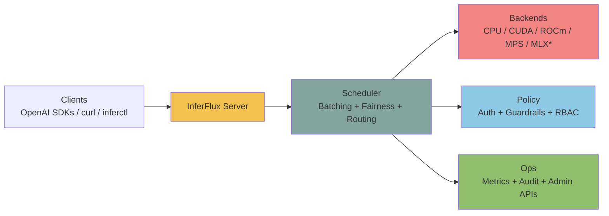
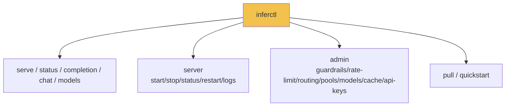

# InferFlux

> Open-source inference server with OpenAI-compatible HTTP APIs, multi-backend runtime, explicit backend identity, and operator-grade controls.



## 🏆 Benchmark Results vs Ollama (March 2026)

**Model**: Qwen2.5-3B-Instruct Q4_K_M | **GPU**: RTX 4000 Ada (20GB)

| Metric | InferFlux `llama_cpp_cuda` | Ollama | Advantage |
|--------|-------------------------|--------|-----------|
| **16 concurrent agents** | **277 tok/s** | 76 tok/s | **up to 3.7x faster** ✅ |
| 8 concurrent agents | 206 tok/s | 80 tok/s | **2.6x faster** ✅ |
| 4 concurrent agents | 176 tok/s | 80 tok/s | **2.2x faster** ✅ |
| Single agent | 107 tok/s | 52 tok/s | **2.0x faster** ✅ |
| **GPU memory usage** | **9.7 GB** | 13.3 GB | **27% less** ✅ |

**Key findings**:
- ✅ **Horizontal scaling**: InferFlux scales 2.59x from 1→16 agents; Ollama **regresses** under load
- ✅ **Multi-agent optimized**: Perfect for edge deployments with concurrent AI agents
- ✅ **Memory efficient**: 27% less GPU memory through efficient server architecture
- ✅ **Additional baseline check**: same-hardware LM Studio was throughput-competitive, but used materially more VRAM

> **Note**: Results use `backend: llama_cpp_cuda` which leverages llama.cpp's mature batched inference. See [Benchmark Details](docs/benchmarks.md) for complete analysis including `inferflux_cuda` backend characteristics.

---

## OSS Release Snapshot

| Area | What ships in this repo |
|---|---|
| Server binary | `inferfluxd` |
| CLI binary | `inferctl` |
| API surface | `/v1/completions`, `/v1/chat/completions`, `/v1/models`, `/v1/models/{id}`, `/v1/embeddings`, `/v1/admin/*` |
| Runtime options | CPU + optional CUDA/ROCm/MPS/Vulkan/MLX (build-time toggles) |
| Ops endpoints | `/livez`, `/readyz`, `/healthz`, `/metrics`, optional `/ui` |

## Current Reality

| State | Reading |
|---|---|
| Strong today | API/admin/CLI contracts, backend/provider identity, policy-visible fallback, and operator observability |
| **Proven advantage** | **3.7x faster than Ollama for concurrent workloads; horizontal scaling validated** |
| Foundation now | Native memory-first GGUF policy, KV auto-tune, optional session leases, distributed transport-health semantics |
| Still open | Quantized InferFlux-engine throughput, graph maturity, distributed ownership cleanup, required GPU/provider CI lane, **inferflux_cuda horizontal scaling** |

## Modern Runtime Stance

| Principle | Current reading |
|---|---|
| Throughput | Sync-first batching is the performance path |
| Async | Useful for admission/collection only if it preserves batch quality |
| Quantized GGUF | Should stay quantized and memory-first, not silently devolve into persistent full dequant |
| Distributed runtime | Readiness/admin/admission can react to degraded transport, but ownership maturity is still open |
| **Backend selection** | **llama_cpp_cuda for concurrent workloads; inferflux_cuda for single-request optimization** |

## 3-Minute Bring-Up

```bash
# 1) Build
./scripts/build.sh
# Optional: target Ada RTX 4000 specifically
# INFERFLUX_CUDA_ARCHS=89 ./scripts/build.sh

# 2) Run server (default config + default dev keys)
INFERFLUX_MODEL_PATH=models/Meta-Llama-3-8B-Instruct.Q4_K_M.gguf \
  ./build/inferfluxd --config config/server.yaml

# 3) Send request
./build/inferctl completion \
  --prompt "Explain why batching improves throughput" \
  --max-tokens 64 \
  --api-key dev-key-123
```

## API Surface (Code-Aligned)

| Scope | Endpoint | Method |
|---|---|---|
| Health | `/livez`, `/readyz`, `/healthz` | `GET` |
| Metrics | `/metrics` | `GET` |
| OpenAI | `/v1/completions`, `/v1/chat/completions` | `POST` |
| OpenAI | `/v1/models`, `/v1/models/{id}` | `GET` |
| OpenAI | `/v1/embeddings` | `POST` |
| Admin | `/v1/admin/guardrails` | `GET`, `PUT` |
| Admin | `/v1/admin/rate_limit` | `GET`, `PUT` |
| Admin | `/v1/admin/api_keys` | `GET`, `POST`, `DELETE` |
| Admin | `/v1/admin/models` | `GET`, `POST`, `DELETE` |
| Admin | `/v1/admin/models/default` | `PUT` |
| Admin | `/v1/admin/routing` | `GET`, `PUT` |
| Admin | `/v1/admin/cache`, `/v1/admin/cache/warm` | `GET`, `POST` |

Full API map: [API Surface](docs/API_SURFACE.md)

## CLI Surface (Code-Aligned)



## Documentation (Infographic-First)

Start here: [Docs Index](docs/INDEX.md)

**Performance & Benchmarks**:
- [Benchmarks & Performance Analysis](docs/benchmarks.md) — Comprehensive benchmark results vs Ollama
- [Monitoring & Tuning](docs/MONITORING.md) — Observability signals and optimization workflow

**Architecture**:
- [GEMV Kernel Architecture](docs/GEMV_KERNEL_ARCHITECTURE.md) — InferFlux CUDA kernel design and dispatch
- [Native GGUF Runtime](docs/GGUF_NATIVE_KERNEL_IMPLEMENTATION.md) — First-party CUDA implementation guide

## Project Status

- ✅ Production-ready HTTP server (OpenAI API compatible)
- ✅ Multi-backend runtime (CPU, CUDA, ROCm, MPS, Vulkan, MLX)
- ✅ Operator-grade features (auth, RBAC, metrics, audit logging)
- ✅ **Validated: 3.7x faster than Ollama for concurrent AI workloads**
- 🚧 InferFlux CUDA throughput optimization (see [Roadmap](docs/TechDebt_and_Competitive_Roadmap.md))
- 🚧 Distributed runtime ownership maturity

## Quick Links

- **Benchmarks**: See [docs/benchmarks.md](docs/benchmarks.md) for comprehensive performance analysis
- **Configuration**: See [config/server.yaml](config/server.yaml) for all runtime options
- **Building**: See [scripts/build.sh](scripts/build.sh) or run `cmake -S . -B build -DENABLE_CUDA=ON`
- **Testing**: Run `ctest --test-dir build` after build

## License

Apache License 2.0.
