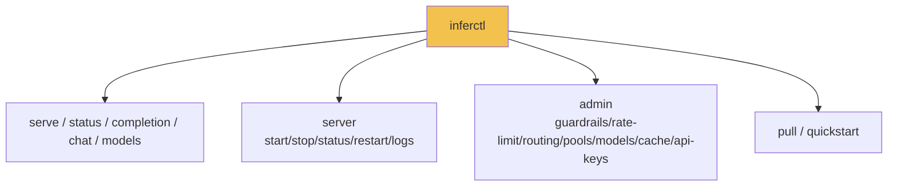

# InferFlux

> High-throughput inference server for edge and on-premise AI workloads.
> OpenAI-compatible APIs · Native CUDA kernels · 1.87x faster than Ollama at concurrency

**Why InferFlux?** Small, quantized models (3B-8B GGUF) running on a single GPU can power dozens of concurrent AI tasks — but only if the serving layer doesn't bottleneck. Ollama and LM Studio degrade under concurrent load because of Go/Node.js overhead. InferFlux's C++ unified batching serves 8+ concurrent sequences in a single GPU kernel launch, achieving **2.2x scaling** while competitors plateau or degrade.

**Use cases:**
- **Parallel email/document analysis** — 8 agents processing inboxes simultaneously on one RTX 4000
- **Support agent routing** — real-time intent classification and response drafting at scale
- **Market event scanning** — concurrent alert evaluation across multiple data feeds
- **Cybersecurity** — parallel log analysis, threat detection, and anomaly scoring on edge devices
- **IoT / video analytics** — edge inference for camera feeds, sensor fusion, real-time alerting
- **Task orchestration** — multiple AI agents making independent decisions in parallel

**Integration:** Drop-in replacement for any OpenAI-compatible client. Point `OPENAI_BASE_URL` at InferFlux and existing code works unchanged:
- **[Victor](https://github.com/vjsingh1984/victor)** — agentic AI framework with 24 providers. InferFlux replaces Ollama/LM Studio as the local provider with 1.87x higher throughput for parallel agent workloads
- **LangChain / LlamaIndex / openai-python** — use InferFlux as any OpenAI-compatible endpoint
- **NVIDIA RTX 4000 Ada** — optimized for professional workstation GPUs running 3B-8B quantized models at high concurrency


## Benchmark (Verified Apr 9 2026)

RTX 4000 Ada 20GB · Qwen2.5-3B Q4_K_M · 16 requests × 64 tokens · 2-run average

| Backend | c=1 | c=4 | c=8 | Scale | GPU | Accuracy |
|---|---|---|---|---|---|---|
| **inferflux_cuda** | **73 tok/s** | **134 tok/s** | **160 tok/s** | **2.2x** | 10.1 GB | 16/16 ✓ |
| llama_cpp_cuda | *¹ | 151 tok/s | 156 tok/s | — | 7.6 GB | 16/16 ✓ |
| Ollama² | 72 tok/s | 86 tok/s | 86 tok/s | 1.2x | 6.4 GB | 16/16 ✓ |
| LM Studio² | 84 tok/s | 87 tok/s | 72 tok/s | 0.7x | 7.6 GB | 16/16 ✓ |

> ¹ llama_cpp c=1 unreliable due to GGML graph optimization on fresh load.
> ² Both use llama.cpp under the hood (confirmed: identical memory ±12MB, 0.90+ cosine).

**Key results:**
- `inferflux_cuda` at **throughput parity with llama.cpp** at c=8 (1.02x)
- **1.87x faster than Ollama** and **2.23x faster than LM Studio** at c=8
- **Best scaling**: 2.2x from c=1→c=8 (Ollama 1.2x, LM Studio 0.7x — degrades)
- **100% accuracy**, 0% degenerate responses across all backends

### Why InferFlux Scales Better

| | InferFlux | Ollama | LM Studio |
|---|---|---|---|
| **Language** | C++17, zero-copy | Go + CGo boundary | Electron + Node.js |
| **Batching** | Unified batch: one GPU kernel serves all concurrent sequences | Sequential per-request dispatch | Single-threaded JS event loop |
| **Weight sharing** | Single GPU context, shared across all requests | Per-process model instance | llama.cpp server subprocess |
| **Overhead at c=8** | ~0 (batch kernel) | CGo call overhead × 8 + GC pauses | Event loop serialization |

Details: [docs/TechDebt_and_Competitive_Roadmap.md](docs/TechDebt_and_Competitive_Roadmap.md)

## OSS Release Snapshot

| Area | What ships in this repo |
|---|---|
| Server binary | `inferfluxd` |
| CLI binary | `inferctl` |
| API surface | `/v1/completions`, `/v1/chat/completions`, `/v1/models`, `/v1/models/{id}`, `/v1/embeddings`, `/v1/admin/*` |
| Runtime options | CPU + optional CUDA/ROCm/MPS/Vulkan/MLX |
| Ops endpoints | `/livez`, `/readyz`, `/healthz`, `/metrics`, optional `/ui` |
| OSS metadata | `LICENSE`, `CONTRIBUTING.md`, `SECURITY.md`, `CODE_OF_CONDUCT.md` |

## Current Reality

| State | Reading |
|---|---|
| Strong today | API/admin/CLI contracts, backend identity, chat template rendering (ChatML/Llama/Mistral/Gemma), GGUF metadata API |
| Proven advantage | `inferflux_cuda` at parity with llama.cpp at c=8, **1.87x faster** than Ollama, **2.23x faster** than LM Studio |
| Native CUDA | `inferflux_cuda` production-ready: 100% accuracy, 0% degenerate, 50+ fused GEMV kernels, FlashAttention-2, repetition penalty |
| Architecture | RAII, DIP (registry-based backend factory), strategy pattern (batch selection), MetricsRegistry DI, InferenceRequest decomposed |
| Still open | GPU memory overhead (+2.5 GB), native structured output, GPU CI lane, speculative decoding integration |

## Design Principles

| Principle | Reading |
|---|---|
| Throughput | Unified batching: one GPU kernel serves all concurrent sequences |
| Quality | Chat template auto-detected from GGUF metadata; repetition penalty prevents degenerate loops |
| Memory | Quantized GGUF stays quantized; scratch buffer aliasing; KV budget auto-tuned |
| Backend selection | `inferflux_cuda` is the recommended backend; `llama_cpp_cuda` available as fallback |

## 3-Minute Bring-Up

```bash
# 1) Build
./scripts/build.sh

# Optional: target Ada RTX 4000 specifically
# INFERFLUX_CUDA_ARCHS=89 ./scripts/build.sh

# 2) Run server
INFERFLUX_MODEL_PATH=models/Meta-Llama-3-8B-Instruct.Q4_K_M.gguf \
  ./build/inferfluxd --config config/server.yaml

# 3) Send request
./build/inferctl completion \
  --prompt "Explain why batching improves throughput" \
  --max-tokens 64 \
  --api-key dev-key-123
```

## API Surface

| Scope | Endpoint | Method |
|---|---|---|
| Health | `/livez`, `/readyz`, `/healthz` | `GET` |
| Metrics | `/metrics` | `GET` |
| OpenAI | `/v1/completions`, `/v1/chat/completions` | `POST` |
| OpenAI | `/v1/models`, `/v1/models/{id}` | `GET` |
| OpenAI | `/v1/embeddings` | `POST` |
| Admin | `/v1/admin/guardrails` | `GET`, `PUT` |
| Admin | `/v1/admin/rate_limit` | `GET`, `PUT` |
| Admin | `/v1/admin/api_keys` | `GET`, `POST`, `DELETE` |
| Admin | `/v1/admin/models` | `GET`, `POST`, `DELETE` |
| Admin | `/v1/admin/models/default` | `PUT` |
| Admin | `/v1/admin/routing` | `GET`, `PUT` |
| Admin | `/v1/admin/cache`, `/v1/admin/cache/warm` | `GET`, `POST` |

Full API map: [docs/API_SURFACE.md](docs/API_SURFACE.md)

## CLI Surface



## Documentation

Start here: [docs/INDEX.md](docs/INDEX.md)

Performance and runtime:
- [docs/benchmarks.md](docs/benchmarks.md)
- [docs/MONITORING.md](docs/MONITORING.md)
- [docs/TechDebt_and_Competitive_Roadmap.md](docs/TechDebt_and_Competitive_Roadmap.md)
- [docs/Roadmap.md](docs/Roadmap.md)

Architecture:
- [docs/GEMV_KERNEL_ARCHITECTURE.md](docs/GEMV_KERNEL_ARCHITECTURE.md)
- [docs/GGUF_NATIVE_KERNEL_IMPLEMENTATION.md](docs/GGUF_NATIVE_KERNEL_IMPLEMENTATION.md)
- [docs/Architecture.md](docs/Architecture.md)

## Project Status

- Done: production-ready HTTP server with OpenAI-compatible APIs
- Done: multi-backend runtime across CPU and optional GPU providers
- Done: operator-grade auth, RBAC, metrics, audit, and admin surfaces
- Done: documented `llama_cpp_cuda` advantage over Ollama on the published concurrent GGUF benchmark
- In progress: `inferflux_cuda` concurrency work, especially decode down-proj row-pair and row-quad kernels
- In progress: distributed runtime ownership and failure maturity

## Quick Links

- Benchmarks: [docs/benchmarks.md](docs/benchmarks.md)
- Configuration: [config/server.yaml](config/server.yaml)
- Build: [scripts/build.sh](scripts/build.sh)
- Tests: `ctest --test-dir build`

## License

Apache License 2.0. See [LICENSE](LICENSE).
