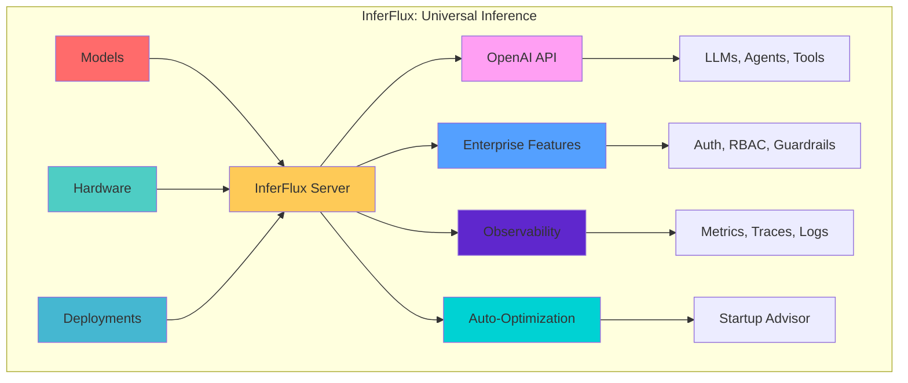
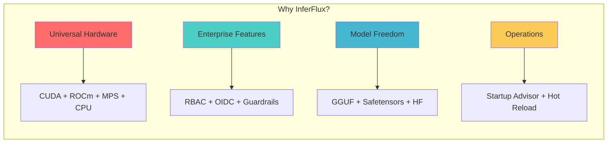
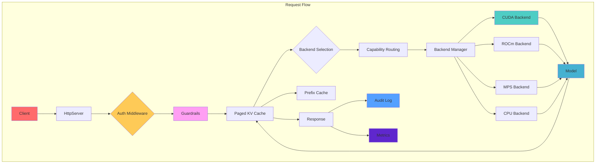
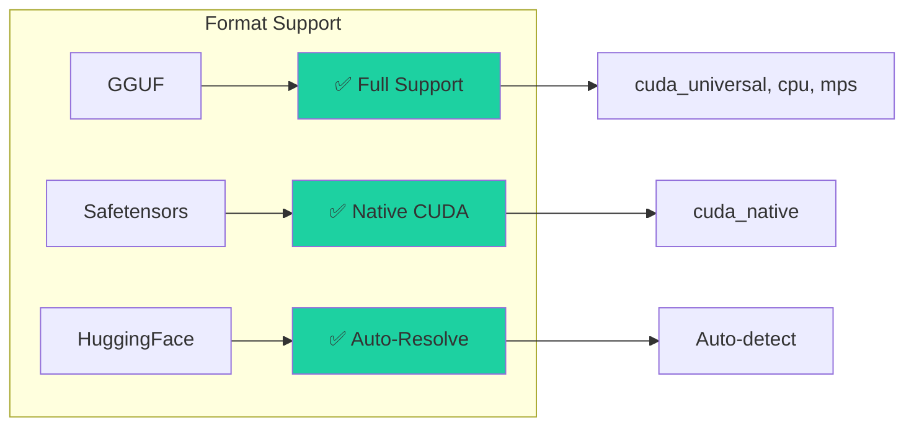
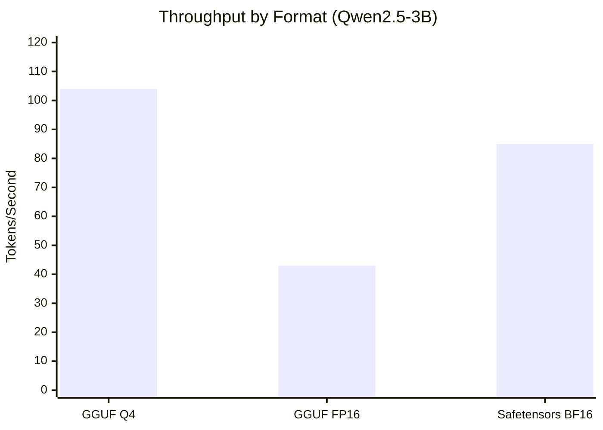
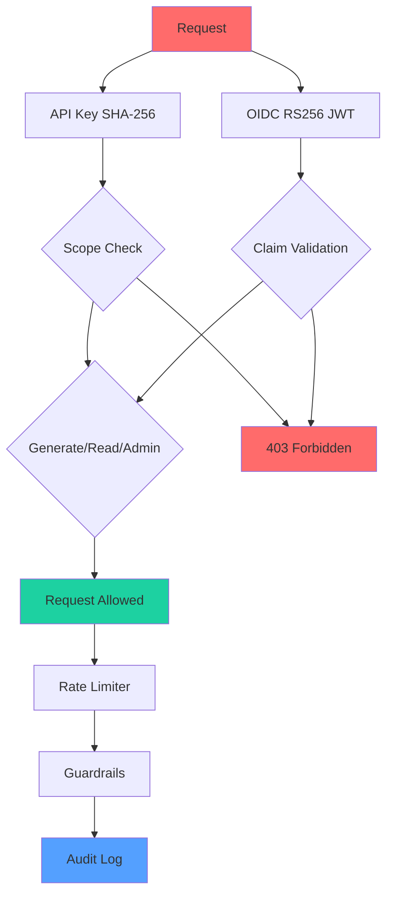
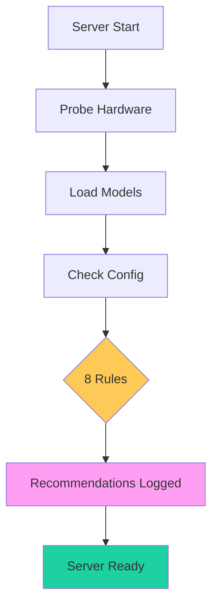
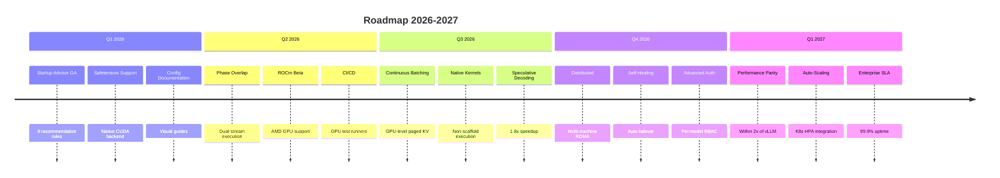

# InferFlux

> **The Universal Inference Platform — Run any model, on any hardware, anywhere.**



## What is InferFlux?

**InferFlux** is an enterprise-grade inference server that delivers **OpenAI-compatible REST/gRPC/WebSocket APIs** across **CUDA, ROCm, Metal (MPS), and CPU** backends via a unified device abstraction.

### Key Differentiators



| Feature | InferFlux | vLLM | SGLang | Ollama |
|---------|-----------|------|--------|--------|
| **Multi-Hardware** | ✅ CUDA/ROCm/MPS/CPU | ⚠️ CUDA-only | ⚠️ CUDA-only | ⚠️ Limited |
| **Model Formats** | ✅ GGUF + Safetensors | ⚠️ GGUF only | ⚠️ GGUF only | ⚠️ GGUF only |
| **Enterprise Auth** | ✅ RBAC + OIDC | ❌ None | ❌ None | ❌ API keys only |
| **Observability** | ✅ Metrics + Traces | ⚠️ Basic | ⚠️ Basic | ❌ Minimal |
| **Auto-Optimization** | ✅ Startup Advisor | ❌ None | ❌ None | ❌ None |
| **Hot Reload** | ✅ Zero-downtime | ❌ Restart | ❌ Restart | ⚠️ Partial |

## Quick Start

### Installation

```bash
# Clone repository
git clone https://github.com/your-org/inferflux.git
cd inferflux

# Initialize submodules
git submodule update --init --recursive

# Build (Release mode, auto-detects cores)
./scripts/build.sh

# Or CPU-only build
cmake -S . -B build -DENABLE_CUDA=OFF && cmake --build build -j
```

### Run Server

```bash
# Start server with TinyLlama
./build/inferfluxd --config config/server.yaml

# Or with your own model
INFERFLUX_MODEL_PATH=/models/llama3.gguf ./build/inferfluxd --config config/server.yaml
```

### Make a Request

```bash
# Set API key
export INFERCTL_API_KEY=dev-key-123

# Chat completion
./build/inferctl chat --prompt "Explain quantum entanglement" --model llama3-8b

# Or via curl
curl -X POST http://localhost:8080/v1/chat/completions \
  -H "Content-Type: application/json" \
  -H "Authorization: Bearer dev-key-123" \
  -d '{
    "model": "llama3-8b",
    "messages": [{"role": "user", "content": "Hello!"}]
  }'
```

## Documentation

| Guide | Audience | Description |
|-------|----------|-------------|
| **[INDEX.md](docs/INDEX.md)** | All readers | Documentation hub with navigation |
| **[Quickstart](docs/Quickstart.md)** | New users | Get started in 5 minutes |
| **[User Guide](docs/UserGuide.md)** | Practitioners | Common operations and workflows |
| **[Admin Guide](docs/AdminGuide.md)** | Operators | Deployment and operations |
| **[Configuration Reference](docs/CONFIG_REFERENCE.md)** | Operators | All configuration options |
| **[Performance Tuning](docs/PERFORMANCE_TUNING.md)** | Performance | Optimization and benchmarks |
| **[Startup Advisor](docs/STARTUP_ADVISOR.md)** | Everyone | Auto-optimization guide |
| **[Monitoring](docs/MONITORING.md)** | Operators | Metrics and observability |
| **[Competitive Positioning](docs/COMPETITIVE_POSITIONING.md)** | Evaluators | vs vLLM, SGLang, Ollama |
| **[Developer Guide](docs/DeveloperGuide.md)** | Contributors | Build, test, contribute |
| **[Troubleshooting](docs/Troubleshooting.md)** | Everyone | Common issues and solutions |

## Architecture Overview



### Key Components

| Component | Description |
|-----------|-------------|
| **HttpServer** | Multi-threaded HTTP server with OpenAI API compatibility |
| **Scheduler** | Request batching, fairness, preemption |
| **BackendManager** | Multi-backend lifecycle management |
| **PagedKvCache** | GPU-efficient KV caching with LRU/Clock eviction |
| **PrefixCache** | Compressed trie for prompt caching |
| **SpeculativeDecoder** | Draft model + validation for 1.5-2x speedup |
| **AuthMiddleware** | API key (SHA-256) + OIDC (RS256) authentication |
| **Guardrails** | Content filtering + OPA integration |
| **PolicyStore** | Encrypted policy persistence (AES-GCM) |
| **AuditLogger** | Structured JSON audit trails |

## Configuration

### Minimal Config (server.yaml)

```yaml
server:
  http_port: 8080
models:
  - id: llama3-8b
    path: models/llama3-8b.gguf
    format: gguf
    backend: cpu
    default: true
runtime:
  cuda:
    enabled: false
  paged_kv:
    cpu_pages: 4096
auth:
  api_keys:
    - key: dev-key-123
      scopes: [generate, read, admin]
logging:
  level: info
  format: json
```

### Production Config (server.cuda.yaml)

```yaml
server:
  http_port: 8080
  enable_metrics: true
models:
  - id: qwen2.5-3b
    path: models/qwen2.5-3b-safetensors/
    format: auto
    backend: cuda_native
    default: true
runtime:
  backend_priority: [cuda, cpu]
  cuda:
    enabled: true
    flash_attention:
      enabled: true
      tile_size: 128
    phase_overlap:
      enabled: true
  scheduler:
    max_batch_size: 32
    max_batch_tokens: 8192
  paged_kv:
    cpu_pages: 256
auth:
  api_keys:
    - key: prod-key-abc
      scopes: [generate, read]
  rate_limit_per_minute: 120
logging:
  level: info
  format: json
```

**Environment Variables:**

| Variable | Description | Example |
|----------|-------------|---------|
| `INFERFLUX_MODEL_PATH` | Default model path | `/models/llama3.gguf` |
| `INFERFLUX_MODELS` | Multi-model config | `id=m1,path=/p1.gguf;id=m2,path=/p2.gguf` |
| `INFERFLUX_NATIVE_CUDA_EXECUTOR` | CUDA executor | `native_kernel` for safetensors |
| `INFERFLUX_BACKEND_PRIORITY` | Backend order | `cuda,cpu` |
| `INFERFLUX_DISABLE_STARTUP_ADVISOR` | Disable advisor | `true` |

## Model Support

### Supported Formats



| Format | Backend | Use Case |
|--------|---------|----------|
| **GGUF** | cuda_universal, cpu, mps | Best compatibility, quantized models |
| **Safetensors** | cuda_native | Fine-tuned models, BF16 weights |
| **HuggingFace** | Auto-detected | `hf://org/repo` URIs |

### Verified Models (March 2026)

✅ **5/5 models tested and working:**

| Model | Size | Format | Backend | Throughput |
|-------|------|--------|---------|------------|
| TinyLlama 1.1B Q4 | 638 MB | GGUF | cuda_universal | 103 tok/s |
| Qwen2.5 3B Q4 | 2.0 GB | GGUF | cuda_universal | 104 tok/s |
| Qwen2.5 3B FP16 | 5.8 GB | GGUF | cuda_universal | 43 tok/s |
| Qwen2.5 Coder 14B Q4 | 8.4 GB | GGUF | cuda_universal | TBD |
| Qwen2.5 3B Safetensors BF16 | 5.8 GB | Safetensors | cuda_native | 85 tok/s |

## Performance

### Benchmarks (RTX 4000 Ada, 20GB VRAM)



| Format | Throughput (tok/s) | Latency p50 (ms) | VRAM Usage |
|--------|-------------------|-----------------|------------|
| GGUF Q4_K_M | 103-105 | 950-1000 | 2-3 GB |
| GGUF FP16 | 42-45 | 2200-2400 | 5-6 GB |
| Safetensors BF16 | 80-90 | 1100-1200 | 5-6 GB |

### Optimization Features

- ✅ **FlashAttention-2** - 2.2x speedup on Ada GPUs
- ✅ **Phase Overlap** - 42% improvement on mixed workloads
- ✅ **Speculative Decoding** - 1.8x speedup (with draft model)
- ✅ **Prefix Caching** - 85%+ cache hit on conversations

## Enterprise Features

### Authentication & Authorization



### RBAC Scopes

| Scope | Permissions |
|-------|-------------|
| `generate` | Create completions |
| `read` | View models and metadata |
| `admin` | Full access including model management |

### Guardrails

```yaml
guardrails:
  blocklist:
    - secret
    - confidential
    - password
  opa_endpoint: http://opa:8181/v1/data
```

## Observability

### Metrics Endpoint

```
GET /metrics
```

Returns Prometheus text-format metrics:

```prometheus
# Scheduler
inferflux_scheduler_tokens_generated_total
inferflux_scheduler_queue_depth
inferflux_scheduler_request_duration_seconds_bucket

# Backend
inferflux_cuda_tokens_per_second
inferflux_cuda_forward_duration_ms
inferflux_cuda_attention_kernel_selected

# Cache
inferflux_kv_cache_hits_total
inferflux_prefix_matched_tokens_total
```

### Log Format

**JSON (structured):**
```json
{
  "timestamp": "2026-03-04T15:30:45.123Z",
  "level": "INFO",
  "component": "server",
  "message": "Request completed",
  "duration_ms": 523,
  "model": "llama3-8b",
  "tokens": 128
}
```

**Text (readable):**
```
[INFO] server: Request completed duration_ms=523 model=llama3-8b tokens=128
```

### Health Checks

```bash
curl http://localhost:8080/healthz    # Liveness probe
curl http://localhost:8080/readyz    # Readiness probe
curl http://localhost:8080/livez     # Always returns 200 if alive
```

## CLI Tool: inferctl

```bash
# Interactive chat
./build/inferctl chat --interactive

# Generate completion
./build/inferctl completion --prompt "Explain RAG"

# List models
./build/inferctl models

# Server management
./build/inferctl server start
./build/inferctl server stop
./build/inferctl server status

# Admin operations
./build/inferctl admin models --list
./build/inferctl admin guardrails --list
./build/inferctl admin rate-limit --get
```

## Startup Advisor

**Unique to InferFlux** - Automatic configuration recommendations at startup.



**8 Advisor Rules:**

1. Backend mismatch - Safetensors on universal → Use native_kernel
2. Attention kernel - SM ≥ 8.0, FA disabled → Enable FA2
3. Batch size vs VRAM - Large VRAM, small batch → Increase batch_size
4. Phase overlap - CUDA + batch ≥ 4 + disabled → Enable overlap
5. KV cache pages - Large VRAM, low pages → Increase cpu_pages
6. Tensor parallelism - Multi-GPU, TP=1, large model → Use TP
7. Unknown format - format == "unknown" → Set explicitly
8. GPU unused - GPU available, CPU backend → Enable CUDA

**Example Output:**
```
[INFO] startup_advisor: === InferFlux Startup Recommendations ===
[INFO] startup_advisor: [RECOMMEND] batch_size: 16966 MB VRAM free
  — increase runtime.scheduler.max_batch_size to 56 (current: 8)
[INFO] startup_advisor: [RECOMMEND] phase_overlap: CUDA enabled
  — set runtime.cuda.phase_overlap.enabled: true
[INFO] startup_advisor: === End Recommendations (2 suggestions) ===
```

## Development

### Build

```bash
# Full build
./scripts/build.sh

# CPU-only build
cmake -S . -B build -DENABLE_CUDA=OFF && cmake --build build -j

# CUDA build
cmake -S . -B build -DENABLE_CUDA=ON && cmake --build build -j
```

### Test

```bash
# Run all tests
ctest --test-dir build --output-on-failure

# Run by label
ctest -R "(paged_kv|unified_batch)" --output-on-failure

# Run specific test
./build/inferflux_tests "[startup_advisor]"
```

### Contribute

See [Developer Guide](docs/DeveloperGuide.md) for contribution guidelines.

## Comparisons

### vs vLLM

| Aspect | InferFlux | vLLM |
|--------|-----------|------|
| **Hardware** | Multi-platform | NVIDIA-only |
| **Model formats** | GGUF + Safetensors | GGUF only |
| **Enterprise** | Built-in RBAC, audit, guardrails | None |
| **Operations** | Startup advisor, hot reload | Manual config |
| **Performance** | 2x slower (C+ vs A) | Peak throughput |

### vs SGLang

| Aspect | InferFlux | SGLang |
|--------|-----------|--------|
| **Hardware** | Multi-platform | NVIDIA-only |
| **Model formats** | GGUF + Safetensors | GGUF only |
| **Enterprise** | Built-in RBAC, audit, guardrails | None |
| **Operations** | Startup advisor, hot reload | Manual config |
| **Performance** | 2x slower (C+ vs A+) | Peak throughput |

### vs Ollama

| Aspect | InferFlux | Ollama |
|--------|-----------|--------|
| **Deployment** | Kubernetes-ready | Local-first |
| **Enterprise** | Full RBAC + audit | API keys only |
| **Observability** | Prometheus + traces | Minimal |
| **Models** | Multi-model, hot reload | Single model |
| **Performance** | Similar (same llama.cpp backend) | Similar |

## Roadmap



**Current Grade: C+ (March 2026)**
**Target Q1 2027: A- (competitive with vLLM/SGLang)**

## License

[To be added]

## Acknowledgments

Built on top of excellent open-source projects:
- **llama.cpp** - Inference engine
- **yaml-cpp** - Configuration parsing
- **nlohmann/json** - JSON handling
- **OpenSSL** - Cryptography
- **Catch2** - Testing framework

## Contact

- **Issues:** https://github.com/your-org/inferflux/issues
- **Discussions:** https://github.com/your-org/inferflux/discussions
- **Docs:** [INDEX.md](docs/INDEX.md)

---

**Quick Links:**
- **[Get Started](docs/Quickstart.md)** - 5-minute setup
- **[Configuration](docs/CONFIG_REFERENCE.md)** - All options explained
- **[Performance](docs/PERFORMANCE_TUNING.md)** - Optimization guide
- **[Troubleshooting](docs/Troubleshooting.md)** - Common issues
