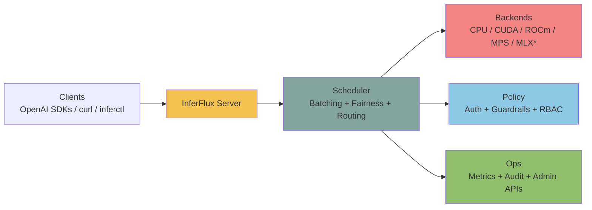
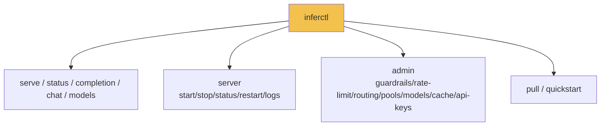

# InferFlux

> Open-source inference server with OpenAI-compatible HTTP APIs, multi-backend runtime, explicit backend identity, and operator-grade controls.



## OSS Release Snapshot

| Area | What ships in this repo |
|---|---|
| Server binary | `inferfluxd` |
| CLI binary | `inferctl` |
| API surface | `/v1/completions`, `/v1/chat/completions`, `/v1/models`, `/v1/models/{id}`, `/v1/embeddings`, `/v1/admin/*` |
| Runtime options | CPU + optional CUDA/ROCm/MPS/Vulkan/MLX (build-time toggles) |
| Ops endpoints | `/livez`, `/readyz`, `/healthz`, `/metrics`, optional `/ui` |

## Current Reality

| State | Reading |
|---|---|
| Strong today | API/admin/CLI contracts, backend/provider identity, policy-visible fallback, and operator observability |
| Foundation now | Native memory-first GGUF policy, KV auto-tune, optional session leases, distributed transport-health semantics |
| Still open | Quantized native throughput, graph maturity, distributed ownership cleanup, required GPU/provider CI lane |

## Modern Runtime Stance

| Principle | Current reading |
|---|---|
| Throughput | Sync-first batching is the performance path |
| Async | Useful for admission/collection only if it preserves batch quality |
| Quantized GGUF | Should stay quantized and memory-first, not silently devolve into persistent full dequant |
| Distributed runtime | Readiness/admin/admission can react to degraded transport, but ownership maturity is still open |

## 3-Minute Bring-Up

```bash
# 1) Build
./scripts/build.sh
# Optional: target Ada RTX 4000 specifically
# INFERFLUX_CUDA_ARCHS=89 ./scripts/build.sh

# 2) Run server (default config + default dev keys)
INFERFLUX_MODEL_PATH=models/Meta-Llama-3-8B-Instruct.Q4_K_M.gguf \
  ./build/inferfluxd --config config/server.yaml

# 3) Send request
./build/inferctl completion \
  --prompt "Explain why batching improves throughput" \
  --max-tokens 64 \
  --api-key dev-key-123
```

## API Surface (Code-Aligned)

| Scope | Endpoint | Method |
|---|---|---|
| Health | `/livez`, `/readyz`, `/healthz` | `GET` |
| Metrics | `/metrics` | `GET` |
| OpenAI | `/v1/completions`, `/v1/chat/completions` | `POST` |
| OpenAI | `/v1/models`, `/v1/models/{id}` | `GET` |
| OpenAI | `/v1/embeddings` | `POST` |
| Admin | `/v1/admin/guardrails` | `GET`, `PUT` |
| Admin | `/v1/admin/rate_limit` | `GET`, `PUT` |
| Admin | `/v1/admin/api_keys` | `GET`, `POST`, `DELETE` |
| Admin | `/v1/admin/models` | `GET`, `POST`, `DELETE` |
| Admin | `/v1/admin/models/default` | `PUT` |
| Admin | `/v1/admin/routing` | `GET`, `PUT` |
| Admin | `/v1/admin/cache`, `/v1/admin/cache/warm` | `GET`, `POST` |

Full API map: [API Surface](docs/API_SURFACE.md)

## CLI Surface (Code-Aligned)



## Documentation (Infographic-First)

Start here: [Docs Index](docs/INDEX.md)

| Use case | Doc |
|---|---|
| Fast local setup | [Quickstart](docs/Quickstart.md) |
| API and auth contracts | [API Surface](docs/API_SURFACE.md) |
| Runtime and subsystem design | [Architecture](docs/Architecture.md) |
| Vision and modernization | [Vision](docs/VISION.md), [Modernization Audit](docs/MODERNIZATION_AUDIT.md) |
| Production operations | [Admin Guide](docs/AdminGuide.md) |
| Config knobs | [Config Reference](docs/CONFIG_REFERENCE.md) |
| Contributor workflow | [Developer Guide](docs/DeveloperGuide.md) |
| Historical deep dives | [Archive Index](docs/ARCHIVE_INDEX.md) |
| Documentation standards | [Docs Style Guide](docs/DOCS_STYLE_GUIDE.md) |

## Build Matrix

| CMake option | Default | Purpose |
|---|---:|---|
| `ENABLE_CUDA` | `ON` | CUDA runtime + native CUDA kernels when toolkit exists |
| `ENABLE_ROCM` | `ON` | ROCm backend path |
| `ENABLE_MPS` | `ON` | Metal/MPS backend path |
| `ENABLE_VULKAN` | `ON` | Vulkan backend via llama.cpp |
| `ENABLE_WEBUI` | `OFF` | Embedded `/ui` assets |
| `ENABLE_MLX` | `OFF` | Experimental MLX backend |
| `ENABLE_MTMD` | `OFF` | Multimodal vision support |

## Current Positioning

Competitive and roadmap status lives in:
- [Vision](docs/VISION.md)
- [Modernization Audit](docs/MODERNIZATION_AUDIT.md)
- [Tech Debt and Competitive Roadmap](docs/TechDebt_and_Competitive_Roadmap.md)
- [Roadmap](docs/Roadmap.md)
- [PRD](docs/PRD.md)
