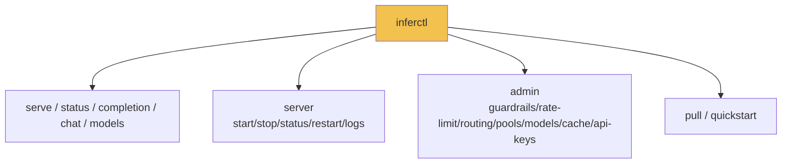

# InferFlux

> Open-source inference server with OpenAI-compatible HTTP APIs, multi-backend runtime, explicit backend identity, and operator-grade controls.


## Benchmark Snapshot

| Track | Current reading |
|---|---|
| Published competitive win | `llama_cpp_cuda` remains materially faster than Ollama on the documented GGUF concurrency matrix |
| Native CUDA status | `inferflux_cuda` is real and measurable, but still behind `llama_cpp_cuda` at sustained concurrency |
| Current optimization focus | Decode down-proj row-pair and row-quad paths, especially in `c=8` style batches |

### Proven Repo-Level Result: `llama_cpp_cuda` vs Ollama

Published benchmark result on RTX 4000 Ada with Qwen2.5-3B-Instruct Q4_K_M:

| Metric | InferFlux `llama_cpp_cuda` | Ollama | Advantage |
|---|---|---|---|
| 16 concurrent agents | 277 tok/s | 76 tok/s | 3.7x |
| 8 concurrent agents | 206 tok/s | 80 tok/s | 2.6x |
| 4 concurrent agents | 176 tok/s | 80 tok/s | 2.2x |
| Single agent | 107 tok/s | 52 tok/s | 2.0x |
| GPU memory usage | 9.7 GB | 13.3 GB | 27% less |

### Current Native CUDA Snapshot: `inferflux_cuda` vs `llama_cpp_cuda`

Representative Windows-native harness run from March 29, 2026 using `16` requests, `32` max tokens, and `batch_accumulation_ms=2`:

| Metric | `inferflux_cuda` | `llama_cpp_cuda` | Reading |
|---|---|---|---|
| c=4 throughput | 182.9 tok/s | 182.9 tok/s | Near parity in this run |
| c=8 throughput | 210.0 tok/s | 268.1 tok/s | Native still behind |

Interpretation:
- `llama_cpp_cuda` is still the recommended CUDA backend for concurrent GGUF serving.
- `inferflux_cuda` is the native optimization path, not yet the default concurrency recommendation.
- Recent profiling shows FFN grouped MMQ3 is active on the live path; the remaining gap is concentrated in decode down-proj row-pair and row-quad work.

Details: [docs/benchmarks.md](docs/benchmarks.md)

## OSS Release Snapshot

| Area | What ships in this repo |
|---|---|
| Server binary | `inferfluxd` |
| CLI binary | `inferctl` |
| API surface | `/v1/completions`, `/v1/chat/completions`, `/v1/models`, `/v1/models/{id}`, `/v1/embeddings`, `/v1/admin/*` |
| Runtime options | CPU + optional CUDA/ROCm/MPS/Vulkan/MLX |
| Ops endpoints | `/livez`, `/readyz`, `/healthz`, `/metrics`, optional `/ui` |
| OSS metadata | `LICENSE`, `CONTRIBUTING.md`, `SECURITY.md`, `CODE_OF_CONDUCT.md` |

## Current Reality

| State | Reading |
|---|---|
| Strong today | API/admin/CLI contracts, backend/provider identity, policy-visible fallback, and operator observability |
| Proven advantage | `llama_cpp_cuda` outperforms Ollama on the published concurrent GGUF benchmark |
| Native CUDA today | `inferflux_cuda` is competitive around `c=4` in the current Windows harness, but still trails at `c=8` |
| Foundation now | Memory-first GGUF policy, KV auto-tune, optional session leases, transport-health semantics, and operator-level metrics |
| Still open | Decode down-proj throughput, graph maturity, distributed ownership cleanup, and required GPU/provider CI lanes |

## Modern Runtime Stance

| Principle | Current reading |
|---|---|
| Throughput | Sync-first batching is the performance path |
| Async | Useful for admission and collection only if it preserves batch quality |
| Quantized GGUF | Should stay quantized and memory-first, not silently devolve into persistent full dequant |
| Distributed runtime | Readiness and admission can react to degraded transport, but ownership maturity is still open |
| Backend selection | `llama_cpp_cuda` for concurrent GGUF workloads today; `inferflux_cuda` remains in active optimization |

## 3-Minute Bring-Up

```bash
# 1) Build
./scripts/build.sh

# Optional: target Ada RTX 4000 specifically
# INFERFLUX_CUDA_ARCHS=89 ./scripts/build.sh

# 2) Run server
INFERFLUX_MODEL_PATH=models/Meta-Llama-3-8B-Instruct.Q4_K_M.gguf \
  ./build/inferfluxd --config config/server.yaml

# 3) Send request
./build/inferctl completion \
  --prompt "Explain why batching improves throughput" \
  --max-tokens 64 \
  --api-key dev-key-123
```

## API Surface

| Scope | Endpoint | Method |
|---|---|---|
| Health | `/livez`, `/readyz`, `/healthz` | `GET` |
| Metrics | `/metrics` | `GET` |
| OpenAI | `/v1/completions`, `/v1/chat/completions` | `POST` |
| OpenAI | `/v1/models`, `/v1/models/{id}` | `GET` |
| OpenAI | `/v1/embeddings` | `POST` |
| Admin | `/v1/admin/guardrails` | `GET`, `PUT` |
| Admin | `/v1/admin/rate_limit` | `GET`, `PUT` |
| Admin | `/v1/admin/api_keys` | `GET`, `POST`, `DELETE` |
| Admin | `/v1/admin/models` | `GET`, `POST`, `DELETE` |
| Admin | `/v1/admin/models/default` | `PUT` |
| Admin | `/v1/admin/routing` | `GET`, `PUT` |
| Admin | `/v1/admin/cache`, `/v1/admin/cache/warm` | `GET`, `POST` |

Full API map: [docs/API_SURFACE.md](docs/API_SURFACE.md)

## CLI Surface



## Documentation

Start here: [docs/INDEX.md](docs/INDEX.md)

Performance and runtime:
- [docs/benchmarks.md](docs/benchmarks.md)
- [docs/MONITORING.md](docs/MONITORING.md)
- [docs/TechDebt_and_Competitive_Roadmap.md](docs/TechDebt_and_Competitive_Roadmap.md)
- [docs/Roadmap.md](docs/Roadmap.md)

Architecture:
- [docs/GEMV_KERNEL_ARCHITECTURE.md](docs/GEMV_KERNEL_ARCHITECTURE.md)
- [docs/GGUF_NATIVE_KERNEL_IMPLEMENTATION.md](docs/GGUF_NATIVE_KERNEL_IMPLEMENTATION.md)
- [docs/Architecture.md](docs/Architecture.md)

## Project Status

- Done: production-ready HTTP server with OpenAI-compatible APIs
- Done: multi-backend runtime across CPU and optional GPU providers
- Done: operator-grade auth, RBAC, metrics, audit, and admin surfaces
- Done: documented `llama_cpp_cuda` advantage over Ollama on the published concurrent GGUF benchmark
- In progress: `inferflux_cuda` concurrency work, especially decode down-proj row-pair and row-quad kernels
- In progress: distributed runtime ownership and failure maturity

## Quick Links

- Benchmarks: [docs/benchmarks.md](docs/benchmarks.md)
- Configuration: [config/server.yaml](config/server.yaml)
- Build: [scripts/build.sh](scripts/build.sh)
- Tests: `ctest --test-dir build`

## License

Apache License 2.0. See [LICENSE](LICENSE).
