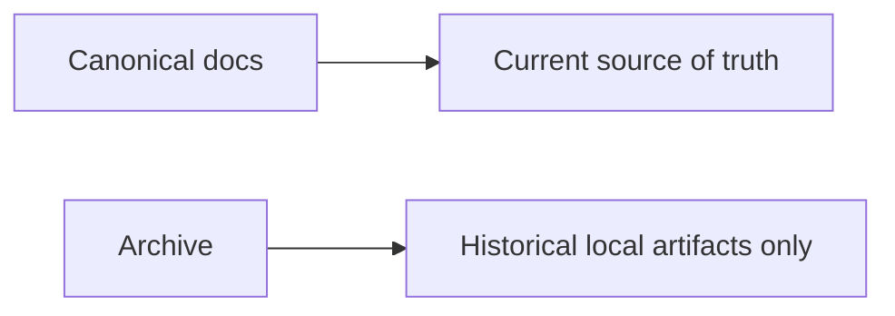

# Archive Index

**Status:** Active reference catalog

## Archive Policy

| Label | Meaning |
|---|---|
| Reference only | Historical evidence, not release-facing source of truth |
| Canonical elsewhere | Current behavior and claims now live in canonical docs |

## Current Archive Contents

| Path | Status | Notes |
|---|---|---|
| `docs/archive/evidence/local-artifacts/` | Present | Historical generated benchmark and profiling evidence |

## What This Means

- Do not use archive content as the public benchmark source of truth.
- Use canonical docs for current product and performance claims.
- If a historical document no longer exists in the tree, it should not be listed here.

## Canonical Sources of Truth

- [README](../README.md)
- [INDEX](INDEX.md)
- [Quickstart](Quickstart.md)
- [API_SURFACE](API_SURFACE.md)
- [Architecture](Architecture.md)
- [benchmarks](benchmarks.md)
- [Roadmap](Roadmap.md)
- [TechDebt_and_Competitive_Roadmap](TechDebt_and_Competitive_Roadmap.md)
