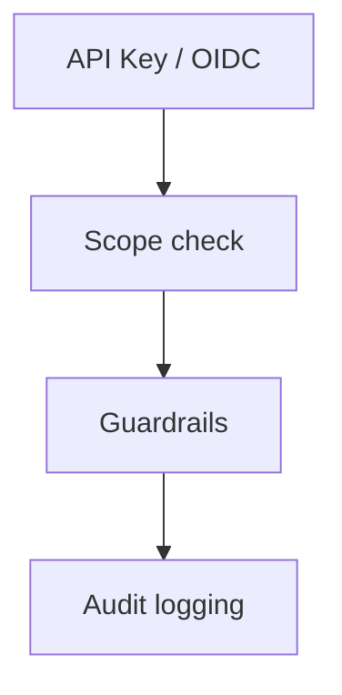

# Admin Guide (Canonical OSS)

**Status:** Done (Canonical)


## 1) Operator Contract at a Glance

| Domain | Contract |
|---|---|
| Server binary | `inferfluxd` |
| Admin client | `inferctl admin ...` |
| Server lifecycle client | `inferctl server ...` |
| Health endpoints | `/livez`, `/readyz`, `/healthz` |
| Metrics endpoint | `/metrics` |
| Admin API namespace | `/v1/admin/*` |
| Required admin scope | `admin` |

## 2) Deployment Modes

| Mode | Command path | Typical use |
|---|---|---|
| Local/systemd | `./build/inferfluxd --config ...` | bare-metal and VM deployments |
| Docker | `docker run ... inferfluxd --config ...` | containerized single-node |
| Kubernetes/Helm | `charts/` | clustered operations |

## 3) Server Lifecycle via `inferctl server`

| Command | Contract |
|---|---|
| `inferctl server start [--config PATH] [--no-wait]` | background start + PID tracking |
| `inferctl server stop [--force]` | graceful stop (`SIGTERM`) or force stop |
| `inferctl server status [--verbose]` | process + health summary |
| `inferctl server restart [--config PATH] [--no-wait]` | stop + start |
| `inferctl server logs [--tail N]` | tail/follow server log |

### Local file paths

| File | Location |
|---|---|
| PID file | `~/.inferflux/server.pid` |
| server log | `~/.inferflux/logs/server.log` |
| default config | `~/.inferflux/config.yaml` |

### Fast lifecycle workflow

```bash
./build/inferctl server start --config config/server.cuda.yaml
./build/inferctl server status --verbose
./build/inferctl server logs --tail 80
./build/inferctl server restart --config config/server.cuda.yaml
./build/inferctl server stop
```

## 4) Security Baseline



### Scope model

| Scope | Allows |
|---|---|
| `generate` | completion/chat generation |
| `read` | model list/detail + embeddings |
| `admin` | admin control plane (`/v1/admin/*`) |

### Minimum production checks

1. Remove default development keys from production configs.
2. Ensure `logs/audit.log` path is writable and persisted.
3. Set non-empty guardrail policy (`guardrails.blocklist` and/or OPA endpoint).
4. Set rate limit for exposed deployments (`auth.rate_limit_per_minute`).
5. Restrict network access to admin endpoints to trusted clients.

## 5) Admin API and CLI Map

| Operation | CLI | API |
|---|---|---|
| Guardrails get/set | `inferctl admin guardrails --list/--set` | `GET/PUT /v1/admin/guardrails` |
| Rate limit get/set | `inferctl admin rate-limit --get/--set` | `GET/PUT /v1/admin/rate_limit` |
| API keys list/add/remove | `inferctl admin api-keys ...` | `GET/POST/DELETE /v1/admin/api_keys` |
| Model list/load/unload | `inferctl admin models ...` | `GET/POST/DELETE /v1/admin/models` |
| Set default model | `inferctl admin models --set-default` | `PUT /v1/admin/models/default` |
| Routing policy | `inferctl admin routing --get/--set` | `GET/PUT /v1/admin/routing` |
| Cache status/warm | `inferctl admin cache --status/--warm` | `GET /v1/admin/cache`, `POST /v1/admin/cache/warm` |
| Pool health snapshot | `inferctl admin pools --get` | aggregates `/readyz` + `/metrics` |

Full endpoint list: [API Surface](API_SURFACE.md)

## 6) Standard Runbooks

### 6.1 Readiness and health

```bash
curl -s http://127.0.0.1:8080/livez
curl -s http://127.0.0.1:8080/readyz
curl -s http://127.0.0.1:8080/healthz
```

### 6.2 Model lifecycle

```bash
./build/inferctl admin models --list --api-key <ADMIN_KEY>
./build/inferctl admin models --load /abs/path/model.gguf --id model-a --default --api-key <ADMIN_KEY>
./build/inferctl admin models --set-default model-a --api-key <ADMIN_KEY>
./build/inferctl admin models --unload model-a --api-key <ADMIN_KEY>
```

### 6.3 Routing policy

```bash
./build/inferctl admin routing --get --api-key <ADMIN_KEY>
./build/inferctl admin routing --set \
  --allow-default-fallback true \
  --require-ready-backend true \
  --fallback-scope any_compatible \
  --api-key <ADMIN_KEY>
```

### 6.4 API key rotation

```bash
./build/inferctl admin api-keys --add new-key-001 --scopes generate,read,admin --api-key <ADMIN_KEY>
./build/inferctl admin api-keys --list --api-key <ADMIN_KEY>
./build/inferctl admin api-keys --remove old-key-001 --api-key <ADMIN_KEY>
```

### 6.5 Cache and pool visibility

```bash
./build/inferctl admin cache --status --api-key <ADMIN_KEY>
./build/inferctl admin pools --get --api-key <ADMIN_KEY>
curl -s http://127.0.0.1:8080/metrics | head -80
```

## 7) Observability Priorities

| Signal | Endpoint/metric | Why it matters |
|---|---|---|
| Readiness role/state | `/readyz` | traffic admission and pool role health |
| Scheduler backlog | queue depth metrics in `/metrics` | latency and saturation indicator |
| Batch quality | `inferflux_batch_size_max`, scheduler limits, skip counters | continuous batching efficiency |
| Token throughput | completion token counters | SLO tracking |
| Error rates | `inferflux_errors_total` + HTTP status logs | incident detection |

## 8) Incident Triage Matrix

| Symptom | Likely area | First actions |
|---|---|---|
| `503 no_backend` | model/backend readiness | check `/readyz`, model list, backend config |
| Frequent `422` capability errors | routing policy mismatch | inspect `/v1/admin/routing`, model capabilities |
| high latency with low throughput | scheduler/runtime pressure | inspect batch metrics and config caps |
| auth failures spike | key/scope drift | list keys, verify client headers and scopes |

## 9) Configuration Sources and Precedence

1. YAML config (`--config <file>`)
2. Environment overrides (`INFERFLUX_*`)
3. Runtime admin updates (where supported by control-plane APIs)

Reference: [CONFIG_REFERENCE](CONFIG_REFERENCE.md)

## 10) Release Readiness (Ops)

- Confirm canonical docs are current: [INDEX](INDEX.md), [API Surface](API_SURFACE.md), [Quickstart](Quickstart.md).
- Confirm release process checks: [ReleaseProcess](ReleaseProcess.md).
