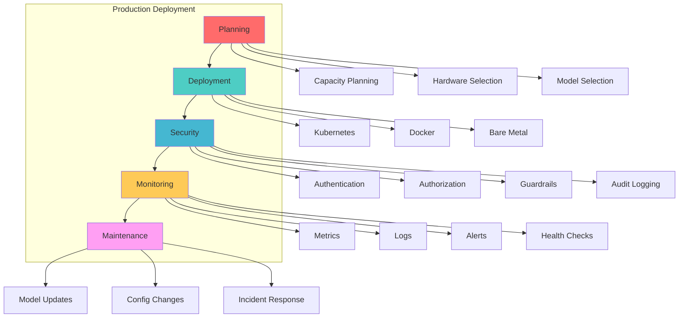
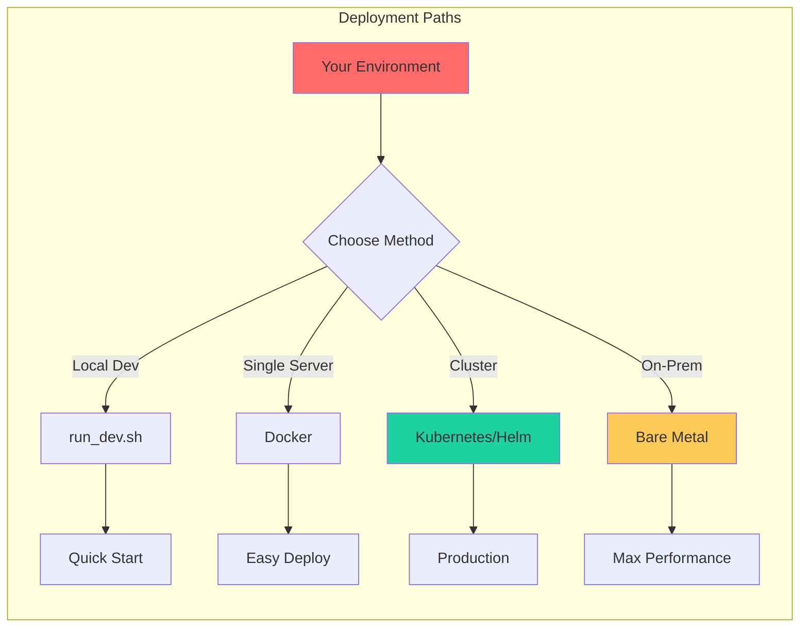
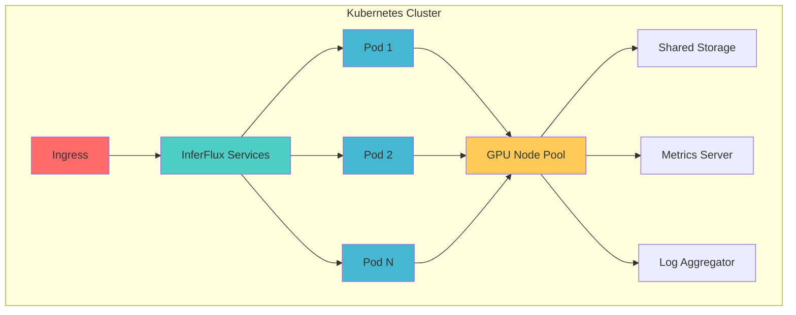
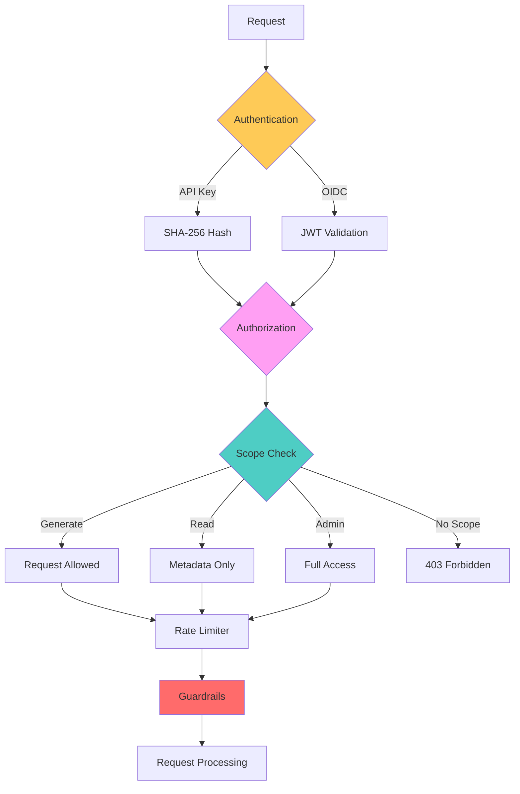
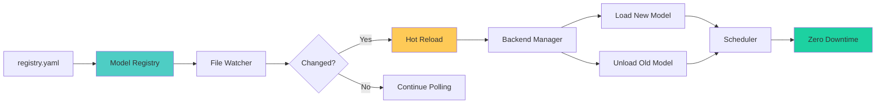
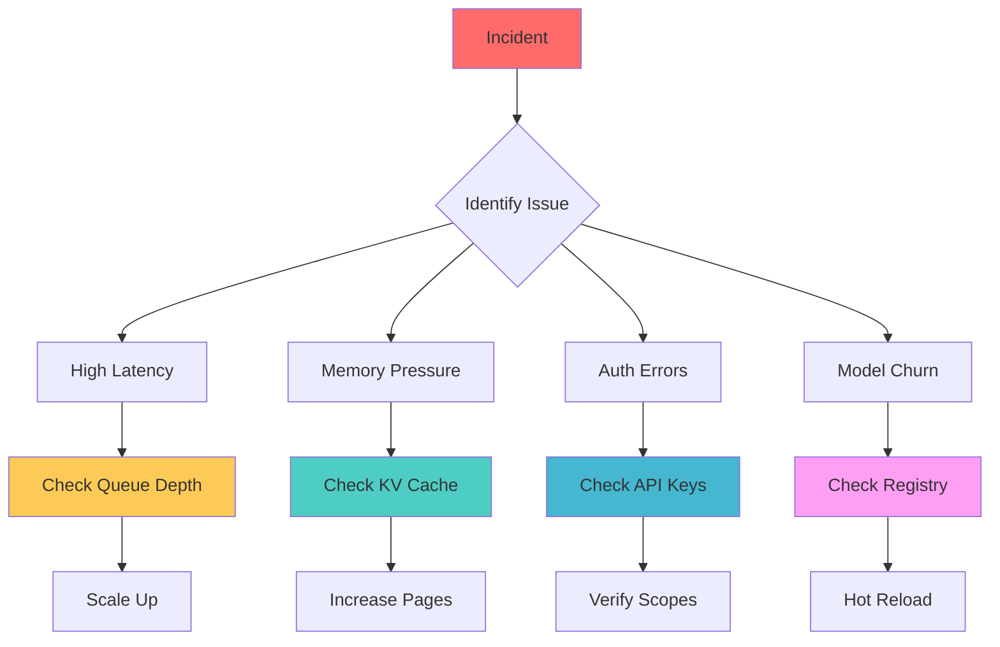
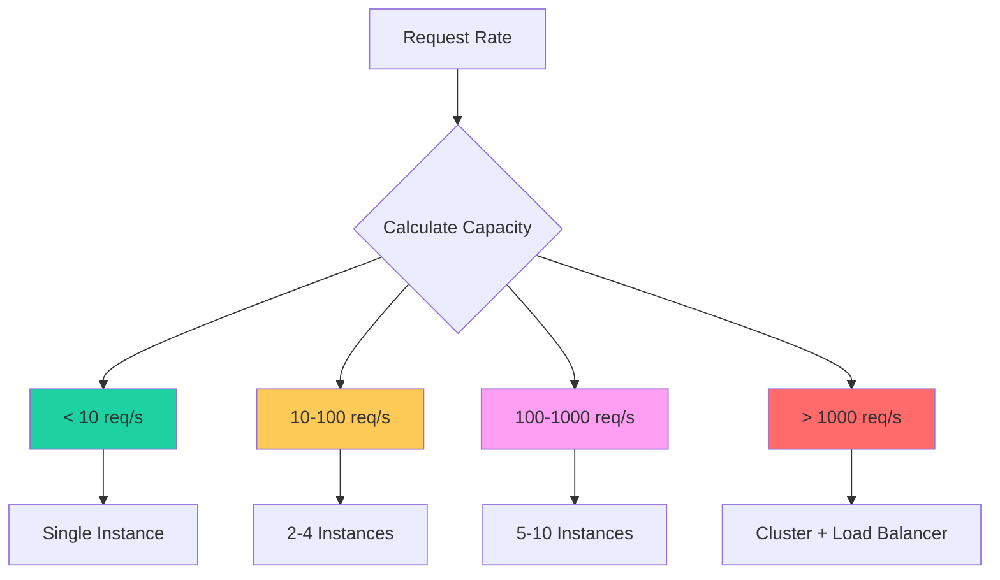

# Admin Guide

Complete guide for deploying, operating, and maintaining InferFlux in production environments.

## Overview



## Deployment Matrix

### Environment Comparison

| Environment | Use Case | Scalability | Operations | Cost |
|------------|----------|-------------|------------|------|
| **Local Dev** | Development, testing | Single instance | Manual | Free |
| **Docker** | Small production, edge | Manual scaling | Docker compose | Low |
| **Kubernetes** | Enterprise production | Auto-scaling | Helm charts | Medium |
| **Bare Metal** | High performance, on-prem | Manual scaling | Systemd | Variable |

### Deployment Options



## Local Development

### Quick Start

```bash
# Clone repository
git clone https://github.com/your-org/inferflux.git
cd inferflux

# Initialize submodules
git submodule update --init --recursive

# Build
./scripts/build.sh

# Run dev server
./scripts/run_dev.sh --config config/server.yaml
```

### Development Configuration

**Minimal `config/server.yaml`:**
```yaml
server:
  http_port: 8080
models:
  - id: tinyllama
    path: models/tinyllama-1.1b.gguf
    format: gguf
    backend: cpu
    default: true
runtime:
  cuda:
    enabled: false
auth:
  api_keys:
    - key: dev-key-123
      scopes: [generate, read, admin]
logging:
  level: debug
  format: text
```

### Tips
- Use CPU backend for faster iteration
- Set `logging.level: debug` for troubleshooting
- Enable `INFERFLUX_DISABLE_STARTUP_ADVISOR=true` to suppress recommendations

## Docker Deployment

### Building Image

```dockerfile
# Dockerfile
FROM ubuntu:22.04

RUN apt-get update && apt-get install -y \
    build-essential \
    cmake \
    git \
    libssl-dev

WORKDIR /app
COPY . .
RUN ./scripts/build.sh

EXPOSE 8080
CMD ["./build/inferfluxd", "--config", "config/server.yaml"]
```

### Running Container

```bash
# Build image
docker build -t inferflux:latest .

# Run container
docker run -d \
  --name inferflux \
  -p 8080:8080 \
  -v $(pwd)/models:/app/models \
  -v $(pwd)/config:/app/config \
  -e INFERFLUX_MODEL_PATH=/app/models/tinyllama-1.1b.gguf \
  inferflux:latest

# View logs
docker logs -f inferflux

# Stop container
docker stop inferflux
```

### Docker Compose

```yaml
# docker-compose.yml
version: '3.8'
services:
  inferflux:
    build: .
    ports:
      - "8080:8080"
    volumes:
      - ./models:/app/models
      - ./config:/app/config
      - ./logs:/app/logs
    environment:
      - INFERFLUX_MODEL_PATH=/app/models/tinyllama-1.1b.gguf
      - INFERCTL_API_KEY=prod-key-abc
    restart: unless-stopped
    healthcheck:
      test: ["CMD", "curl", "-f", "http://localhost:8080/healthz"]
      interval: 30s
      timeout: 10s
      retries: 3
```

```bash
# Start with docker compose
docker-compose up -d

# View logs
docker-compose logs -f

# Scale instances
docker-compose up -d --scale inferflux=3
```

## Kubernetes Deployment

### Architecture



### Helm Deployment

```bash
# Add InferFlux Helm repo
helm repo add inferflux https://charts.inferflux.io
helm repo update

# Install
helm install inferflux inferflux/inferflux \
  --namespace inference \
  --create-namespace \
  --set config.models[0].path=/models/tinyllama-1.1b.gguf \
  --set config.auth.apiKeys[0].key=prod-key-abc \
  --set resources.requests.memory=8Gi \
  --set resources.limits.memory=16Gi

# Upgrade
helm upgrade inferflux inferflux/inferflux \
  --namespace inference \
  --values values.yaml

# Rollback
helm rollback inferflux --namespace inference
```

### Values Configuration

```yaml
# values.yaml
replicaCount: 3

image:
  repository: inferflux/inferflux
  tag: "latest"
  pullPolicy: IfNotPresent

service:
  type: ClusterIP
  port: 8080

ingress:
  enabled: true
  className: nginx
  annotations:
    cert-manager.io/cluster-issuer: "letsencrypt-prod"
  hosts:
    - host: inference.example.com
      paths:
        - path: /
          pathType: Prefix
  tls:
    - secretName: inference-tls
      hosts:
        - inference.example.com

resources:
  requests:
    memory: 8Gi
    cpu: 4
  limits:
    memory: 16Gi
    cpu: 8
    nvidia.com/gpu: 1

autoscaling:
  enabled: true
  minReplicas: 2
  maxReplicas: 10
  targetCPUUtilizationPercentage: 80
  targetMemoryUtilizationPercentage: 80

config:
  models:
    - id: tinyllama
      path: /models/tinyllama-1.1b.gguf
      format: gguf
      backend: cuda_native
      default: true

  runtime:
    cuda:
      enabled: true
      flash_attention:
        enabled: true
      phase_overlap:
        enabled: true
    scheduler:
      max_batch_size: 32
    paged_kv:
      cpu_pages: 256

  auth:
    api_keys:
      - key: ${API_KEY}
        scopes: [generate, read]

  logging:
    level: info
    format: json

persistence:
  enabled: true
  storageClass: fast-ssd
  accessModes:
    - ReadWriteMany
  size: 100Gi

monitoring:
  enabled: true
  serviceMonitor:
    interval: 30s
```

### Horizontal Pod Autoscaler

```yaml
# hpa.yaml
apiVersion: autoscaling/v2
kind: HorizontalPodAutoscaler
metadata:
  name: inferflux-hpa
spec:
  scaleTargetRef:
    apiVersion: apps/v1
    kind: Deployment
    name: inferflux
  minReplicas: 2
  maxReplicas: 10
  metrics:
    - type: Resource
      resource:
        name: cpu
        target:
          type: Utilization
          averageUtilization: 80
    - type: Resource
      resource:
        name: memory
        target:
          type: Utilization
          averageUtilization: 80
  behavior:
    scaleDown:
      stabilizationWindowSeconds: 300
      policies:
        - type: Percent
          value: 50
          periodSeconds: 60
    scaleUp:
      stabilizationWindowSeconds: 0
      policies:
        - type: Percent
          value: 100
          periodSeconds: 30
```

## Security Configuration

### Authentication & Authorization



### API Key Configuration

```yaml
# config/server.yaml
auth:
  api_keys:
    # Production key with full access
    - key: prod-key-abc123
      scopes: [generate, read, admin]
      rate_limit_per_minute: 1000

    # Service key with limited access
    - key: service-key-xyz789
      scopes: [generate]
      rate_limit_per_minute: 100

    # Read-only analytics key
    - key: analytics-key-read456
      scopes: [read]
      rate_limit_per_minute: 500
```

### OIDC/SSO Configuration

```yaml
auth:
  oidc:
    enabled: true
    issuer: https://auth.example.com
    audience: inferflux-production
    jwks_endpoint: https://auth.example.com/.well-known/jwks.json

  # Allow both API keys and OIDC
  require_api_key: false
```

### Guardrails

```yaml
guardrails:
  # Content filtering
  blocklist:
    - secret
    - confidential
    - password
    - api_key
    - internal

  # OPA policy integration
  opa_endpoint: http://opa:8181/v1/data/inferflux/allow
  opa_timeout_ms: 500

  # Custom policies
  policies:
    - name: pci-compliance
      rules:
        - pattern: "\\b\\d{4}[\\s-]?\\d{4}[\\s-]?\\d{4}[\\s-]?\\d{4}\\b"
          action: block
          message: "Credit card numbers are not allowed"

    - name: source-code-leak-prevention
      rules:
        - pattern: "(?i)(password|secret|token)\\s*=\\s*['\"][^'\"]+['\"]"
          action: redact
          message: "Potential credential detected"
```

### Policy Store Encryption

```bash
# Enable encrypted policy storage
export INFERFLUX_POLICY_PASSPHRASE="your-secure-passphrase-here"

# Start server
./build/inferfluxd --config config/server.yaml

# Policy store is now encrypted at rest
```

### Security Checklist

Before deploying to production:

- [ ] **API Keys**: Configure production API keys with appropriate scopes
- [ ] **OIDC**: Enable SSO for enterprise environments
- [ ] **Guardrails**: Set up content filtering and OPA policies
- [ ] **Encryption**: Enable policy store encryption
- [ ] **TLS**: Enable HTTPS for all endpoints
- [ ] **Network**: Restrict access to admin endpoints
- [ ] **Audit Logging**: Enable structured JSON audit logs
- [ ] **Rate Limiting**: Configure per-key rate limits
- [ ] **Secrets Management**: Use Kubernetes secrets or vault
- [ ] **Backup**: Regular backups of policy store and audit logs

## Monitoring & Observability

### Prometheus Metrics

```yaml
# Enable metrics
server:
  enable_metrics: true
  metrics_port: 9090
```

**Key Metrics to Monitor:**

| Metric | Type | Description | Alert Threshold |
|--------|------|-------------|-----------------|
| `inferflux_scheduler_queue_depth` | Gauge | Current queue depth | > 50 |
| `inferflux_http_request_duration_seconds` | Histogram | Request latency | p99 > 2s |
| `inferflux_cuda_tokens_per_second` | Gauge | Throughput | < 50 tok/s |
| `inferflux_kv_cache_hits_total` | Counter | Cache hits | hit rate < 60% |
| `inferflux_guardrail_blocks_total` | Counter | Guardrail blocks | spike > 10/min |

### Prometheus Configuration

```yaml
# prometheus.yml
global:
  scrape_interval: 15s
  evaluation_interval: 15s

scrape_configs:
  - job_name: 'inferflux'
    kubernetes_sd_configs:
      - role: pod
        namespaces:
          names:
            - inference
    relabel_configs:
      - source_labels: [__meta_kubernetes_pod_label_app]
        regex: inferflux
        action: keep
      - source_labels: [__meta_kubernetes_pod_ip]
        target_label: __address__
        replacement: $1:8080
      - source_labels: [__meta_kubernetes_pod_name]
        target_label: pod
    metrics_path: /metrics
    scrape_interval: 10s
```

### Alerting Rules

```yaml
# alerting_rules.yml
groups:
  - name: inferflux_alerts
    rules:
      - alert: HighQueueDepth
        expr: inferflux_scheduler_queue_depth > 50
        for: 5m
        labels:
          severity: warning
        annotations:
          summary: "High queue depth on {{ $labels.pod }}"
          description: "Queue depth is {{ $value }}, consider scaling up"

      - alert: HighLatency
        expr: histogram_quantile(0.99, rate(inferflux_http_request_duration_seconds_bucket[5m])) > 2
        for: 5m
        labels:
          severity: critical
        annotations:
          summary: "High P99 latency on {{ $labels.pod }}"
          description: "P99 latency is {{ $value }}s"

      - alert: LowThroughput
        expr: inferflux_cuda_tokens_per_second < 50
        for: 10m
        labels:
          severity: warning
        annotations:
          summary: "Low throughput on {{ $labels.pod }}"
          description: "Throughput is {{ $value }} tok/s"

      - alert: OOMRisk
        expr: inferflux_cuda_vram_used_bytes / inferflux_cuda_vram_total_bytes > 0.95
        for: 5m
        labels:
          severity: critical
        annotations:
          summary: "GPU VRAM nearly full on {{ $labels.pod }}"
          description: "VRAM usage is {{ $value | humanizePercentage }}"
```

### Log Aggregation

```yaml
# Enable JSON logging
logging:
  level: info
  format: json
  audit_log: /var/log/inferflux/audit.log

# Fluentd configuration for log aggregation
# fluentd.conf
<source>
  @type tail
  path /var/log/containers/inferflux-*.log
  pos_file /var/log/fluentd-inferflux.pos
  tag kubernetes.*
  <parse>
    @type json
  </parse>
</source>

<match **>
  @type elasticsearch
  host elasticsearch
  port 9200
  logstash_format true
  logstash_prefix inferflux
</match>
```

### Health Checks

```bash
# Liveness probe (always returns 200 if alive)
curl http://localhost:8080/livez

# Readiness probe (checks if ready to serve requests)
curl http://localhost:8080/readyz

# Health check (comprehensive health status)
curl http://localhost:8080/healthz
```

## Model Management

### Model Registry



### Registry Configuration

```yaml
# registry.yaml
models:
  - id: qwen2.5-3b-instruct
    path: models/qwen2.5-3b-instruct.gguf
    format: gguf
    backend: cuda_universal
    default: true

  - id: qwen2.5-3b-safetensors
    path: models/qwen2.5-3b-safetensors/
    format: safetensors
    backend: cuda_native
    default: false
```

### Hot Reload

```bash
# Update registry.yaml to add/remove models
# Server automatically detects changes and reloads

# Verify loaded models via API
curl -H "Authorization: Bearer $API_KEY" \
  http://localhost:8080/v1/admin/models

# Output:
{
  "models": [
    {
      "id": "qwen2.5-3b-instruct",
      "backend": "cuda_universal",
      "format": "gguf",
      "loaded": true
    }
  ]
}
```

### Model Updates Without Restart

```bash
# Add new model via API
curl -X PUT \
  -H "Authorization: Bearer $API_KEY" \
  -H "Content-Type: application/json" \
  -d '{
    "id": "new-model",
    "path": "/models/new-model.gguf",
    "format": "gguf",
    "backend": "cuda_universal"
  }' \
  http://localhost:8080/v1/admin/models

# Set as default
curl -X PUT \
  -H "Authorization: Bearer $API_KEY" \
  -H "Content-Type: application/json" \
  -d '{"id": "new-model"}' \
  http://localhost:8080/v1/admin/models/default

# Unload old model
curl -X DELETE \
  -H "Authorization: Bearer $API_KEY" \
  http://localhost:8080/v1/admin/models/old-model
```

## Incident Response

### Common Issues



### Troubleshooting Commands

```bash
# Check server status
curl http://localhost:8080/healthz
curl http://localhost:8080/readyz

# View metrics
curl http://localhost:8080/metrics | grep queue_depth

# Check logs
tail -f logs/server.log | grep ERROR

# Check GPU usage
nvidia-smi

# Check model status
curl -H "Authorization: Bearer $API_KEY" \
  http://localhost:8080/v1/admin/models

# Check loaded models
curl -H "Authorization: Bearer $API_KEY" \
  http://localhost:8080/v1/models
```

### Runbook Scenarios

**Scenario 1: High Latency**

1. Check queue depth: `curl http://localhost:8080/metrics | grep queue_depth`
2. If queue_depth > 50: Scale up replicas
3. Check fairness config: Adjust priorities if needed
4. Check backend utilization: Look for GPU bottlenecks

**Scenario 2: Memory Pressure**

1. Check KV cache metrics: `curl http://localhost:8080/metrics | grep kv_cache`
2. If low hit rate: Increase `runtime.paged_kv.cpu_pages`
3. Check VRAM: `nvidia-smi`
4. If VRAM > 90%: Reduce batch size or enable KV offload

**Scenario 3: Auth Errors**

1. Verify API key format: Should be SHA-256 hashed
2. Check scopes: Ensure key has required permissions
3. Verify OIDC tokens: Check issuer and audience
4. Review audit logs: `tail -f logs/audit.log`

**Scenario 4: Model Churn**

1. Use model registry: Add models via registry.yaml or API
2. Avoid restarts: Use hot reload instead
3. Monitor model load time: `metrics | grep model_load_duration`
4. Preload models: Load common models at startup

## Capacity Planning

### Hardware Requirements

| Model Size | VRAM | System RAM | CPU | GPU | Recommended Use |
|------------|------|------------|-----|-----|-----------------|
| 1B (Q4) | 2 GB | 4 GB | 4 cores | Any | Development |
| 3B (Q4) | 3 GB | 8 GB | 8 cores | GTX 1660+ | Small production |
| 7B (Q4) | 5 GB | 16 GB | 8 cores | RTX 3060+ | Medium production |
| 14B (Q4) | 9 GB | 32 GB | 16 cores | RTX 3080+ | Large production |
| 32B (Q4) | 20 GB | 64 GB | 32 cores | RTX 4090/A100 | Enterprise |

### Scaling Guidelines



### Performance Tuning

**Startup Advisor Recommendations:**
```bash
# Start server to see recommendations
./build/inferfluxd --config config/server.yaml

# Example output:
[INFO] startup_advisor: [RECOMMEND] batch_size: 16966 MB VRAM free
  — increase runtime.scheduler.max_batch_size to 56 (current: 8)
[INFO] startup_advisor: [RECOMMEND] phase_overlap: CUDA enabled
  — set runtime.cuda.phase_overlap.enabled: true
```

## Backup & Recovery

### Backup Strategy

```bash
#!/bin/bash
# backup.sh

DATE=$(date +%Y%m%d_%H%M%S)
BACKUP_DIR=/backups/inferflux/$DATE

# Create backup directory
mkdir -p $BACKUP_DIR

# Backup configuration
cp -r /etc/inferflux/config $BACKUP_DIR/

# Backup policy store (encrypted)
cp /etc/inferflux/policy_store.conf $BACKUP_DIR/

# Backup audit logs
cp /var/log/inferflux/audit.log $BACKUP_DIR/

# Backup model registry
cp /etc/inferflux/registry.yaml $BACKUP_DIR/

# Create tarball
tar -czf $BACKUP_DIR.tar.gz $BACKUP_DIR
rm -rf $BACKUP_DIR

# Upload to S3
aws s3 cp $BACKUP_DIR.tar.gz s3://backups/inferflux/

echo "Backup completed: $BACKUP_DIR.tar.gz"
```

### Recovery Procedure

```bash
#!/bin/bash
# restore.sh

BACKUP_FILE=$1

# Extract backup
tar -xzf $BACKUP_FILE -C /tmp/restore

# Restore configuration
cp -r /tmp/restore/config/* /etc/inferflux/config/

# Restore policy store
cp /tmp/restore/policy_store.conf /etc/inferflux/

# Restore model registry
cp /tmp/restore/registry.yaml /etc/inferflux/

# Restart server
systemctl restart inferflux

echo "Restore completed, server restarted"
```

## Maintenance

### Rolling Updates

```bash
# Kubernetes rolling update
helm upgrade inferflux ./charts/inferflux \
  --namespace inference \
  --set image.tag=new-version \
  --wait

# Monitor rollout
kubectl rollout status deployment/inferflux -n inference

# Rollback if needed
kubectl rollout undo deployment/inferflux -n inference
```

### Log Rotation

```bash
# /etc/logrotate.d/inferflux
/var/log/inferflux/*.log {
    daily
    rotate 14
    compress
    delaycompress
    notifempty
    create 0640 inferflux inferflux
    sharedscripts
    postrotate
        systemctl reload inferflux > /dev/null 2>&1 || true
    endscript
}
```

### Health Monitoring

```yaml
# health_check.sh
#!/bin/bash
HEALTH_URL="http://localhost:8080/healthz"
ALERT_EMAIL="ops@example.com"

if ! curl -f -s $HEALTH_URL > /dev/null; then
    echo "InferFlux health check failed!" | mail -s "Alert: InferFlux Down" $ALERT_EMAIL
    systemctl restart inferflux
fi
```

## Best Practices

### DO's ✅

1. **Use Startup Advisor** - Let the advisor recommend optimal settings
2. **Enable Metrics** - Always enable Prometheus metrics in production
3. **Secure Secrets** - Use Kubernetes secrets or vault for API keys
4. **Enable TLS** - Use HTTPS for all external endpoints
5. **Configure Guardrails** - Set up content filtering and OPA policies
6. **Monitor Alerts** - Set up alerting rules for critical metrics
7. **Regular Backups** - Backup config, policies, and audit logs daily
8. **Test Recovery** - Test restore procedures monthly

### DON'Ts ❌

1. **Don't use default keys** - Change dev-key-123 in production
2. **Don't skip auth** - Always enable authentication
3. **Don't ignore alerts** - Investigate all critical alerts
4. **Don't disable logging** - Keep audit logs for compliance
5. **Don't skip updates** - Keep server updated with security patches
6. **Don't hardcode paths** - Use environment variables
7. **Don't run as root** - Use dedicated user account

---

**Next:** [Configuration Reference](CONFIG_REFERENCE.md) | [Monitoring Guide](MONITORING.md) | [Developer Guide](DeveloperGuide.md)
