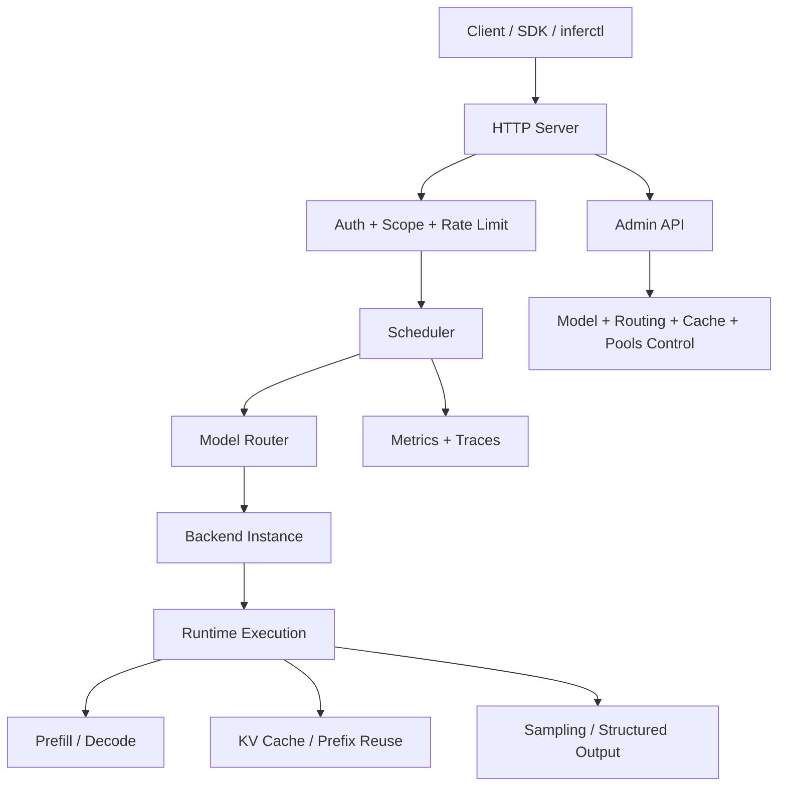
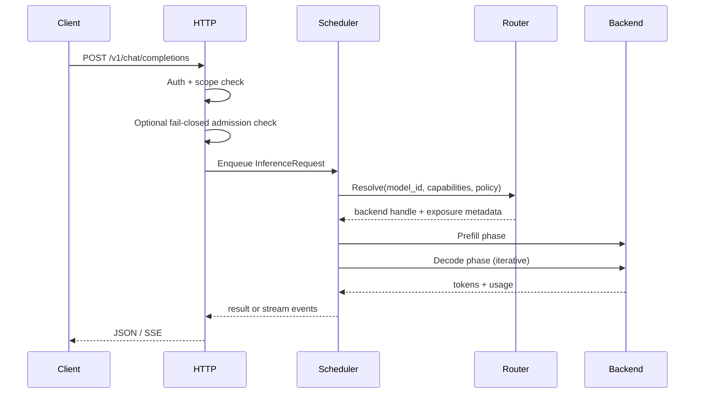
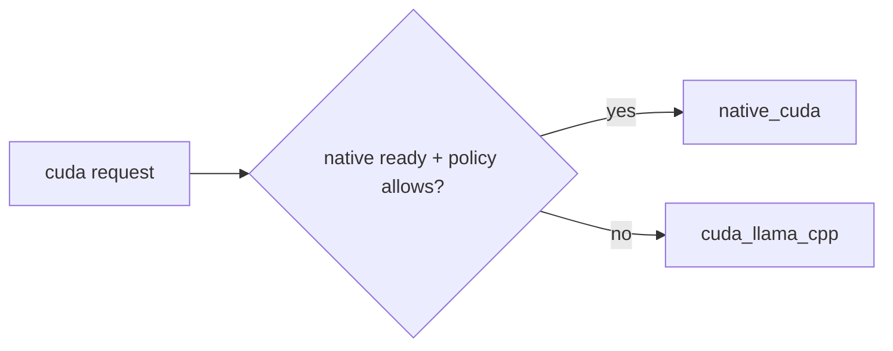

# InferFlux Architecture

**Status:** Canonical (OSS)  
**Snapshot date:** March 9, 2026

## 1) One-Screen Runtime Map

## 2) Request Lifecycle Contract

## 3) Core Contracts by Layer

| Layer | Contract | Key files |
|---|---|---|
| HTTP + Auth | OpenAI-compatible endpoints with scope enforcement and optional fail-closed generation admission | `server/http/http_server.cpp`, `server/auth/*` |
| Scheduler | Fair, phase-aware batch construction and execution | `scheduler/scheduler.cpp`, `runtime/execution/batch_executor.cpp` |
| Model routing | Capability and policy-driven backend resolution | `scheduler/model_router.h`, `scheduler/single_model_router.cpp` |
| Backend runtime | Prefill/decode execution with per-sequence state | `runtime/backends/*` |
| Policy/admin | Guardrails, rate-limit, API keys, routing, models, cache, pools | `policy/*`, `/v1/admin/*` handlers |
| Observability | Prometheus metrics + traces for queueing/runtime and distributed transport health | `server/metrics/*`, `server/observability/*` |

## 4) Scheduler and Runtime Execution Model

| Concern | Current contract |
|---|---|
| Request admission | HTTP-layer async admission into scheduler queues; optional fail-closed policy on degraded distributed transport |
| Throughput core | Sync-first batched execution inside the runtime |
| Phase model | Prefill and decode remain explicit |
| Mixed workloads | Prefill/decode overlap exists for native CUDA in the sync path |
| Batch quality | Prefix-affinity scoring and mixed-step knobs influence batch construction |
| Async backend API | Native CUDA intentionally returns `SupportsAsyncUnifiedBatch()==false` today because the sync path preserves throughput better |
| Decode-worker mode | Optional for split prefill/decode deployments |
| Cancellation/streaming | Request-scoped cancellation and SSE token callbacks are preserved through decode |

## 5) Model Routing and Capability Semantics

| Contract point | Behavior |
|---|---|
| Explicit model ID | Resolve exact model or fail fast |
| Default model path | Use configured default, then policy-governed compatible fallback if allowed |
| Capability gating | Reject incompatible backends before execution |
| Identity exposure | API/CLI expose requested backend, selected backend, provider, fallback, and reason |
| Strict-native policy | Requests can require native execution and return deterministic `backend_policy_violation` errors |

## 6) Backend Identity Contract

| Field | Meaning |
|---|---|
| `requested_backend` | backend hint from config/admin intent |
| `exposed_backend` | backend actually selected |
| `provider` | runtime provider path (`native` or `llama_cpp`) |
| `fallback` | `true` when routing/policy changed the selected backend |
| `fallback_reason` | machine-visible reason for changed selection |

This contract is reflected in `/v1/models`, `/v1/models/{id}`, and `inferctl models`.

## 6.1) Two-CUDA-Backend Value Matrix

| Axis | `native_cuda` provider | `cuda_llama_cpp` provider |
|---|---|---|
| Primary value | Throughput/control path owned by InferFlux | Stable compatibility baseline and deterministic fallback |
| Runtime core | `NativeCudaRuntime` + native loaders + native metrics | llama.cpp runtime behind InferFlux control plane |
| Strong today | Native safetensors path, GGUF loader detection, memory-first dequant policy, KV auto-tune metrics, explicit provider identity | Mature GGUF behavior, lower operational risk, broad compatibility |
| Current limits | Async unified batch intentionally off; quantized GGUF throughput and native-owned parity are still maturing | Lower headroom for first-party kernel/runtime innovation |
| Operational role | Preferred when native is ready and policy allows | Compatibility/safety net when policy permits fallback |

## 6.2) Memory and State Lifecycle Contract

| Area | Current contract |
|---|---|
| Model format detection | Loader is selected from artifact structure and GGUF metadata rather than filename guesses |
| Model weights | Loaded once per model instance; treated as shared runtime state |
| Dequantized projections | Policy-scoped as `none`, `batch`, or `model`; native quantized path defaults to memory-first `none` |
| KV cache | Separate lifecycle from weights; precision is fixed at model-load scope |
| KV sizing | Native CUDA can auto-tune max sequence length against a VRAM budget and exports planning metrics |
| Prefix reuse | Token-aligned reuse with balanced acquire/release accounting |
| Session reuse | Optional `session_id` lease layer with TTL; disabled in decode-worker mode today |

## 7) Distributed Runtime Status

| Area | Current state |
|---|---|
| Topology foundation | `ParallelContext` and split prefill/decode roles exist |
| KV transport | In-process channel path plus SHM-backed transport exist |
| Ticket lifecycle | Enqueue, acknowledge, commit, and timeout states are tracked and exported |
| Health semantics | Decode nodes gate on loaded model, live workers, transport timeout streak/debt, and admin pools visibility |
| Admission semantics | Optional fail-closed generation admission can stop new work when distributed transport is degraded |
| Missing for maturity | Sequence ownership cleanup, decode-worker session reuse, multi-process proof, and CI fault matrix |

## 8) Admin Control Plane Contract

| Domain | Endpoint family |
|---|---|
| Guardrails | `/v1/admin/guardrails` |
| Rate limits | `/v1/admin/rate_limit` |
| API keys | `/v1/admin/api_keys` |
| Model operations | `/v1/admin/models`, `/v1/admin/models/default` |
| Routing policy | `/v1/admin/routing` |
| Cache operations | `/v1/admin/cache`, `/v1/admin/cache/warm` |
| Pool/runtime health | `/v1/admin/pools` |

See [API Surface](API_SURFACE.md) for the full method matrix.

## 9) Operational Invariants

1. No request enters backend execution before auth/scope checks pass.
2. Scheduler enforces batch/token limits before dispatch.
3. Capability mismatches are rejected during routing, not discovered late in streaming.
4. Backend/provider identity remains machine-visible across API and CLI surfaces.
5. Native throughput optimization must not rely on per-step async fragmentation.
6. Decode-node readiness requires both loaded weights and all configured workers alive.
7. Distributed transport degradation can surface in `/readyz`, `/v1/admin/pools`, and optionally generation admission.

## 10) Extension Points

| Extension | Where to add it |
|---|---|
| New backend provider | `runtime/backends/` + backend factory + capability map |
| New routing policy | scheduler/router + `/v1/admin/routing` |
| New admin domain | HTTP admin handlers + `inferctl admin` |
| New metrics family | `server/metrics/*` + [MONITORING](MONITORING.md) |
| New request feature | request schema + scheduler requirements + capability gating |

## 11) What This Doc Does Not Do

This doc is the runtime contract, not the benchmark log. Historical perf snapshots and one-off evidence belong in [ARCHIVE_INDEX](ARCHIVE_INDEX.md).

## 12) Related Docs

- [VISION](VISION.md)
- [PRD](PRD.md)
- [Roadmap](Roadmap.md)
- [TechDebt_and_Competitive_Roadmap](TechDebt_and_Competitive_Roadmap.md)
- [MONITORING](MONITORING.md)
- [design/NATIVE_CUDA_SGLANG_INSPIRED_EXECUTION_PLAN](design/NATIVE_CUDA_SGLANG_INSPIRED_EXECUTION_PLAN.md)
