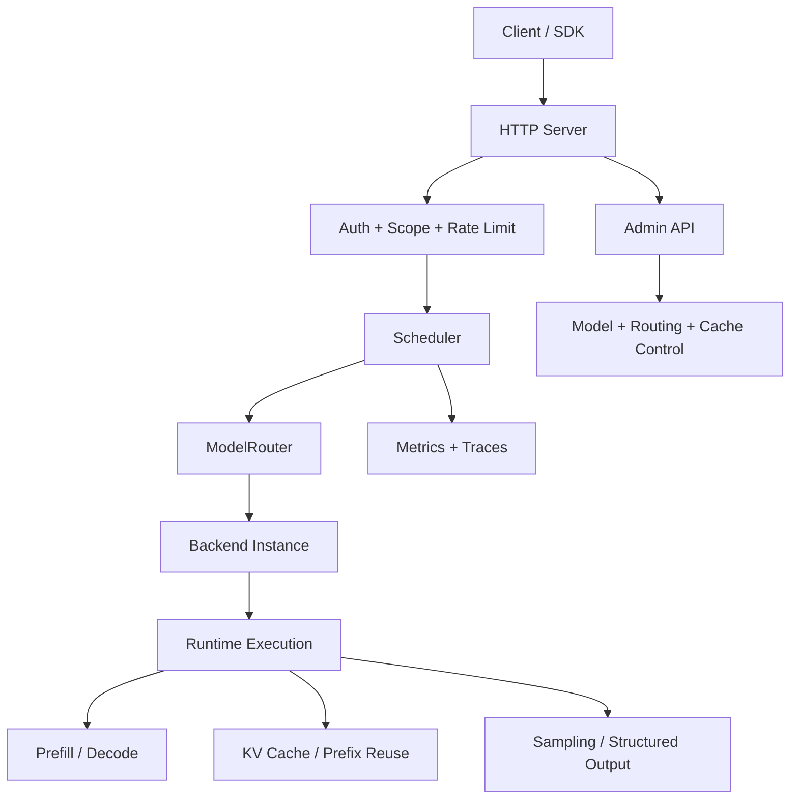
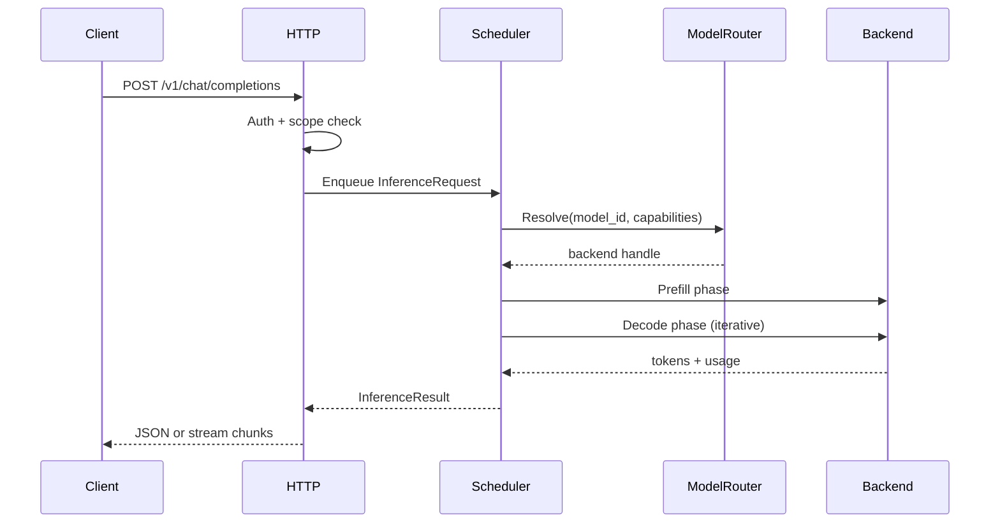
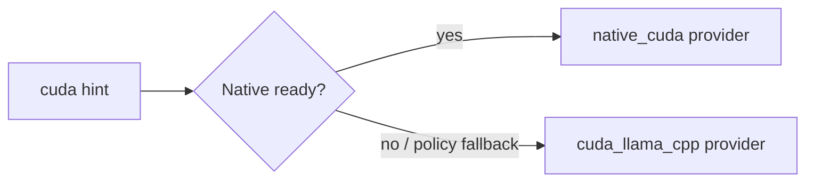
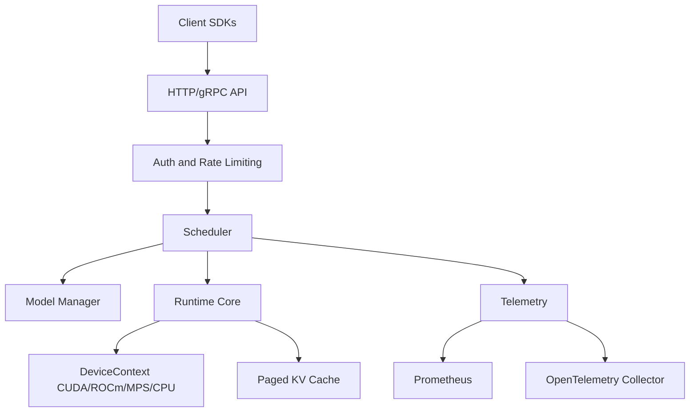
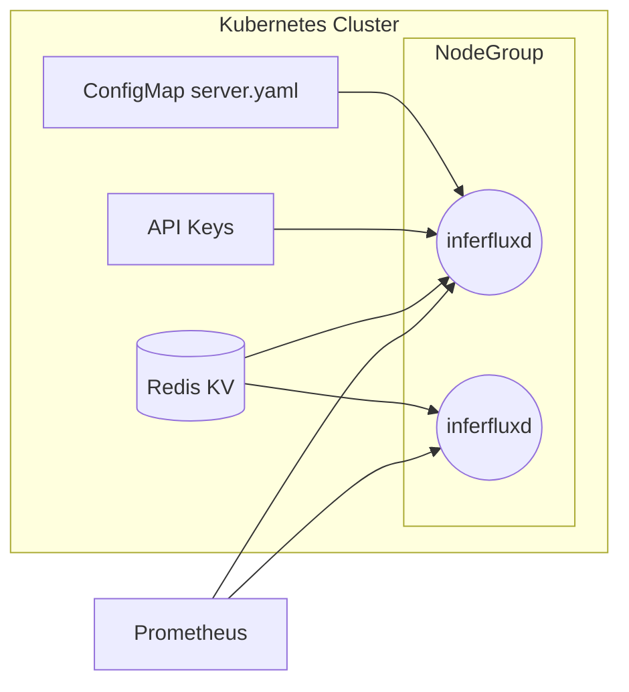

# InferFlux Architecture

**Status:** Canonical (OSS)

## 1) One-Screen Runtime Map

## 2) Request Lifecycle Contract

## 3) Core Contracts by Layer

| Layer | Contract | Key files |
|---|---|---|
| HTTP + Auth | OpenAI-compatible endpoints with scope enforcement | `server/http/http_server.cpp`, `server/auth/*` |
| Scheduler | Fair, phase-aware batch construction and execution | `scheduler/scheduler.cpp`, `scheduler/request_batch.h` |
| Model routing | Resolve model/backend using capability and policy constraints | `scheduler/model_router.h`, `scheduler/single_model_router.cpp` |
| Backend runtime | Prefill/decode execution with per-sequence state | `runtime/backends/*` |
| Policy/admin | Guardrails, rate-limit, API keys, model lifecycle ops | `policy/*`, `/v1/admin/*` handlers |
| Observability | Prometheus metrics + traces for queueing/runtime | `server/metrics/*`, `server/observability/*` |

## 4) Scheduler and Batching Semantics

| Concern | Current contract |
|---|---|
| Batch unit | `InferenceRequest` grouped into scheduler-owned batch slices |
| Phase separation | Prefill and decode are explicit phases |
| Fairness | Priority-aware scheduling with timeslice support |
| Cancellation | Request-scoped cancellation propagated through decode loop |
| Streaming | Token callback path from scheduler/runtime to HTTP SSE |
| Budgeting | Batch-size and token-budget caps enforced before execution |

## 5) Model Routing and Capability Contracts

| Contract point | Behavior |
|---|---|
| Explicit model ID | Resolve exact model or fail with API contract error |
| Default model path | Use configured default, then capability fallback policy if allowed |
| Capability gating | Reject incompatible backends early (routing stage) |
| Identity exposure | API/CLI expose requested vs selected backend/provider metadata |
| Admin lifecycle | load/unload/set-default are strict and contract-tested |

## 6) Backend Identity Contract

| Field | Meaning |
|---|---|
| `requested_backend` | backend hint from config/admin load intent |
| `exposed_backend` | backend actually selected |
| `provider` | provider path (`native` or `llama_cpp`) |
| `fallback` | `true` when routing/policy changed selected backend |
| `fallback_reason` | diagnostic reason for changed selection |

This contract is reflected in `/v1/models`, `/v1/models/{id}`, and `inferctl models` JSON/table outputs.

## 6.1) Two-CUDA-Backend Value Matrix

| Axis | `native_cuda` provider | `cuda_llama_cpp` provider |
|---|---|---|
| Primary value | Throughput-core + kernel control path | Compatibility + broad feature coverage |
| Runtime core | InferFlux native runtime (`NativeCudaRuntime`) | llama.cpp runtime (`LlamaCPUBackend` CUDA target) |
| Model format posture | First-class safetensors; GGUF path in active maturity work | Strong GGUF compatibility path |
| Feature surface today | Generation core + mixed decode/prefill overlap path + KV prefix/serialize contracts; endpoint parity for completion/chat/embeddings is contract-closed via native parity delegate paths when available | Full mature llama.cpp feature surface used as compatibility baseline |
| Concurrency contract today | Async unified-batch API is intentionally disabled in native runtime (`SupportsAsyncUnifiedBatch()==false`), so overlap is currently delivered through synchronous mixed-batch execution | Async unified-batch contract is available through llama.cpp path |
| Policy semantics | Capability routing is explicit; if native parity contract is unavailable, fallback/422 behavior is policy-driven and observable in backend exposure fields | Serves as deterministic fallback/safety net under policy and capability checks |
| Fallback role | Preferred when ready and policy allows | Deterministic fallback when native is unavailable or policy routes to llama.cpp |
| Operational risk profile | Faster-moving, higher upside, active maturity backlog | Lower risk, stable baseline for OSS users and production fallback |

Keeping both backends is intentional: one maximizes control/performance headroom (`native_cuda`), the other maximizes compatibility/stability (`cuda_llama_cpp`).

## 7) Prefix/KV Reuse Contract

| Area | Contract |
|---|---|
| Prefix matching | Token-aligned matching for safe reuse |
| Sequence ownership | KV sequence state remains backend-instance scoped |
| Slot accounting | Acquire/release behavior must remain balanced under reuse |
| Metrics | Prefix hit/reuse and batching counters exported for tuning |

## 8) Admin Control Plane Contract

| Domain | Endpoint family |
|---|---|
| Guardrails | `/v1/admin/guardrails` |
| Rate limits | `/v1/admin/rate_limit` |
| API keys | `/v1/admin/api_keys` |
| Model operations | `/v1/admin/models`, `/v1/admin/models/default` |
| Routing policy | `/v1/admin/routing` |
| Cache operations | `/v1/admin/cache`, `/v1/admin/cache/warm` |

See [API Surface](API_SURFACE.md) for full method-level matrix.

## 9) Operational Invariants

1. No request enters backend execution without successful auth/scope checks.
2. Scheduler must enforce token/batch limits before dispatch.
3. Routing must reject incompatible capability requests early.
4. Backend/provider identity must be machine-visible in API/CLI outputs.
5. Metrics endpoints remain stable across runtime policy changes.
6. Admin operations remain fail-fast on invalid argument combinations.

## 10) Extension Points

| Extension | Where to add |
|---|---|
| New backend provider | `runtime/backends/` + backend factory + capability map |
| New routing policy | model router + `/v1/admin/routing` contract |
| New admin domain | HTTP admin handlers + `inferctl admin` command surface |
| New metrics family | `server/metrics/*` + monitoring docs |
| New request feature (e.g., decoding mode) | request schema + scheduler requirements + capability gating |

## 11) Architecture Boundaries (What this doc does not do)

This canonical doc intentionally avoids deep experiment logs and long benchmark narratives.
For historical evidence and snapshots, use:

- [ARCHIVE_INDEX](ARCHIVE_INDEX.md)
- [Roadmap](Roadmap.md)
- [TechDebt and Competitive Roadmap](TechDebt_and_Competitive_Roadmap.md)

## 12) Additional Reference Diagrams

## 13) Related Docs

- [Quickstart](Quickstart.md)
- [CONFIG_REFERENCE](CONFIG_REFERENCE.md)
- [Admin Guide](AdminGuide.md)
- [Developer Guide](DeveloperGuide.md)
- [API Surface](API_SURFACE.md)
