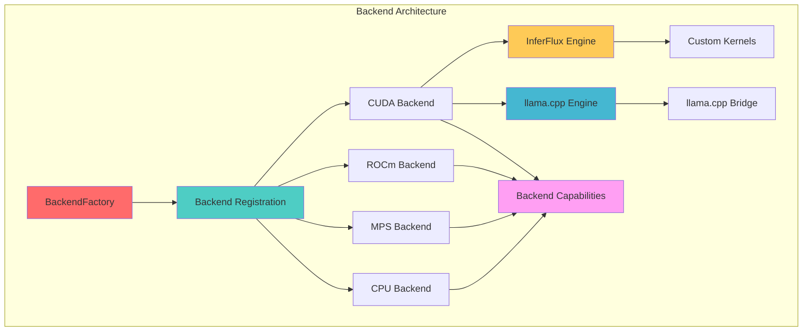
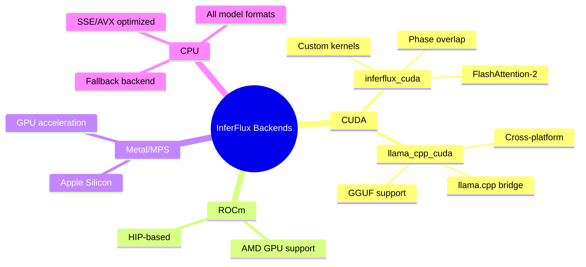
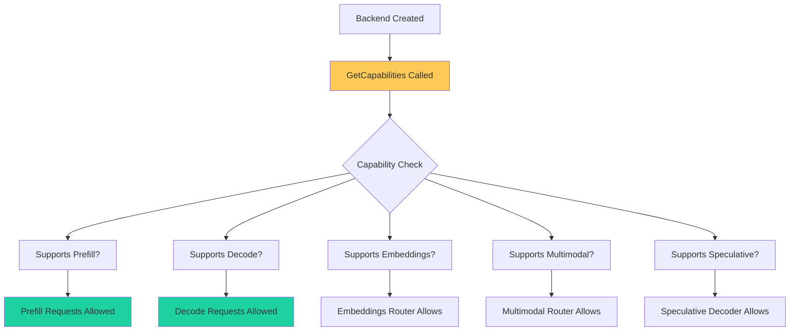
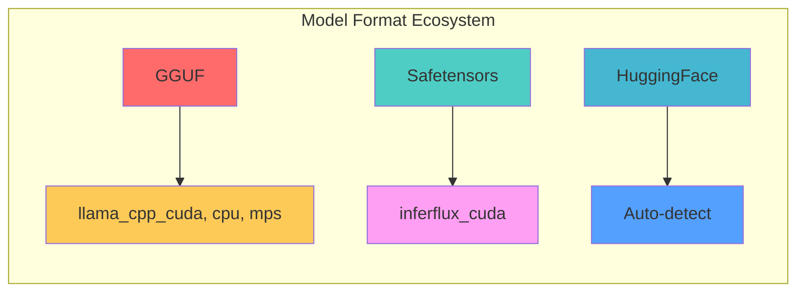
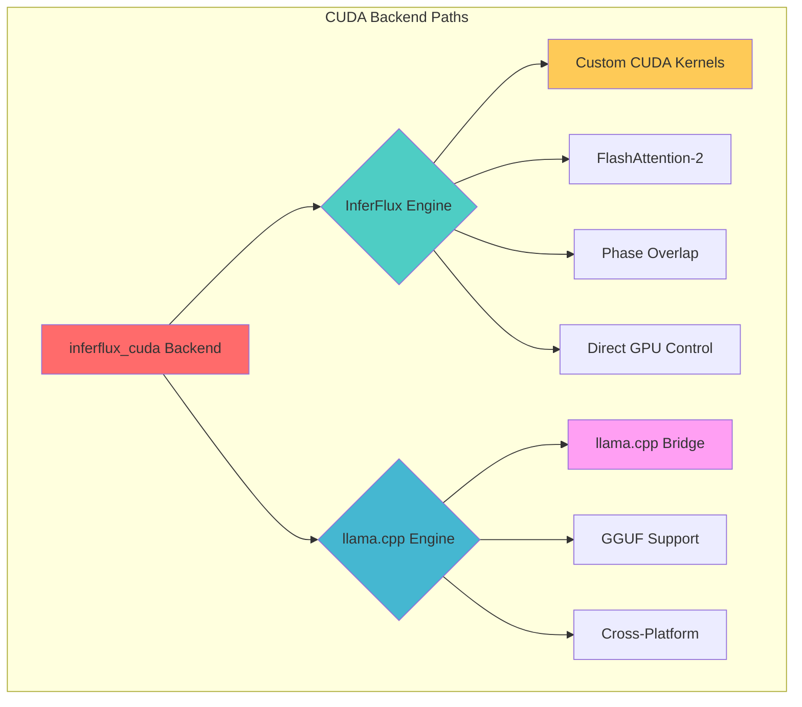
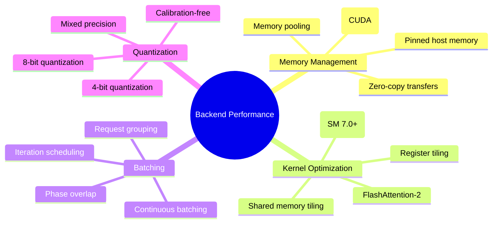
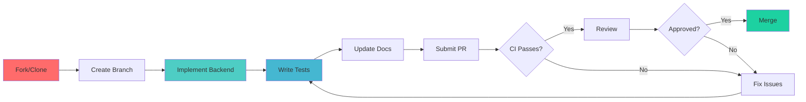

# Backend Development Guide

Complete guide to developing and extending InferFlux backends.

## Overview



## Backend Architecture

### Core Components

| Component | Location | Purpose |
|-----------|----------|---------|
| **BackendInterface** | `runtime/backends/common/backend_interface.h` | Pure-virtual base for all backends |
| **BackendConfig** | `runtime/backends/common/backend_config.h` | Model load configuration (no llama.h dependency) |
| **BackendFactory** | `runtime/backends/backend_factory.cpp` | Backend registration and creation |
| **BackendRegistry** | `runtime/backends/backend_registry.h` | Creator function registry |
| **BackendCapabilities** | `runtime/backends/backend_capabilities.h` | Feature discovery and routing |
| **DeviceContext** | `runtime/device_context.h` | Hardware abstraction |
| **BackendManager** | `runtime/backends/backend_manager.cpp` | Lifecycle management |

### Backend Types



## Creating a Standalone Backend

Standalone backends inherit directly from `BackendInterface` — no llama.cpp dependency, no `LlamaCppBackend` inheritance required. All methods on `BackendInterface` have default implementations, so you only override what your backend supports.

### Step 1: Define Backend Class

```cpp
// runtime/backends/tensorrt/tensorrt_backend.h
#pragma once
#include "runtime/backends/common/backend_config.h"
#include "runtime/backends/common/backend_interface.h"

#include <filesystem>
#include <memory>
#include <string>
#include <vector>

namespace inferflux {

class TensorRtBackend : public BackendInterface {
public:
  TensorRtBackend();
  ~TensorRtBackend() override;

  // --- Required overrides ---
  std::string Name() const override { return "tensorrt"; }
  bool LoadModel(const std::filesystem::path &model_path,
                 const LlamaBackendConfig &config = {}) override;
  bool IsReady() const override;

  // --- Inference (override what you support) ---
  std::vector<UnifiedBatchOutput>
  ExecuteUnifiedBatch(const std::vector<UnifiedBatchInput> &inputs) override;
  PrefillResult Prefill(const std::string &prompt, int sequence_id) override;
  std::string
  Decode(int n_past, int sequence_id, int max_tokens,
         const std::function<bool(const std::string &, const TokenLogprob *)>
             &on_chunk = {},
         const std::function<bool()> &should_stop = {},
         int logprob_top_n = 0,
         std::vector<TokenLogprob> *out_logprobs = nullptr,
         int first_token = -1,
         const std::vector<std::string> &stop_seqs = {}) override;

  // --- Sequence lifecycle ---
  void FreeSequence(int sequence_id) override;

  // --- Capabilities ---
  BackendCapabilities ReportCapabilities() const override;
  int ContextSize() const override;

private:
  // TensorRT-specific state — no llama.h types needed
  // ...
};

} // namespace inferflux
```

### Step 2: Implement the Backend

```cpp
// runtime/backends/tensorrt/tensorrt_backend.cpp
#include "runtime/backends/tensorrt/tensorrt_backend.h"
#include "server/logging/logger.h"

namespace inferflux {

TensorRtBackend::TensorRtBackend() = default;
TensorRtBackend::~TensorRtBackend() = default;

bool TensorRtBackend::LoadModel(const std::filesystem::path &model_path,
                                const LlamaBackendConfig &config) {
  // Load TensorRT engine — no llama.cpp involvement
  log::Info("tensorrt", "Loading model from " + model_path.string());
  // ...
  return true;
}

BackendCapabilities TensorRtBackend::ReportCapabilities() const {
  BackendCapabilities caps;
  caps.supports_logprobs = true;
  caps.supports_structured_output = false;  // See "Grammar Delegation" below
  caps.supports_embeddings = true;
  caps.supports_vision = false;
  return caps;
}

// Implement Prefill, Decode, FreeSequence, etc.
// Methods you don't override return safe defaults (empty results, false, 0).

} // namespace inferflux
```

### Step 3: Self-Register via BackendRegistry

Backends self-register using a static initializer in their `.cpp` file.
`BackendFactory` discovers them via the registry — no need to add includes
or creation logic to `backend_factory.cpp`.

```cpp
// runtime/backends/tensorrt/tensorrt_backend.cpp
#include "runtime/backends/backend_registry.h"
#include "runtime/backends/tensorrt/tensorrt_backend.h"

namespace inferflux {

// Self-registration: runs at static-init time, before main().
// BackendFactory::Create("cuda") finds this via BackendRegistry::Has().
#ifdef INFERFLUX_HAS_TENSORRT
static const bool kRegistered =
    (BackendRegistry::Instance().Register(
         LlamaBackendTarget::kCuda, BackendProvider::kNative,
         [] { return std::make_shared<TensorRtBackend>(); }),
     true);
#endif

} // namespace inferflux
```

> **Note:** `BackendFactory` contains zero concrete backend `#include` directives.
> All backend creation flows through `BackendRegistry`. This is enforced by design.

### Step 4: Add to CMakeLists.txt

```cmake
# Add your source files to the INFERFLUX_CORE_SOURCES list in CMakeLists.txt
list(APPEND INFERFLUX_CORE_SOURCES
    runtime/backends/tensorrt/tensorrt_backend.cpp
)
```

### What You Get for Free

Methods with sensible defaults (no override needed unless you support them):

| Method | Default | Override when... |
|--------|---------|------------------|
| `Embed()` | Returns `{}` | Your backend produces embeddings |
| `SupportsVision()` | `false` | Your backend handles image inputs |
| `IsMoE()` | `false` | Your backend loads MoE architectures |
| `SetupSampler()` / `TeardownSampler()` | No-op | You implement custom sampling |
| `SerializeSequence()` / `HydrateSequence()` | Empty/false | You support KV cache serialization |
| `BeginFreeSequence()` / `PollFreeSequence()` | Sync free | You need async sequence cleanup |
| `FormatChatMessages()` | Empty | You ship a chat template |

## Backend Capabilities

### Capability Discovery



### Implementing Capabilities

```cpp
BackendCapabilities ReportCapabilities() const override {
    BackendCapabilities caps;

    // Feature flags — report what your backend actually supports
    caps.supports_logprobs = true;             // Can compute token log-probabilities
    caps.supports_structured_output = false;   // Grammar-constrained generation
    caps.supports_embeddings = true;           // Can produce embeddings
    caps.supports_vision = false;              // Can process image inputs
    caps.supports_speculative_decoding = false; // Can act as draft/target

    return caps;
}
```

The router uses these capabilities to decide request routing. Backends that report `false` for a capability will not receive requests requiring it (requests are routed to a capable backend or rejected with a clear error).

## Grammar and Structured Output Delegation

Grammar-constrained generation (JSON schema, regex, CFG) is the **one capability that still requires llama.cpp's sampler chain** (`llama_sampler_init_grammar`). This section documents how the architecture handles it without leaking the dependency into the interface.

### How It Works

1. **Capability reporting**: Every backend reports `supports_structured_output` via `ReportCapabilities()`. The router checks this before dispatching grammar-constrained requests.

2. **Standalone backends**: A backend that doesn't support grammar simply reports `supports_structured_output = false`. Requests requiring grammar are either rejected with a clear error or routed to a backend that supports it (via capability-based fallback in the router).

3. **NativeGpuBackend parity delegation**: The InferFlux native CUDA backend (`inferflux_cuda`) handles grammar by internally delegating to a private `LlamaCppBackend` parity instance. This is a **private implementation detail** — the parity backend is created lazily, lives behind `parity_backend_mutex_`, and is never exposed through the interface.

4. **Interface methods**: `SetupSampler(grammar, root, params)` and `TeardownSampler()` exist on `BackendInterface` with no-op defaults. A standalone backend that implements its own grammar engine (e.g., Outlines, lm-format-enforcer) can override these directly.

### Decision Tree for New Backends

```
Does your backend need grammar/structured output?
  |
  +-- No --> Report supports_structured_output = false. Done.
  |          Router will reject or fallback grammar requests.
  |
  +-- Yes --> Do you have your own grammar engine?
                |
                +-- Yes --> Override SetupSampler/TeardownSampler.
                |           Report supports_structured_output = true.
                |
                +-- No  --> Ship without it. Grammar requests route
                            to a llama.cpp backend via capability fallback.
```

### Key Files

| File | Role |
|------|------|
| `runtime/backends/common/backend_interface.h` | `SetupSampler()`, `TeardownSampler()` defaults |
| `runtime/backends/native/native_gpu_backend.cpp` | Parity delegation for grammar in `Decode()` |
| `scheduler/single_model_router.cpp` | Capability-based routing, `supports_structured_output` check |
| `runtime/backends/backend_capabilities.h` | `BackendCapabilities::supports_structured_output` field |

## Model Format Support

### Supported Formats



### Adding Format Support

```cpp
// model/model_format.cpp
ModelFormat DetectModelFormat(const std::string &path) {
    // Check for safetensors
    if (std::filesystem::exists(path + "/model.safetensors")) {
        return ModelFormat::Safetensors;
    }

    // Check for GGUF
    if (path.ends_with(".gguf")) {
        return ModelFormat::GGUF;
    }

    // Check for HuggingFace structure
    if (std::filesystem::exists(path + "/config.json")) {
        return ModelFormat::HuggingFace;
    }

    return ModelFormat::Unknown;
}
```

## CUDA Backend Development

### InferFlux vs llama.cpp Engines



### Native Kernel Executor

The InferFlux CUDA executor (`runtime/backends/cuda/inferflux_cuda_executor.cpp`) provides a framework for implementing custom CUDA kernels.

```cpp
// Example: Adding a custom attention kernel
class InferfluxCudaExecutor {
public:
    bool LaunchAttentionKernel(const AttentionParams &params) {
        // Select kernel based on hardware capability
        if (gpu_info_.sm_major >= 8) {
            return LaunchFlashAttention2(params);
        } else {
            return LaunchStandardAttention(params);
        }
    }

private:
    bool LaunchFlashAttention2(const AttentionParams &params) {
        // FA2 kernel implementation
        dim3 grid, block;
        ComputeGridBlockSize(params, &grid, &block);

        flash_attention_2_kernel<<<grid, block, 0, stream_>>>(
            params.query_ptr, params.key_ptr, params.value_ptr,
            params.output_ptr, params.seq_len, params.num_heads,
            params.head_dim
        );

        return cudaGetLastError() == cudaSuccess;
    }
};
```

### Phase Overlap Implementation

Phase overlap enables concurrent prefill and decode execution on CUDA streams.

```cpp
class CudaBackend {
private:
    cudaStream_t prefill_stream_;
    cudaStream_t decode_stream_;
    std::mutex overlap_mutex_;

public:
    bool EnablePhaseOverlap(bool enable) {
        if (enable) {
            // Create separate streams
            cudaStreamCreate(&prefill_stream_);
            cudaStreamCreate(&decode_stream_);
            phase_overlap_enabled_ = true;
        } else {
            // Use single stream
            phase_overlap_enabled_ = false;
        }
        return true;
    }

    token_id_t Decode() {
        std::lock_guard<std::mutex> lock(overlap_mutex_);

        // Record decode lane submission
        metrics_->RecordLaneSubmission();

        // Launch decode on decode stream
        token_id_t token = LaunchDecodeOnStream(decode_stream_);

        // Record completion
        metrics_->RecordLaneCompletion();

        return token;
    }
};
```

## Metrics and Observability

### Backend Metrics

All backends should report Prometheus metrics for observability.

```cpp
class BackendMetrics {
public:
    void RecordForwardPass(const std::string &phase, double duration_ms) {
        forward_duration_ms_.Observe(duration_ms);
        forward_passes_total_->Increment({{"phase", phase}});
    }

    void RecordTokensGenerated(size_t count) {
        tokens_generated_total_->FetchAdd(count);
    }

    void RecordBatchTokens(size_t count) {
        batch_tokens_total_->FetchAdd(count);
    }

private:
    Histogram* forward_duration_ms_;
    Counter* forward_passes_total_;
    Counter* tokens_generated_total_;
    Counter* batch_tokens_total_;
};
```

### NVTX Profiling

Use NVIDIA Tools Extension (NVTX) for Nsight Systems profiling.

```cpp
#include <nvtx3/nvToolsExt.h>

token_id_t CudaBackend::Decode() {
    // Push range for profiling
    nvtxRangePushA("Decode");

    // Sub-ranges
    nvtxRangePushA("KV_Append");
    AppendKVCache();
    nvtxRangePop();

    nvtxRangePushA("Attention");
    ComputeAttention();
    nvtxRangePop();

    nvtxRangePushA("Sampling");
    token_id_t token = SampleToken();
    nvtxRangePop();

    nvtxRangePop(); // Decode

    return token;
}
```

## Testing Backends

### Unit Tests

```cpp
// tests/unit/test_my_backend.cpp
#include "runtime/backends/my_backend/my_backend.h"

TEST_CASE("MyBackend: Load GGUF model", "[my_backend]") {
    ModelLoadRequest req;
    req.path = "models/test-model.gguf";
    req.format = ModelFormat::GGUF;

    BackendConfig config;
    config.device_id = 0;

    MyBackend backend(req, config);

    REQUIRE(backend.LoadModel() == true);
    REQUIRE(backend.PromptTokenCount() == 0);
}

TEST_CASE("MyBackend: Prefill and decode", "[my_backend]") {
    // Create backend
    MyBackend backend = CreateTestBackend();

    // Prefill
    std::vector<token_id_t> tokens = {1, 2, 3, 4, 5};
    REQUIRE(backend.Prefill(tokens) == true);

    // Decode
    token_id_t token = backend.Decode();
    REQUIRE(token > 0);

    // Cleanup
    backend.FreeSequence(0);
}
```

### Integration Tests

```bash
# Test backend with real model
./scripts/test_backend.sh \
  --backend my_backend \
  --model models/qwen2.5-3b.gguf \
  --format gguf
```

## Performance Optimization

### Optimization Strategies



### Benchmarking

```bash
# Profile backend with Nsight Systems
nsys profile \
  --output=profile.qdrep \
  --force-overwrite=true \
  ./build/inferfluxd --config config/server.cuda.yaml

# Profile kernels with NCU
ncu --set full \
  --target-processes=all \
  ./build/inferfluxd --config config/server.cuda.yaml

# Benchmark throughput
./scripts/run_throughput_gate.py \
  --server-bin ./build/inferfluxd \
  --config config/server.cuda.yaml \
  --model qwen2.5-3b \
  --backend cuda \
  --min-completion-tok-per-sec 100
```

## Debugging

### Common Issues

| Issue | Symptom | Solution |
|-------|---------|----------|
| Model fails to load | `LoadModel()` returns false | Check file path, format, permissions |
| CUDA out of memory | Allocation failures | Reduce batch size, enable KV offload |
| Wrong token output | Garbage tokens | Check tokenizer, model architecture |
| Poor performance | Low tok/s | Enable FA2, phase overlap, quantization |
| Capability errors | Requests rejected | Check `GetCapabilities()` implementation |

### Debug Logging

```cpp
#define BACKEND_DEBUG_LOG(msg, ...) \
  log::Debug("my_backend", "[DEBUG] " msg, ##__VA_ARGS__)

bool MyBackend::Prefill(const std::vector<token_id_t> &tokens) {
  BACKEND_DEBUG_LOG("Prefill: %zu tokens", tokens.size());

  for (size_t i = 0; i < tokens.size(); ++i) {
    BACKEND_DEBUG_LOG("  token[%zu] = %d", i, tokens[i]);
  }

  // ... prefill implementation
}
```

## Best Practices

### Do's ✅

1. **Use RAII** - Manage resources with smart pointers
2. **Check capabilities** - Respect backend capability limits
3. **Report metrics** - Enable observability
4. **Handle errors** - Graceful degradation on failures
5. **Document config** - Explain all configuration options
6. **Test thoroughly** - Unit + integration tests
7. **Profile code** - Use Nsight Systems/NCU

### Don'ts ❌

1. **Don't ignore errors** - Always check return values
2. **Don't hardcode paths** - Use config/env variables
3. **Don't leak memory** - Free sequences, clear caches
4. **Don't block threads** - Use async operations
5. **Don't assume hardware** - Probe capabilities
6. **Don't skip tests** - CI will catch regressions
7. **Don't break API** - Maintain backward compatibility

## Contributing

### Contribution Workflow



### Code Review Checklist

- [ ] Backend inherits from `BackendInterface` (not `LlamaCppBackend`)
- [ ] `ReportCapabilities()` reports correct capabilities
- [ ] Prometheus metrics added and documented
- [ ] Unit tests cover all code paths
- [ ] Integration tests pass with real models
- [ ] Documentation updated (CONFIG_REFERENCE.md)
- [ ] Nsight Systems profiling shows no issues
- [ ] Throughput gate passes (≥100 tok/s for 3B models)

---

**Next:** [Configuration Reference](CONFIG_REFERENCE.md) | [Performance Tuning](PERFORMANCE_TUNING.md) | [Developer Guide](DeveloperGuide.md)
