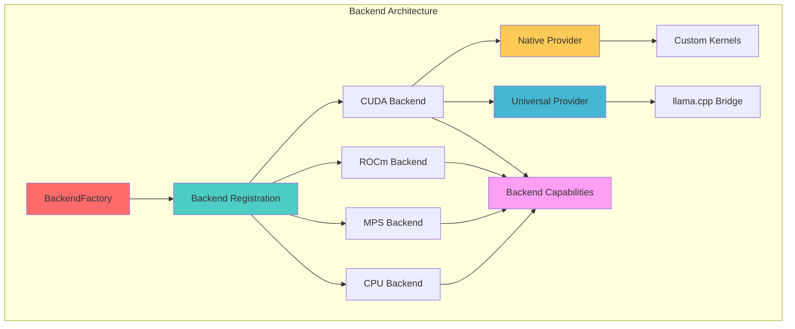
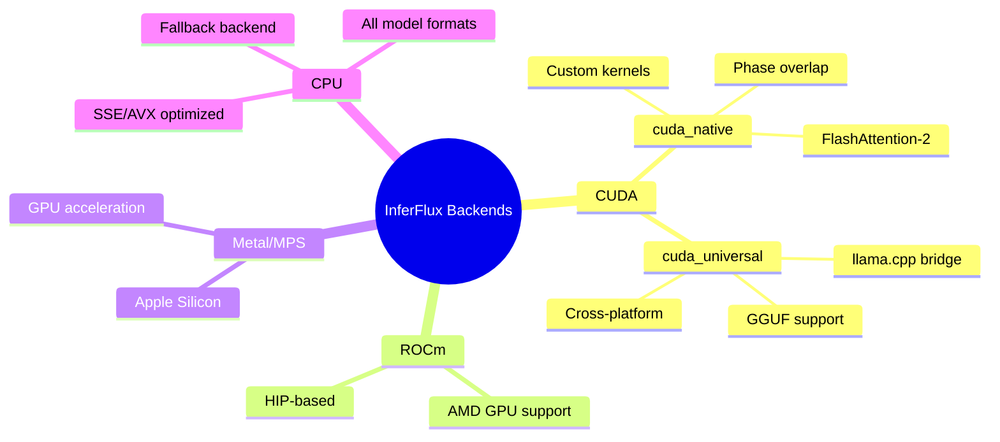
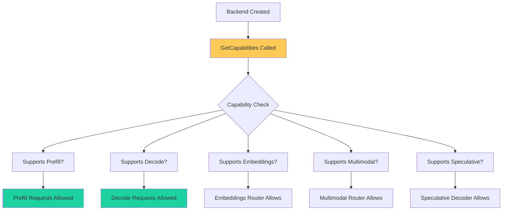
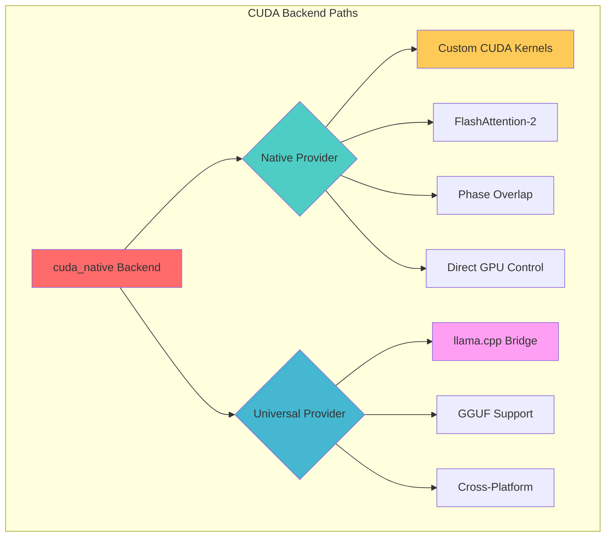
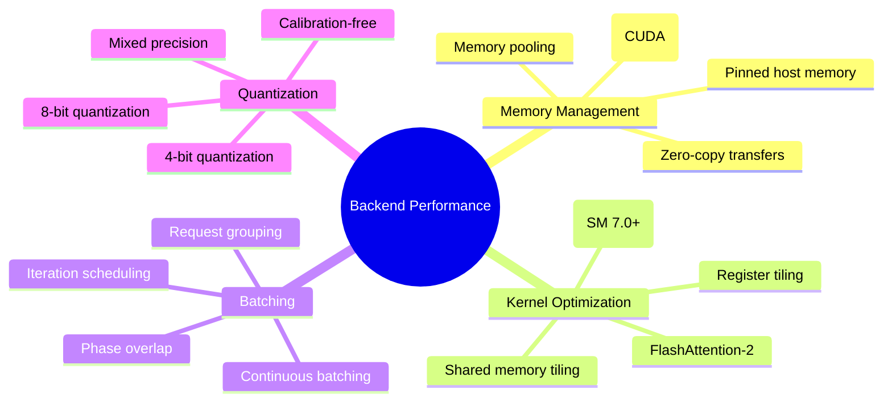
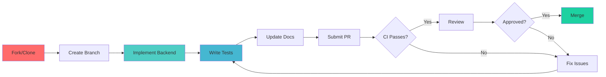

# Backend Development Guide

Complete guide to developing and extending InferFlux backends.

## Overview



## Backend Architecture

### Core Components

| Component | Location | Purpose |
|-----------|----------|---------|
| **BackendFactory** | `runtime/backends/backend_factory.cpp` | Backend registration and creation |
| **BackendCapabilities** | `runtime/backends/backend_capabilities.h` | Feature discovery and routing |
| **DeviceContext** | `runtime/device_context.h` | Hardware abstraction |
| **BackendManager** | `runtime/backends/backend_manager.cpp` | Lifecycle management |

### Backend Types



## Creating a New Backend

### Step 1: Define Backend Class

```cpp
// runtime/backends/my_backend/my_backend.h
#pragma once
#include "runtime/backends/backend_base.h"

namespace inferflux {

class MyBackend : public BackendBase {
public:
    MyBackend(const ModelLoadRequest &req, const BackendConfig &config);
    ~MyBackend() override;

    // Required interface methods
    bool LoadModel() override;
    size_t PromptTokenCount() const override;
    std::vector<float> Embedding() const override;

    // Inference methods
    bool Prefill(const std::vector<token_id_t> &tokens) override;
    token_id_t Decode() override;
    void FreeSequence(sequence_id_t seq_id) override;

    // Capabilities
    BackendCapabilities GetCapabilities() const override;

private:
    std::unique_ptr<DeviceContext> device_;
    std::unique_ptr<ModelLoader> loader_;
    // Your backend-specific state
};

} // namespace inferflux
```

### Step 2: Implement Backend Methods

```cpp
// runtime/backends/my_backend/my_backend.cpp
#include "runtime/backends/my_backend/my_backend.h"

namespace inferflux {

MyBackend::MyBackend(const ModelLoadRequest &req, const BackendConfig &config)
    : BackendBase(req, config) {
    // Initialize device context
    device_ = std::make_unique<MyDeviceContext>();

    // Initialize model loader
    loader_ = std::make_unique<MyModelLoader>(req.path);
}

bool MyBackend::LoadModel() {
    if (!loader_->LoadMetadata()) {
        log::Error("my_backend", "Failed to load model metadata");
        return false;
    }

    if (!device_->AllocateMemory(loader_->GetModelSize())) {
        log::Error("my_backend", "Failed to allocate device memory");
        return false;
    }

    // Load weights onto device
    if (!loader_->LoadWeights(device_.get())) {
        log::Error("my_backend", "Failed to load weights");
        return false;
    }

    log::Info("my_backend", "Model loaded successfully");
    return true;
}

BackendCapabilities MyBackend::GetCapabilities() const {
    BackendCapabilities caps;
    caps.supports_prefill = true;
    caps.supports_decode = true;
    caps.supports_embeddings = true;  // If your backend supports embeddings
    caps.supports_multimodal = false; // If your backend doesn't support vision
    caps.supports_speculative = false; // If your backend doesn't support speculative decoding
    caps.max_batch_size = 32;
    caps.max_sequence_length = 4096;
    return caps;
}

token_id_t MyBackend::Decode() {
    // Implement token generation
    token_id_t token = device_->GenerateToken();
    metrics_->IncrementTokensGenerated(1);
    return token;
}

void MyBackend::FreeSequence(sequence_id_t seq_id) {
    device_->FreeSequence(seq_id);
    log::Debug("my_backend", "Freed sequence %d", seq_id);
}

} // namespace inferflux
```

### Step 3: Register Backend

```cpp
// runtime/backends/backend_factory.cpp
#include "runtime/backends/my_backend/my_backend.h"

namespace inferflux {

void BackendFactory::RegisterBackends() {
    // ... existing registrations ...

    RegisterBackend("my_backend", [](const ModelLoadRequest &req,
                                      const BackendConfig &config) {
        return std::make_unique<MyBackend>(req, config);
    });
}

} // namespace inferflux
```

### Step 4: Update CMakeLists.txt

```cmake
# CMakeLists.txt
set(INFERFLUX_BACKEND_SOURCES
    runtime/backends/backend_factory.cpp
    runtime/backends/backend_manager.cpp
    runtime/backends/cpu/backend_cpu.cpp
    runtime/backends/cuda/cuda_backend.cpp
    runtime/backends/my_backend/my_backend.cpp  # Add your backend
)

set(INFERFLUX_BACKEND_HEADERS
    runtime/backends/backend_factory.h
    runtime/backends/backend_manager.h
    runtime/backends/cpu/backend_cpu.h
    runtime/backends/cuda/cuda_backend.h
    runtime/backends/my_backend/my_backend.h  # Add your backend
)
```

## Backend Capabilities

### Capability Discovery



### Implementing Capabilities

```cpp
BackendCapabilities GetCapabilities() const override {
    BackendCapabilities caps;

    // Core inference capabilities
    caps.supports_prefill = true;        // Can process prompts
    caps.supports_decode = true;         // Can generate tokens
    caps.supports_embeddings = false;    // Can generate embeddings

    // Advanced features
    caps.supports_multimodal = false;    // Can process images
    caps.supports_speculative = false;   // Can use draft models
    caps.supports_tensor_parallel = false; // Can shard across GPUs

    // Limits
    caps.max_batch_size = max_batch_size_;
    caps.max_sequence_length = context_length_;
    caps.max_total_tokens = max_total_tokens_;

    // Performance hints
    caps.recommends_batch_size = optimal_batch_size_;
    caps.recommends_prefill_batch = optimal_prefill_batch_;
    caps.recommends_decode_batch = optimal_decode_batch_;

    return caps;
}
```

## Model Format Support

### Supported Formats


### Adding Format Support

```cpp
// model/model_format.cpp
ModelFormat DetectModelFormat(const std::string &path) {
    // Check for safetensors
    if (std::filesystem::exists(path + "/model.safetensors")) {
        return ModelFormat::Safetensors;
    }

    // Check for GGUF
    if (path.ends_with(".gguf")) {
        return ModelFormat::GGUF;
    }

    // Check for HuggingFace structure
    if (std::filesystem::exists(path + "/config.json")) {
        return ModelFormat::HuggingFace;
    }

    return ModelFormat::Unknown;
}
```

## CUDA Backend Development

### Native vs Universal Providers



### Native Kernel Executor

The native kernel executor (`runtime/backends/cuda/native_kernel_executor.cpp`) provides a framework for implementing custom CUDA kernels.

```cpp
// Example: Adding a custom attention kernel
class NativeKernelExecutor {
public:
    bool LaunchAttentionKernel(const AttentionParams &params) {
        // Select kernel based on hardware capability
        if (gpu_info_.sm_major >= 8) {
            return LaunchFlashAttention2(params);
        } else {
            return LaunchStandardAttention(params);
        }
    }

private:
    bool LaunchFlashAttention2(const AttentionParams &params) {
        // FA2 kernel implementation
        dim3 grid, block;
        ComputeGridBlockSize(params, &grid, &block);

        flash_attention_2_kernel<<<grid, block, 0, stream_>>>(
            params.query_ptr, params.key_ptr, params.value_ptr,
            params.output_ptr, params.seq_len, params.num_heads,
            params.head_dim
        );

        return cudaGetLastError() == cudaSuccess;
    }
};
```

### Phase Overlap Implementation

Phase overlap enables concurrent prefill and decode execution on CUDA streams.

```cpp
class CudaBackend {
private:
    cudaStream_t prefill_stream_;
    cudaStream_t decode_stream_;
    std::mutex overlap_mutex_;

public:
    bool EnablePhaseOverlap(bool enable) {
        if (enable) {
            // Create separate streams
            cudaStreamCreate(&prefill_stream_);
            cudaStreamCreate(&decode_stream_);
            phase_overlap_enabled_ = true;
        } else {
            // Use single stream
            phase_overlap_enabled_ = false;
        }
        return true;
    }

    token_id_t Decode() {
        std::lock_guard<std::mutex> lock(overlap_mutex_);

        // Record decode lane submission
        metrics_->RecordLaneSubmission();

        // Launch decode on decode stream
        token_id_t token = LaunchDecodeOnStream(decode_stream_);

        // Record completion
        metrics_->RecordLaneCompletion();

        return token;
    }
};
```

## Metrics and Observability

### Backend Metrics

All backends should report Prometheus metrics for observability.

```cpp
class BackendMetrics {
public:
    void RecordForwardPass(const std::string &phase, double duration_ms) {
        forward_duration_ms_.Observe(duration_ms);
        forward_passes_total_->Increment({{"phase", phase}});
    }

    void RecordTokensGenerated(size_t count) {
        tokens_generated_total_->FetchAdd(count);
    }

    void RecordBatchTokens(size_t count) {
        batch_tokens_total_->FetchAdd(count);
    }

private:
    Histogram* forward_duration_ms_;
    Counter* forward_passes_total_;
    Counter* tokens_generated_total_;
    Counter* batch_tokens_total_;
};
```

### NVTX Profiling

Use NVIDIA Tools Extension (NVTX) for Nsight Systems profiling.

```cpp
#include <nvtx3/nvToolsExt.h>

token_id_t CudaBackend::Decode() {
    // Push range for profiling
    nvtxRangePushA("Decode");

    // Sub-ranges
    nvtxRangePushA("KV_Append");
    AppendKVCache();
    nvtxRangePop();

    nvtxRangePushA("Attention");
    ComputeAttention();
    nvtxRangePop();

    nvtxRangePushA("Sampling");
    token_id_t token = SampleToken();
    nvtxRangePop();

    nvtxRangePop(); // Decode

    return token;
}
```

## Testing Backends

### Unit Tests

```cpp
// tests/unit/test_my_backend.cpp
#include "runtime/backends/my_backend/my_backend.h"

TEST_CASE("MyBackend: Load GGUF model", "[my_backend]") {
    ModelLoadRequest req;
    req.path = "models/test-model.gguf";
    req.format = ModelFormat::GGUF;

    BackendConfig config;
    config.device_id = 0;

    MyBackend backend(req, config);

    REQUIRE(backend.LoadModel() == true);
    REQUIRE(backend.PromptTokenCount() == 0);
}

TEST_CASE("MyBackend: Prefill and decode", "[my_backend]") {
    // Create backend
    MyBackend backend = CreateTestBackend();

    // Prefill
    std::vector<token_id_t> tokens = {1, 2, 3, 4, 5};
    REQUIRE(backend.Prefill(tokens) == true);

    // Decode
    token_id_t token = backend.Decode();
    REQUIRE(token > 0);

    // Cleanup
    backend.FreeSequence(0);
}
```

### Integration Tests

```bash
# Test backend with real model
./scripts/test_backend.sh \
  --backend my_backend \
  --model models/qwen2.5-3b.gguf \
  --format gguf
```

## Performance Optimization

### Optimization Strategies



### Benchmarking

```bash
# Profile backend with Nsight Systems
nsys profile \
  --output=profile.qdrep \
  --force-overwrite=true \
  ./build/inferfluxd --config config/server.cuda.yaml

# Profile kernels with NCU
ncu --set full \
  --target-processes=all \
  ./build/inferfluxd --config config/server.cuda.yaml

# Benchmark throughput
./scripts/run_throughput_gate.py \
  --server-bin ./build/inferfluxd \
  --config config/server.cuda.yaml \
  --model qwen2.5-3b \
  --backend cuda \
  --min-completion-tok-per-sec 100
```

## Debugging

### Common Issues

| Issue | Symptom | Solution |
|-------|---------|----------|
| Model fails to load | `LoadModel()` returns false | Check file path, format, permissions |
| CUDA out of memory | Allocation failures | Reduce batch size, enable KV offload |
| Wrong token output | Garbage tokens | Check tokenizer, model architecture |
| Poor performance | Low tok/s | Enable FA2, phase overlap, quantization |
| Capability errors | Requests rejected | Check `GetCapabilities()` implementation |

### Debug Logging

```cpp
#define BACKEND_DEBUG_LOG(msg, ...) \
  log::Debug("my_backend", "[DEBUG] " msg, ##__VA_ARGS__)

bool MyBackend::Prefill(const std::vector<token_id_t> &tokens) {
  BACKEND_DEBUG_LOG("Prefill: %zu tokens", tokens.size());

  for (size_t i = 0; i < tokens.size(); ++i) {
    BACKEND_DEBUG_LOG("  token[%zu] = %d", i, tokens[i]);
  }

  // ... prefill implementation
}
```

## Best Practices

### Do's ✅

1. **Use RAII** - Manage resources with smart pointers
2. **Check capabilities** - Respect backend capability limits
3. **Report metrics** - Enable observability
4. **Handle errors** - Graceful degradation on failures
5. **Document config** - Explain all configuration options
6. **Test thoroughly** - Unit + integration tests
7. **Profile code** - Use Nsight Systems/NCU

### Don'ts ❌

1. **Don't ignore errors** - Always check return values
2. **Don't hardcode paths** - Use config/env variables
3. **Don't leak memory** - Free sequences, clear caches
4. **Don't block threads** - Use async operations
5. **Don't assume hardware** - Probe capabilities
6. **Don't skip tests** - CI will catch regressions
7. **Don't break API** - Maintain backward compatibility

## Contributing

### Contribution Workflow



### Code Review Checklist

- [ ] Backend implements `BackendBase` interface completely
- [ ] `GetCapabilities()` reports correct capabilities
- [ ] Prometheus metrics added and documented
- [ ] Unit tests cover all code paths
- [ ] Integration tests pass with real models
- [ ] Documentation updated (CONFIG_REFERENCE.md)
- [ ] Nsight Systems profiling shows no issues
- [ ] Throughput gate passes (≥100 tok/s for 3B models)

---

**Next:** [Configuration Reference](CONFIG_REFERENCE.md) | [Performance Tuning](PERFORMANCE_TUNING.md) | [Developer Guide](DeveloperGuide.md)
