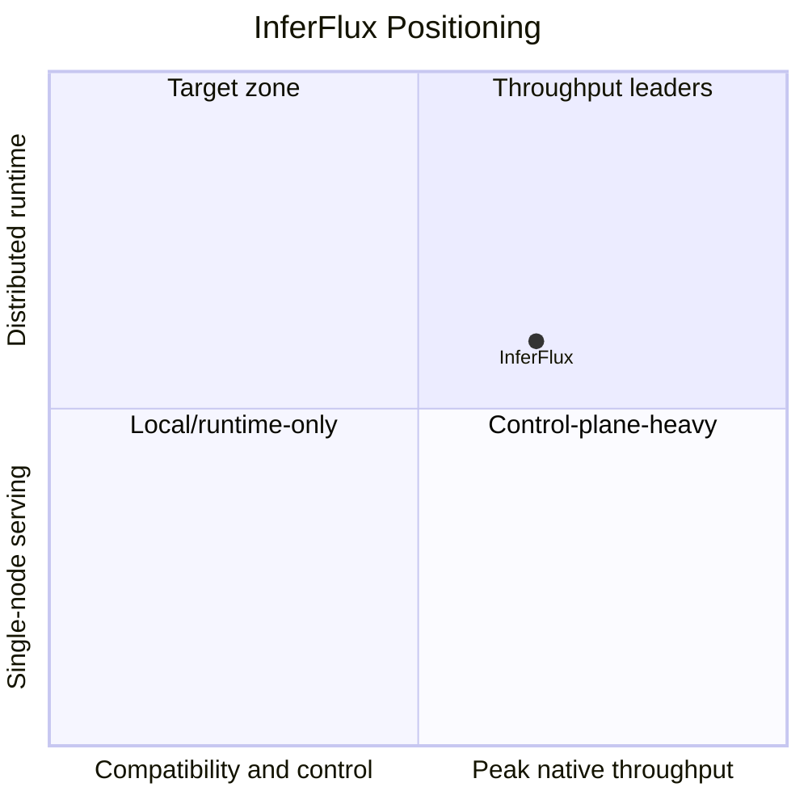

# Competitive Positioning

**Snapshot date:** March 29, 2026

## 1) Current Position

| Category | Current InferFlux reading |
|---|---|
| Compatibility-first CUDA serving | Strong today via `llama_cpp_cuda` |
| Native-kernel-first CUDA serving | Exceeds llama.cpp on single-sequence (~1.1x), c=4 parity, but still 0.78x at c≥8 sustained concurrency |
| Operator/control-plane rigor | Strong and release-worthy |
| Distributed runtime credibility | KV channel and SHM transport are production-tested; ownership cleanup still needs hardening |

## 2) What Is Distinctive

| Trait | Why it matters |
|---|---|
| Two-CUDA-backend strategy | Separates compatibility risk from native-kernel iteration without hiding fallback behavior |
| Machine-visible backend identity | Makes policy, benchmarking, and automation deterministic |
| Production-grade native CUDA | FlashAttention-2 with GQA, CUDA graph capture/replay, 50+ fused GEMV kernels, GPU-adaptive dispatch thresholds |
| API/admin/CLI contract rigor | Release-facing behavior is explicit and testable |
| Transport-aware ops semantics | `/readyz`, admin pools, KV channel with SHM transport, and failure-sensitive admission already reflect runtime health |

## 3) Best-In-Class Gap Map

| Gap | What closes it |
|---|---|
| Native concurrent GGUF throughput | Better decode down-proj kernels and better sustained hot-path residency |
| Release confidence on GPU paths | Required GPU/provider CI instead of optional manual validation |
| Distributed runtime credibility | Ownership cleanup, worker-loss handling, and failure-path testing |

## 4) Current Competitive Reading

| Comparison | Current reading |
|---|---|
| InferFlux vs Ollama | Strong repo-level win via `llama_cpp_cuda` on the published benchmark matrix |
| InferFlux native vs compatibility | `inferflux_cuda` exceeds llama.cpp on single-sequence and matches at c=4, but `llama_cpp_cuda` still wins the c≥8 sustained concurrency story |
| InferFlux vs native-kernel leaders | Control plane is credible; native single-sequence throughput now competitive, but sustained high-concurrency decode still needs improvement |

## 5) Release-Facing Guidance

| Question | Current answer |
|---|---|
| What should public benchmark claims emphasize? | The documented `llama_cpp_cuda` advantage over Ollama and the measured but still-in-progress state of `inferflux_cuda` |
| What should not be oversold? | Native CUDA concurrency parity, distributed ownership maturity, and release confidence on GPU paths |

## 6) References

- [README](../README.md)
- [benchmarks](benchmarks.md)
- [Roadmap](Roadmap.md)
- [TechDebt_and_Competitive_Roadmap](TechDebt_and_Competitive_Roadmap.md)
