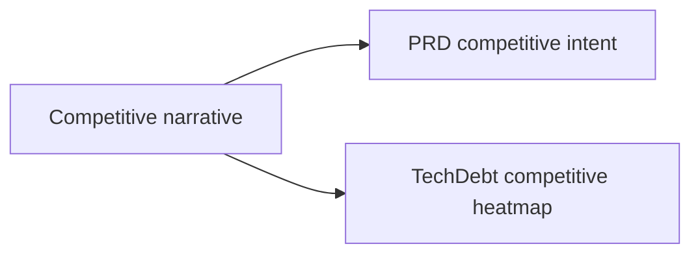

# Competitive Positioning (Consolidated)

**Status:** Consolidated into planning docs

## Canonical Source Map

| Need | Source of truth |
|---|---|
| Product-level positioning intent | [PRD](PRD.md) |
| Grade/debt/priority execution | [TechDebt_and_Competitive_Roadmap](TechDebt_and_Competitive_Roadmap.md) |
| Milestone sequencing | [Roadmap](Roadmap.md) |

## Archived Full Analysis

- [COMPETITIVE_POSITIONING_2026_03_05](archive/evidence/COMPETITIVE_POSITIONING_2026_03_05.md)
