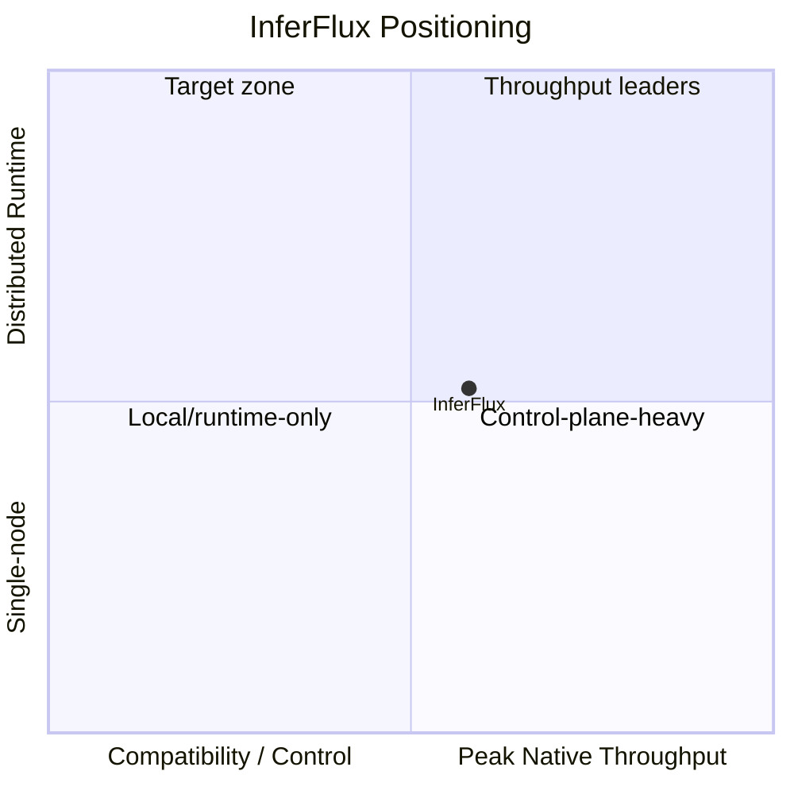

# Competitive Positioning

**Snapshot date:** March 9, 2026

## 1) Where InferFlux Competes Today

| Category | Typical strength | InferFlux status now |
|---|---|---|
| Compatibility-first local servers | Broad GGUF support and low friction | Covered through `cuda_llama_cpp` and CPU paths; not the main differentiator |
| Native-kernel-first GPU servers | Peak throughput and batching efficiency | Native path is active but still behind best-in-class maturity on quantized heavy-batch workloads |
| Operator/control-plane servers | Auth, policy, routing, audit, metrics | Strong today and already part of the shipped product contract |
| Distributed inference stacks | Multi-node reliability and ownership semantics | Early foundation only; not yet a competitive strength |

## 2) What Is Distinctive

| Trait | Why it matters |
|---|---|
| Two-CUDA-backend strategy | Separates compatibility risk from performance experimentation without hiding fallback behavior |
| Machine-visible backend identity | Makes policy, automation, and benchmarking deterministic |
| API/admin/CLI contract rigor | Control-plane behavior is explicit and testable, not best-effort |
| Portable runtime scope | One server surface spans CPU/CUDA/ROCm/MPS/MLX targets |

## 3) Best-In-Class Gap Map

| Gap | What closes it |
|---|---|
| Quantized native throughput | Fused quantized kernels, graph capture, and batch-quality-preserving scheduling |
| Memory economy on edge GPUs | Immutable quantized weights, budgeted KV sizing, paged KV maturity, and no persistent dequant by default |
| Distributed runtime credibility | Ticketed KV handoff, worker-health readiness, sequence ownership cleanup, and CI fault matrix |
| Release confidence on GPU paths | Mandatory GPU behavior lane instead of optional perf smoke runs |

## 4) Canonical Source Map

| Need | Source |
|---|---|
| Product intent | [PRD](PRD.md) |
| Grade and execution plan | [Roadmap](Roadmap.md) |
| Debt and migration priority | [TechDebt_and_Competitive_Roadmap](TechDebt_and_Competitive_Roadmap.md) |
| Practice modernization | [MODERNIZATION_AUDIT](MODERNIZATION_AUDIT.md) |
