# Configuration Reference

Complete guide to configuring InferFlux with visual examples.

## Quick Reference

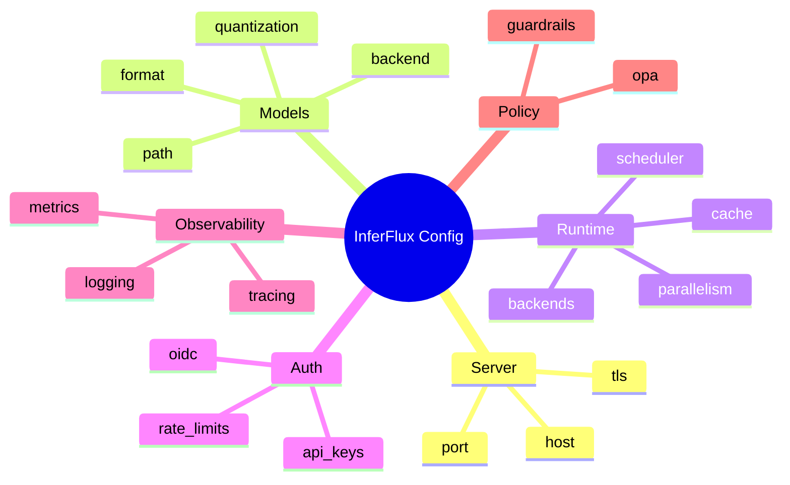
```mermaid
mindmap
  root((InferFlux Config))
    Server
      host
      port
      tls
    Models
      path
      format
      backend
      quantization
    Runtime
      backends
      scheduler
      cache
      parallelism
    Auth
      api_keys
      oidc
      rate_limits
    Observability
      metrics
      logging
      tracing
    Policy
      guardrails
      opa
```

## File Locations

| Environment | Config Path |
|-------------|-------------|
| Default | `~/.inferflux/config.yaml` |
| System | `/etc/inferflux/config.yaml` |
| Custom | `--config /path/to/config.yaml` |
| Env override | `INFERFLUX_*` variables |

## Configuration Hierarchy

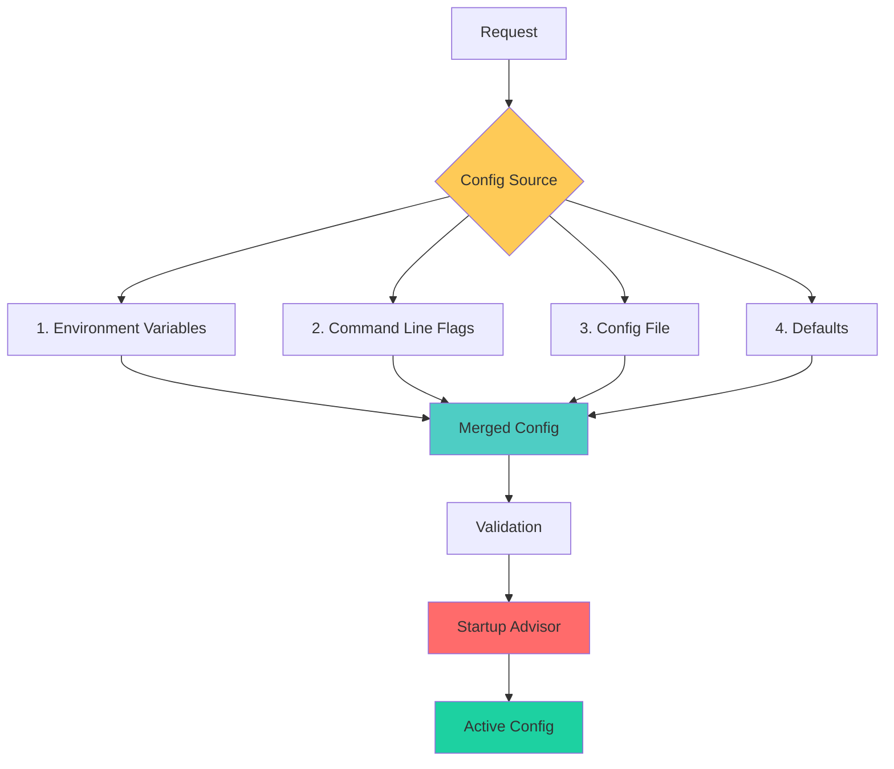
```mermaid
graph TD
    A[Request] --> B{Config Source}
    B --> C1[1. Environment Variables]
    B --> C2[2. Command Line Flags]
    B --> C3[3. Config File]
    B --> C4[4. Defaults]

    C1 --> D[Merged Config]
    C2 --> D
    C3 --> D
    C4 --> D

    D --> E[Validation]
    E --> F[Startup Advisor]
    F --> G[Active Config]

    style B fill:#feca57
    style D fill:#4ecdc4
    style F fill:#ff6b6b
    style G fill:#1dd1a1
```

**Priority:** Env vars > CLI flags > Config file > Defaults

## Server Configuration

```yaml
server:
  host: 0.0.0.0              # Bind address (0.0.0.0 = all interfaces)
  http_port: 8080            # HTTP port for API
  max_concurrent: 1024        # Max concurrent requests
  enable_metrics: true        # Prometheus /metrics endpoint
  enable_tracing: false       # OpenTelemetry tracing (future)
```

### Network Diagram

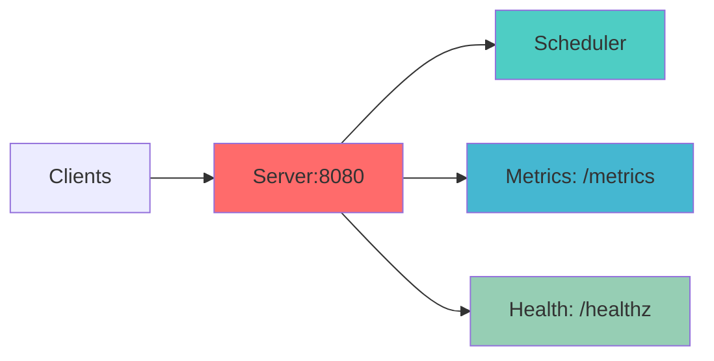
```mermaid
graph LR
    A[Clients] --> B[Server:8080]
    B --> C[Scheduler]
    B --> D[Metrics: /metrics]
    B --> E[Health: /healthz]

    style B fill:#ff6b6b
    style C fill:#4ecdc4
    style D fill:#45b7d1
    style E fill:#96ceb4
```

## Model Configuration

### Single Model

```yaml
models:
  - id: llama3-8b
    path: /models/llama3-8b.gguf
    format: gguf                # gguf, safetensors, hf, auto
    backend: cuda                # cuda, cpu, mps, rocm, cuda_native, cuda_universal
    default: true
```

### Multi-Model

```yaml
models:
  - id: llama3-8b
    path: /models/llama3-8b.gguf
    format: gguf
    backend: cuda_universal
    default: true

  - id: qwen2.5-3b
    path: /models/qwen2.5-3b/
    format: safetensors
    backend: cuda_native
    default: false
```

### Model Selection Flow

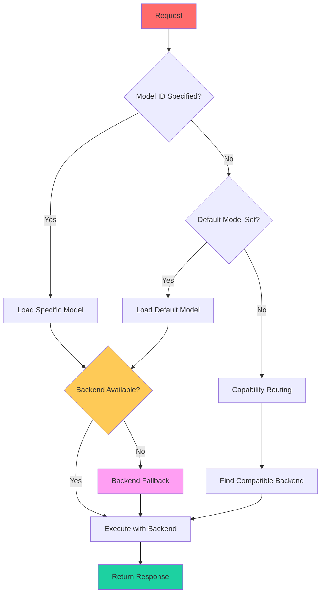
```mermaid
flowchart TD
    A[Request] --> B{Model ID Specified?}
    B -->|Yes| C[Load Specific Model]
    B -->|No| D{Default Model Set?}
    D -->|Yes| E[Load Default Model]
    D -->|No| F[Capability Routing]

    C --> G{Backend Available?}
    E --> G
    F --> H[Find Compatible Backend]

    G -->|Yes| I[Execute with Backend]
    G -->|No| J[Backend Fallback]

    H --> I
    J --> I

    I --> K[Return Response]

    style A fill:#ff6b6b
    style G fill:#feca57
    style J fill:#ff9ff3
    style K fill:#1dd1a1
```

### Format Options

| Format | Description | Backend | When to Use |
|--------|-------------|---------|------------|
| `gguf` | llama.cpp format | cuda_universal, cpu | Best compatibility |
| `safetensors` | HuggingFace format | cuda_native | Native CUDA inference |
| `hf` | HuggingFace URI | Auto-detected | `hf://org/repo` |
| `auto` | Auto-detect | Auto-detected | Unknown format |

### Model Formats and Quantization - Deep Dive

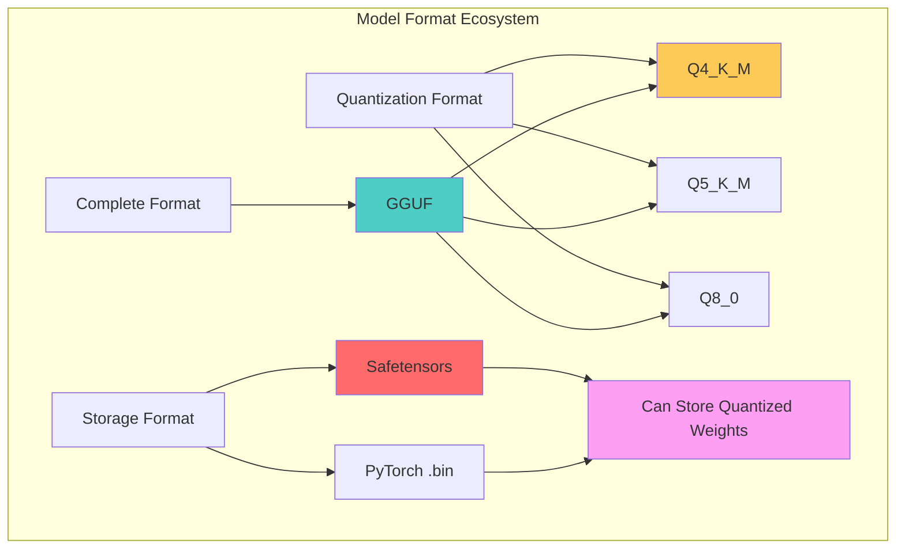
```mermaid
graph TB
    subgraph "Model Format Ecosystem"
        A[Storage Format]
        B[Quantization Format]
        C[Complete Format]

        A --> A1[Safetensors]
        A --> A2[PyTorch .bin]

        B --> B1[Q4_K_M]
        B --> B2[Q5_K_M]
        B --> B3[Q8_0]

        C --> C1[GGUF]

        C1 --> B1
        C1 --> B2
        C1 --> B3

        A1 --> D[Can Store Quantized Weights]
        A2 --> D

        style A1 fill:#ff6b6b
        style C1 fill:#4ecdc4
        style B1 fill:#feca57
        style D fill:#ff9ff3
    end
```

#### Understanding the Difference

**Storage Format vs. Quantization Format**

| Aspect | Storage Format | Quantization Format |
|--------|----------------|---------------------|
| **Purpose** | How tensors are stored | How weights are compressed |
| **Examples** | Safetensors, PyTorch .bin | Q4_K_M, Q5_K_M, Q8_0 |
| **Contains** | Raw tensor data (fp16, bf16, fp32, int8, int4) | Quantization scheme + scales + metadata |
| **Dequantization** | Needs custom kernels | Built into format handler |
| **Independence** | Can be used with any model | Tied to specific framework |

#### GGUF Format

GGUF is a **self-contained format** created by llama.cpp:

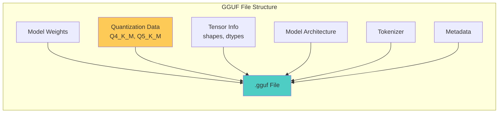
```mermaid
graph LR
    subgraph "GGUF File Structure"
        A1[Model Weights]
        A2[Quantization Data<br/>Q4_K_M, Q5_K_M]
        A3[Tensor Info<br/>shapes, dtypes]
        A4[Model Architecture]
        A5[Tokenizer]
        A6[Metadata]

        A1 --> G[.gguf File]
        A2 --> G
        A3 --> G
        A4 --> G
        A5 --> G
        A6 --> G
    end

    style G fill:#4ecdc4
    style A2 fill:#feca57
```

**What GGUF Contains:**
- ✅ Model weights (quantized or full precision)
- ✅ Quantization scheme (Q4_K_M, Q5_K_M, Q8_0, etc.)
- ✅ Dequantization parameters (scales, zero-points)
- ✅ Model architecture (layer counts, sizes)
- ✅ Tokenizer vocabulary
- ✅ Metadata (model name, context length)

**GGUF Quantization Options:**

| Quantization | Bits | VRAM (3B model) | Quality | Description |
|--------------|------|-----------------|---------|-------------|
| **Q4_K_M** | 4 | 2.0 GB | Good | Recommended for most use cases |
| **Q5_K_M** | 5 | 2.4 GB | Better | Balance of quality and size |
| **Q5_K_S** | 5 | 2.3 GB | Better | Small variants |
| **Q8_0** | 8 | 3.5 GB | Excellent | Near-float quality |
| **F16** | 16 | 5.6 GB | Perfect | Full precision |

**Q4_K_M Details:**
- **4-bit quantization** with specific structure
- **Block-wise quantization** (32-256 elements per block)
- **Separate scales** per block for accuracy
- **Asymmetric quantization** (different scale for positive/negative)
- **Optimized for llama.cpp** inference

#### Safetensors Format

Safetensors is a **tensor storage format** created by HuggingFace:

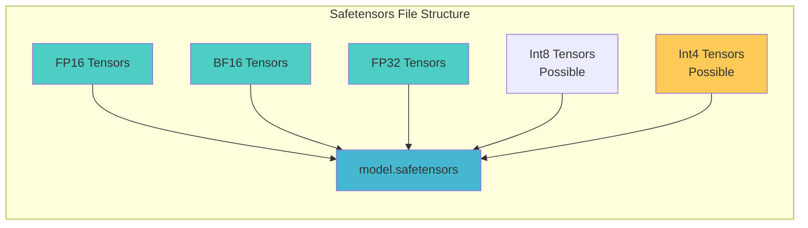
```mermaid
graph LR
    subgraph "Safetensors File Structure"
        B1[FP16 Tensors]
        B2[BF16 Tensors]
        B3[FP32 Tensors]
        B4[Int8 Tensors<br/>Possible]
        B5[Int4 Tensors<br/>Possible]

        B1 --> S[model.safetensors]
        B2 --> S
        B3 --> S
        B4 --> S
        B5 --> S
    end

    style S fill:#45b7d1
    style B1 fill:#4ecdc4
    style B2 fill:#4ecdc4
    style B3 fill:#4ecdc4
    style B5 fill:#feca57
```

**What Safetensors Contains:**
- ✅ Tensor data (any dtype: fp32, fp16, bf16, int8, int4, etc.)
- ✅ Tensor metadata (shapes, dtypes, names)
- ✅ Safety validation (no pickle/code execution)
- ❌ No model architecture
- ❌ No tokenizer
- ❌ No quantization/dequantization logic

**Safetensors Data Types:**

| Dtype | Bits | Native Support | Notes |
|-------|------|-----------------|-------|
| `F32` | 32 | ✅ Yes | Float32 (full precision) |
| `F16` | 16 | ✅ Yes | Float16 (half precision) |
| `BF16` | 16 | ✅ Yes | BFloat16 (brain float) |
| `I8` | 8 | ⚠️ Possible | Int8 (requires dequant kernels) |
| `I4` | 4 | ⚠️ Possible | Int4 (requires dequant kernels) |

#### Can Safetensors Use Q4_K_M Quantization?

**Short Answer:** No, not directly.

**Technical Explanation:**

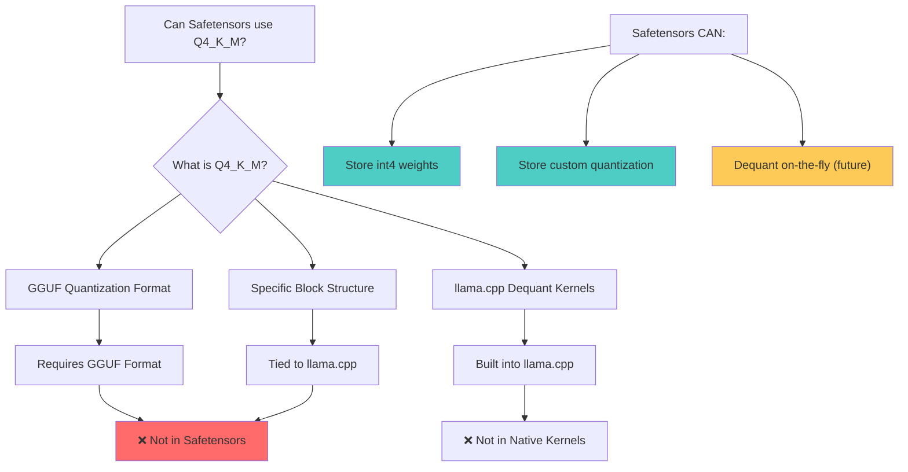
```mermaid
graph TB
    A["Can Safetensors use Q4_K_M?"] --> B{What is Q4_K_M?}

    B --> C["GGUF Quantization Format"]
    B --> D["Specific Block Structure"]
    B --> E["llama.cpp Dequant Kernels"]

    C --> F["Requires GGUF Format"]
    D --> G["Tied to llama.cpp"]
    E --> H["Built into llama.cpp"]

    F --> I["❌ Not in Safetensors"]
    G --> I
    H --> J["❌ Not in Native Kernels"]

    K["Safetensors CAN:"] --> L["Store int4 weights"]
    K --> M["Store custom quantization"]
    K --> N["Dequant on-the-fly (future)"]

    style I fill:#ff6b6b
    style L fill:#4ecdc4
    style M fill:#4ecdc4
    style N fill:#feca57
```

**Why Q4_K_M Doesn't Work with Safetensors:**

1. **Q4_K_M is a GGUF-specific format**
   - Defined by llama.cpp
   - Includes dequantization logic in GGUF reader
   - Block structure optimized for llama.cpp

2. **Safetensors is storage-only**
   - Can store int4/8 tensors
   - No quantization metadata format
   - No dequantization kernels

3. **Native kernels expect FP16/BF16**
   - Current implementation: FP16/BF16 only
   - No on-the-fly dequantization
   - Direct tensor-to-compute path

**What IS Possible:**

| Option | Format | Backend | Status |
|--------|--------|---------|--------|
| **Quantized GGUF** | `.gguf` (Q4_K_M) | `cuda_universal` | ✅ Working |
| **Full precision Safetensors** | `.safetensors` (BF16) | `cuda_native` | ✅ Working |
| **Int8 Safetensors** | `.safetensors` (int8) | `cuda_native` | 🔮 Future |
| **Int4 Safetensors** | `.safetensors` (int4) | `cuda_native` | 🔮 Future |
| **Custom Quantized Safetensors** | `.safetensors` (custom) | `cuda_native` | 🔮 Requires dev work |

#### Performance Comparison

| Format | Quantization | VRAM (3B) | Throughput | Quality | Backend |
|--------|--------------|------------|------------|---------|---------|
| **GGUF Q4_K_M** | 4-bit | 2.0 GB | 104 tok/s | Good | llama.cpp |
| **GGUF Q5_K_M** | 5-bit | 2.4 GB | 90 tok/s | Better | llama.cpp |
| **GGUF Q8_0** | 8-bit | 3.5 GB | 65 tok/s | Excellent | llama.cpp |
| **GGUF F16** | 16-bit | 5.6 GB | 43 tok/s | Perfect | llama.cpp |
| **Safetensors BF16** | 16-bit | 5.8 GB | 85 tok/s | Perfect | Native |
| **Safetensors FP16** | 16-bit | 5.8 GB | 80 tok/s | Perfect | Native |
| **Safetensors Int8** | 8-bit | ~3 GB | ~? tok/s | Excellent | 🔮 Future |
| **Safetensors Int4** | 4-bit | ~2 GB | ~? tok/s | Good | 🔮 Future |

**Key Findings:**
- **GGUF Q4_K_M**: Best VRAM efficiency (2.0 GB)
- **Safetensors BF16**: Best performance for precision (85 tok/s)
- **Safetensors FP16**: Comparable to GGUF F16, but faster (80 vs 43 tok/s)
- **Native kernels**: 2x faster than GGUF F16 for same precision

#### Decision Guide

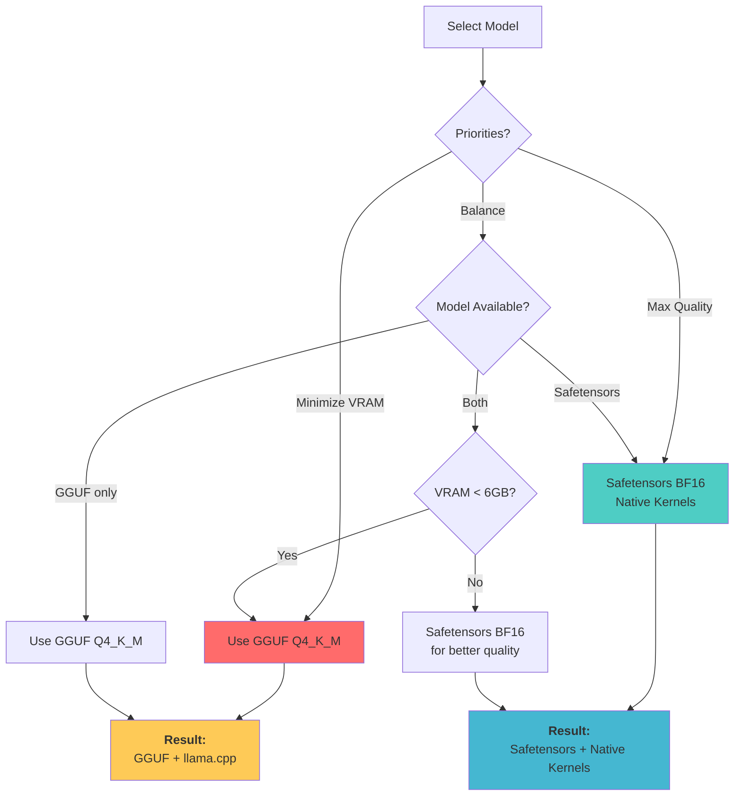
```mermaid
graph TB
    A[Select Model] --> B{Priorities?}

    B -->|Minimize VRAM| C["Use GGUF Q4_K_M"]
    B -->|Max Quality| D["Safetensors BF16<br/>Native Kernels"]
    B -->|Balance| E{Model Available?}

    E -->|Safetensors| D
    E -->|GGUF only| F["Use GGUF Q4_K_M"]
    E -->|Both| G{"VRAM < 6GB?"}

    G -->|Yes| C
    G -->|No| H["Safetensors BF16<br/>for better quality"]

    C --> I[<b>Result:</b><br/>GGUF + llama.cpp]
    D --> J[<b>Result:</b><br/>Safetensors + Native Kernels]
    F --> I
    H --> J

    style C fill:#ff6b6b
    style D fill:#4ecdc4
    style I fill:#feca57
    style J fill:#45b7d1
```

#### Configuration Examples

**Option 1: Quantized GGUF (Low VRAM)**
```yaml
models:
  - id: qwen2.5-3b-quantized
    path: models/qwen2.5-3b-Q4_K_M.gguf
    format: gguf
    backend: cuda_universal  # Uses llama.cpp
    default: true
```

**Option 2: Full Precision Safetensors (Best Quality)**
```yaml
models:
  - id: qwen2.5-3b-bf16
    path: models/qwen2.5-3b-safetensors/
    format: safetensors
    backend: cuda_native  # Uses native kernels (auto-detected)
    default: true
```

**Option 3: Both Available (Auto-Select)**
```yaml
models:
  # Low VRAM option
  - id: qwen2.5-3b-quantized
    path: models/qwen2.5-3b-Q4_K_M.gguf
    backend: cuda

  # High quality option
  - id: qwen2.5-3b-bf16
    path: models/qwen2.5-3b-safetensors/
    backend: cuda_native
    default: true
```

#### Future Work: Quantized Safetensors with Native Kernels

To support quantized safetensors (int4/int8) with native kernels:

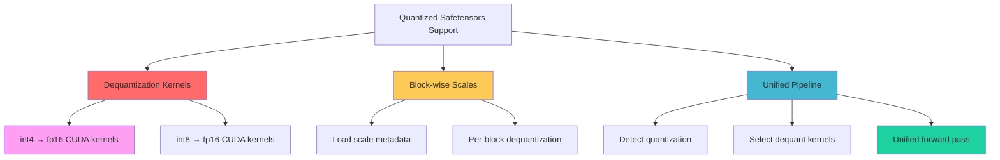
```mermaid
graph TB
    A[Quantized Safetensors Support] --> B[Dequantization Kernels]
    A --> C[Block-wise Scales]
    A --> D[Unified Pipeline]

    B --> E[int4 → fp16 CUDA kernels]
    B --> F[int8 → fp16 CUDA kernels]

    C --> G[Load scale metadata]
    C --> H[Per-block dequantization]

    D --> I[Detect quantization]
    D --> J[Select dequant kernels]
    D --> K[Unified forward pass]

    style B fill:#ff6b6b
    style C fill:#feca57
    style D fill:#45b7d1
    style E fill:#ff9ff3
    style K fill:#1dd1a1
```

**Required Implementation:**

1. **Dequantization Kernels**
   ```cpp
   // Int4 → FP16 dequantization
   __global__ void dequant_int4_to_fp16(
       const uint8_t* input,
       const half* scales,
       half* output,
       int block_size
   );
   ```

2. **Scale Metadata**
   ```yaml
   # Would need to store scales in safetensors
   scales:
     - tensor: model.layers.0.self_attn.q_proj
       block_size: 64
       scales: [0.123, 0.456, ...]
   ```

3. **Unified Pipeline**
   ```cpp
   if (is_quantized) {
       dequantize_weights();
       run_fp16_kernels();
   } else {
       run_fp16_kernels_directly();
   }
   ```

**Expected Performance (Estimated):**

| Format | VRAM | Throughput | Quality | Backend |
|--------|------|------------|---------|---------|
| Safetensors Int8 | ~3.0 GB | ~70 tok/s | Excellent | Native + Dequant |
| Safetensors Int4 | ~2.2 GB | ~60 tok/s | Good | Native + Dequant |

**Timeline:** This feature is planned for Q2 2026.

#### Summary

| Question | Answer |
|----------|--------|
| **Can safetensors use Q4_K_M?** | No - Q4_K_M is GGUF-specific |
| **Can safetensors be quantized?** | Yes - can store int4/int8, but needs dequant kernels |
| **Can native kernels use quantization?** | Not yet - FP16/BF16 only currently |
| **Best for low VRAM?** | GGUF Q4_K_M (2.0 GB VRAM) |
| **Best for quality?** | Safetensors BF16 with native kernels |
| **Future support?** | Planned for Q2 2026 |

### Backend Options

| Backend | Description | Formats | Hardware |
|---------|-------------|---------|----------|
| `cuda` | Auto-select CUDA | All | NVIDIA GPUs |
| `cuda_native` | Native implementation | safetensors | NVIDIA GPUs |
| `cuda_universal` | llama.cpp CUDA | gguf | NVIDIA GPUs |
| `cpu` | CPU inference | All | Any CPU |
| `mps` | Metal Performance Shaders | gguf | Apple Silicon |
| `rocm` | AMD HIP | gguf | AMD GPUs |

#### Native CUDA Kernels

**When Native Kernels Are Used:**

Native CUDA kernels are automatically enabled for safetensors models when using `cuda_native` backend.

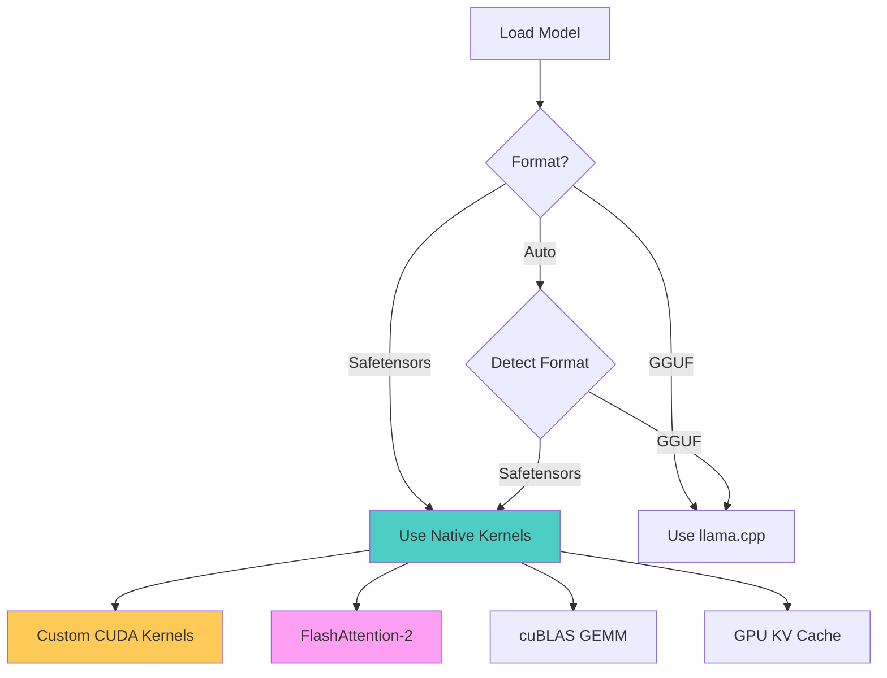
```mermaid
graph TB
    A[Load Model] --> B{Format?}

    B -->|Safetensors| C[Use Native Kernels]
    B -->|GGUF| D[Use llama.cpp]
    B -->|Auto| E{Detect Format}

    E -->|Safetensors| C
    E -->|GGUF| D

    C --> F[Custom CUDA Kernels]
    C --> G[FlashAttention-2]
    C --> H[cuBLAS GEMM]
    C --> I[GPU KV Cache]

    style C fill:#4ecdc4
    style F fill:#feca57
    style G fill:#ff9ff3
```

**Automatic Detection:**

When `INFERFLUX_NATIVE_CUDA_EXECUTOR` is not set, InferFlux auto-detects safetensors models and uses native kernels:

```yaml
models:
  - id: qwen2.5-3b
    path: models/qwen2.5-3b-safetensors/
    format: auto  # Detected as safetensors → native kernels
    backend: cuda_native
```

**Manual Override:**

```bash
# Force native kernels (for safetensors)
export INFERFLUX_NATIVE_CUDA_EXECUTOR=native_kernel

# Force llama.cpp delegate
export INFERFLUX_NATIVE_CUDA_EXECUTOR=delegate
```

**Native Kernel Components:**

| Component | Description | Performance |
|-----------|-------------|-------------|
| **FlashAttention-2** | Optimized attention kernel | 2.2x speedup (SM 8.0+) |
| **cuBLAS GEMM** | NVIDIA optimized matrix multiply | Peak throughput |
| **GPU KV Cache** | On-GPU KV cache storage | Zero-copy access |
| **Custom CUDA kernels** | RMSNorm, RoPE, FFN | End-to-end optimization |
| **NVTX annotations** | Profiling support | Nsight Systems compatible |

**Metrics:**

Native kernels report Prometheus metrics:

```prometheus
# Forward pass timing
inferflux_native_forward_passes_total{phase="prefill|decode"}
inferflux_native_forward_duration_ms{phase="prefill|decode"}

# Sampling
inferflux_native_sampling_duration_ms

# KV cache
inferflux_native_kv_active_sequences
inferflux_native_kv_max_sequences

# Throughput
inferflux_native_forward_batch_tokens_total
```

**When to Use Native Kernels:**

✅ **Use native kernels for:**
- Safetensors models (BF16, FP16)
- Maximum performance on NVIDIA GPUs
- Models trained with FlashAttention
- Production deployments

❌ **Use llama.cpp (cuda_universal) for:**
- GGUF quantized models (Q4, Q8, etc.)
- Models with custom llama.cpp optimizations
- Compatibility testing

**Example Configuration:**

```yaml
models:
  # Native kernels for safetensors
  - id: qwen2.5-3b-bf16
    path: models/qwen2.5-3b-safetensors/
    backend: cuda_native
    format: auto

  # llama.cpp for GGUF
  - id: tinyllama-quantized
    path: models/tinyllama-1.1b.gguf
    backend: cuda
    format: gguf
```

## Runtime Configuration

### Backend Priority

```yaml
runtime:
  backend_priority: [cuda, cpu]  # Try CUDA first, fallback to CPU
```

**Selection Flow:**

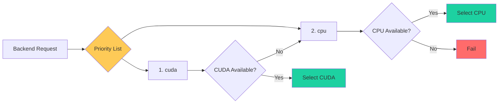
```mermaid
flowchart LR
    A[Backend Request] --> B{Priority List}
    B --> C1[1. cuda]
    B --> C2[2. cpu]

    C1 --> D1{CUDA Available?}
    D1 -->|Yes| E1[Select CUDA]
    D1 -->|No| C2

    C2 --> D2{CPU Available?}
    D2 -->|Yes| E2[Select CPU]
    D2 -->|No| F[Fail]

    style B fill:#feca57
    style E1 fill:#1dd1a1
    style E2 fill:#1dd1a1
    style F fill:#ff6b6b
```

### CUDA Configuration

```yaml
runtime:
  cuda:
    enabled: true

    # Attention kernel selection
    attention:
      kernel: auto              # auto, fa2, fa3, standard

    # FlashAttention configuration
    flash_attention:
      enabled: true             # Enable FA2 (requires SM 8.0+)
      tile_size: 128            # FA2 tile size (64-256)

    # Phase overlap for mixed batches
    phase_overlap:
      enabled: true             # Enable prefill/decode overlap
      min_prefill_tokens: 256   # Min tokens before overlap
      prefill_replica: false    # Dual-context overlap (memory intensive)
```

### FlashAttention Decision Tree

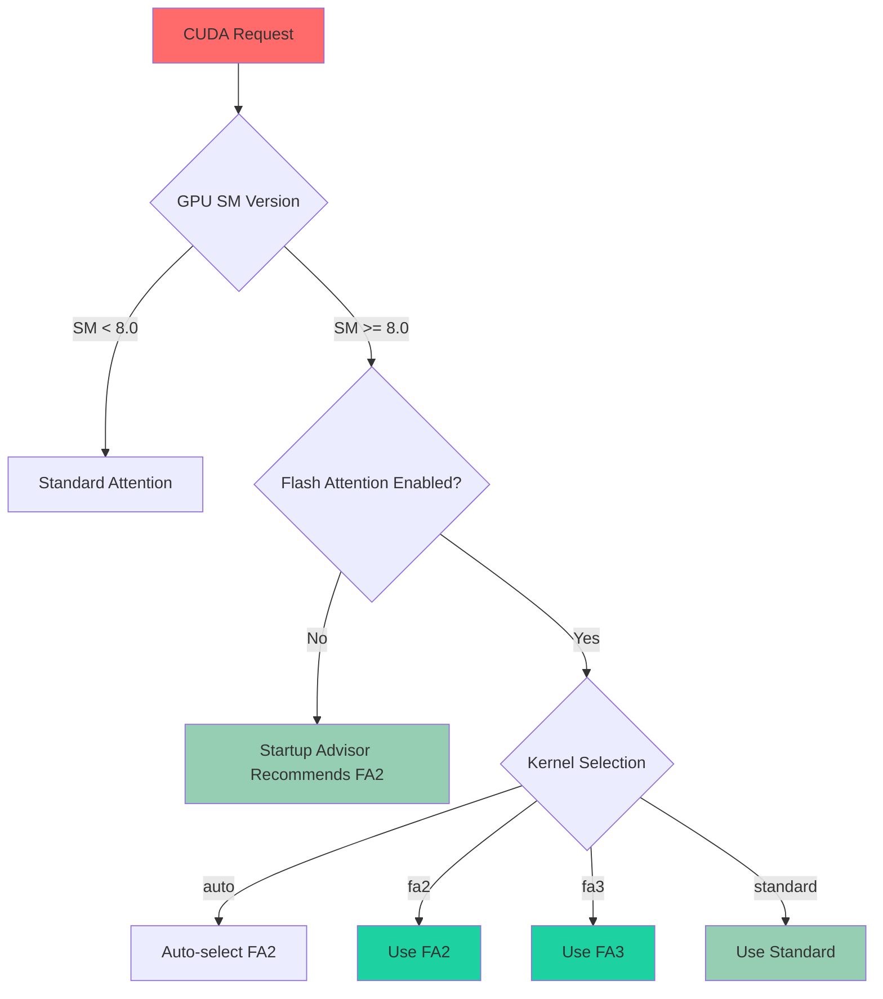
```mermaid
flowchart TD
    A[CUDA Request] --> B{GPU SM Version}
    B -->|SM < 8.0| C[Standard Attention]
    B -->|SM >= 8.0| D{Flash Attention Enabled?}

    D -->|No| E[Startup Advisor Recommends FA2]
    D -->|Yes| F{Kernel Selection}

    F -->|auto| G[Auto-select FA2]
    F -->|fa2| H[Use FA2]
    F -->|fa3| I[Use FA3]
    F -->|standard| J[Use Standard]

    style A fill:#ff6b6b
    style E fill:#96ceb4
    style H fill:#1dd1a1
    style I fill:#1dd1a1
    style J fill:#96ceb4
```

### Scheduler Configuration

```yaml
runtime:
  scheduler:
    max_batch_size: 16           # Max concurrent requests
    max_batch_tokens: 8192        # Max tokens per batch
    min_batch_size: 1             # Min batch before flushing
    batch_accumulation_ms: 5      # Wait time to accumulate larger batches
```

### Batch Size Recommendation

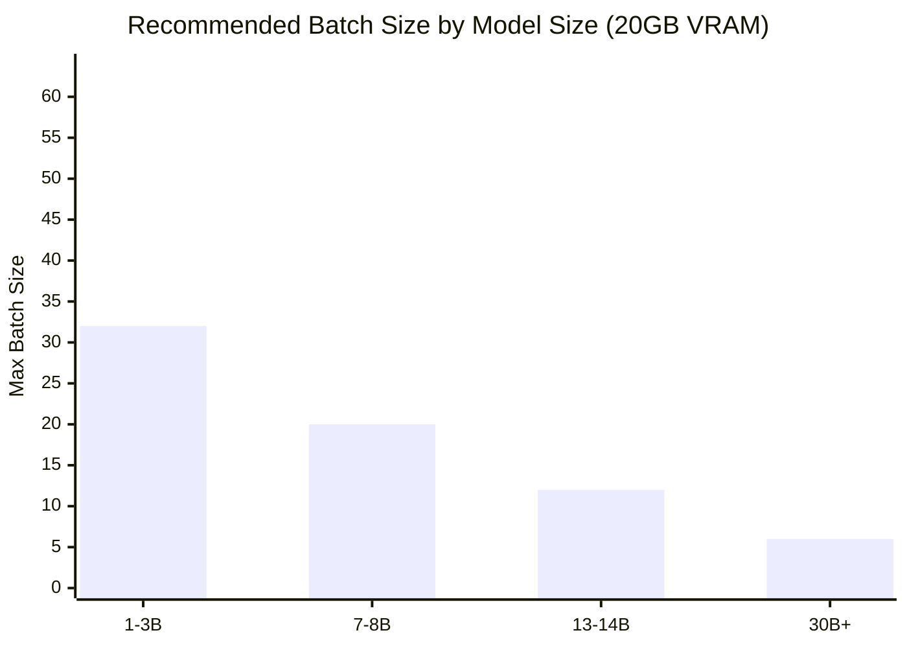
```mermaid
xychart-beta
    title "Recommended Batch Size by Model Size (20GB VRAM)"
    x-axis ["1-3B", "7-8B", "13-14B", "30B+"]
    y-axis "Max Batch Size" 0 --> 64
    bar [32, 20, 12, 6]
```

| Model Size | max_batch_size | max_batch_tokens | cpu_pages |
|-------------|----------------|-------------------|-----------|
| 1-3B | 24-32 | 8192-16384 | 256-512 |
| 7-8B | 16-24 | 8192 | 512-1024 |
| 13-14B | 12-16 | 8192 | 1536-2048 |
| 30B+ | 6-12 | 4096-8192 | 2048-3072 |

### KV Cache Configuration

```yaml
runtime:
  paged_kv:
    cpu_pages: 256               # Number of KV cache pages
    eviction: lru                # Eviction policy: lru or clock
```

### KV Cache Sizing

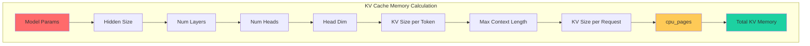
```mermaid
graph TB
    subgraph "KV Cache Memory Calculation"
        A[Model Params] --> B[Hidden Size]
        B --> C[Num Layers]
        C --> D[Num Heads]
        D --> E[Head Dim]

        E --> F[KV Size per Token]
        F --> G[Max Context Length]
        G --> H[KV Size per Request]

        H --> I[cpu_pages]
        I --> J[Total KV Memory]
    end

    style A fill:#ff6b6b
    style I fill:#feca57
    style J fill:#1dd1a1
```

**Formula:** `KV_memory = cpu_pages × page_size × 2 (K+V) × 2 bytes (FP16)`

### Tensor Parallelism

```yaml
runtime:
  tensor_parallel: 1             # Number of GPUs for model sharding
```

### Multi-GPU Decision

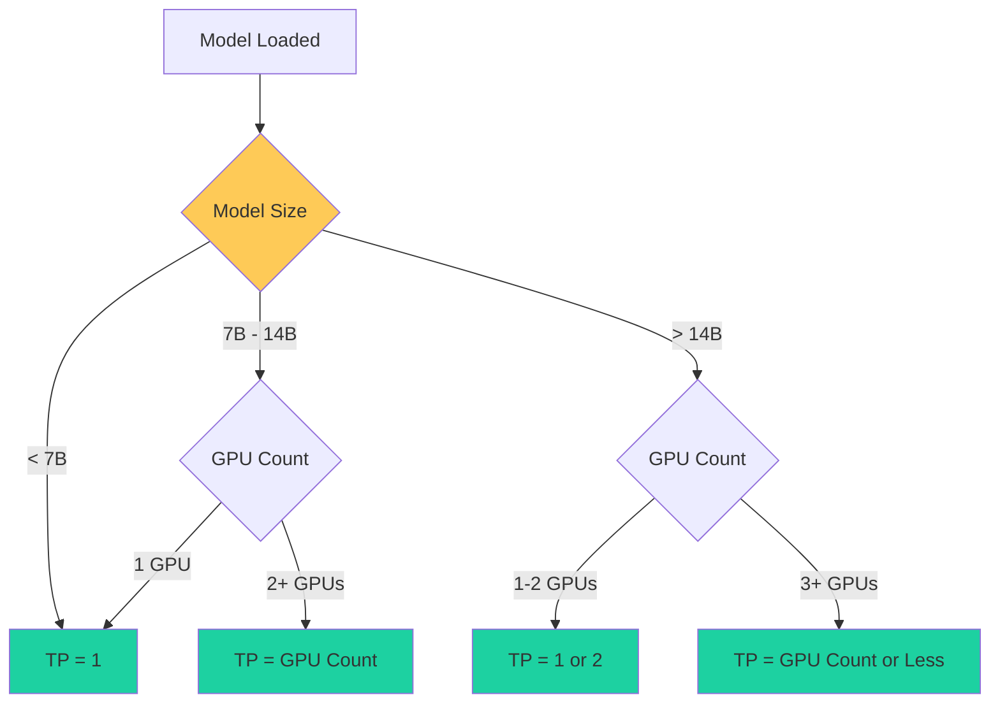
```mermaid
flowchart TD
    A[Model Loaded] --> B{Model Size}
    B -->|< 7B| C[TP = 1]
    B -->|7B - 14B| D{GPU Count}
    B -->|> 14B| E{GPU Count}

    D -->|1 GPU| C
    D -->|2+ GPUs| F[TP = GPU Count]

    E -->|1-2 GPUs| G[TP = 1 or 2]
    E -->|3+ GPUs| H[TP = GPU Count or Less]

    style B fill:#feca57
    style C fill:#1dd1a1
    style F fill:#1dd1a1
    style G fill:#1dd1a1
    style H fill:#1dd1a1
```

## Authentication Configuration

### API Key Authentication

```yaml
auth:
  api_keys:
    - key: dev-key-123            # Development key
      scopes:                     # Permissions
        - generate                # - generate: Create completions
        - read                    # - read: View models
        - admin                   # - admin: Full access

    - key: prod-key-abc           # Production key
      scopes:
        - generate
        - read                    # No admin access
```

### Permission Matrix

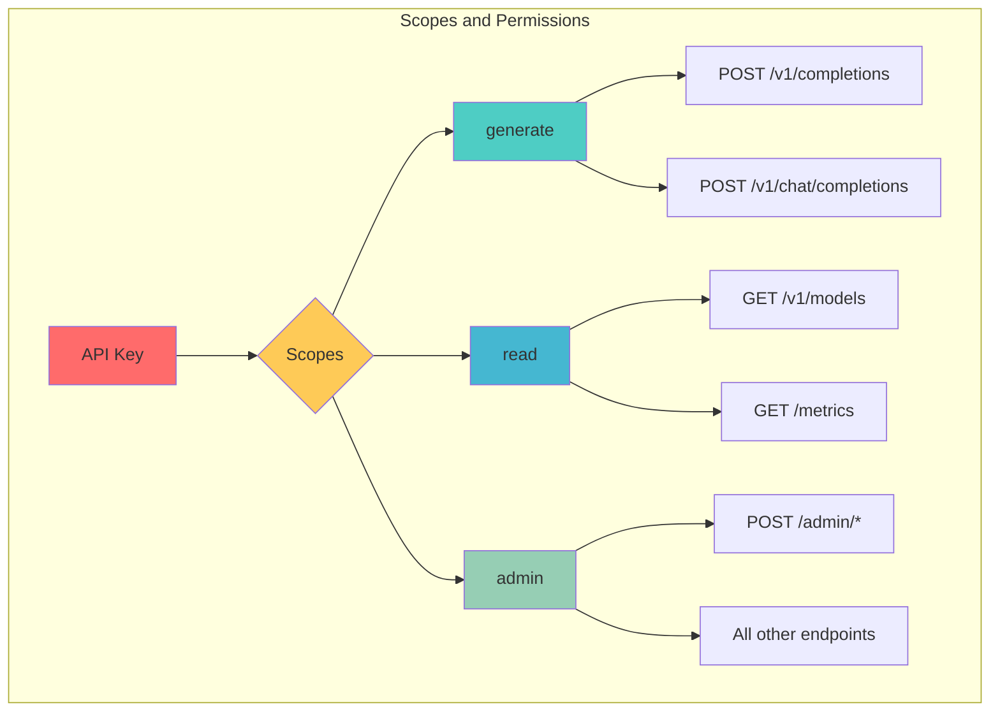
```mermaid
graph TD
    subgraph "Scopes and Permissions"
        A[API Key] --> B{Scopes}

        B --> C1[generate]
        B --> C2[read]
        B --> C3[admin]

        C1 --> D1[POST /v1/completions]
        C1 --> D2[POST /v1/chat/completions]

        C2 --> D3[GET /v1/models]
        C2 --> D4[GET /metrics]

        C3 --> D5[POST /admin/*]
        C3 --> D6[All other endpoints]
    end

    style A fill:#ff6b6b
    style B fill:#feca57
    style C1 fill:#4ecdc4
    style C2 fill:#45b7d1
    style C3 fill:#96ceb4
```

### OIDC Authentication

```yaml
auth:
  oidc_issuer: https://auth.example.com
  oidc_audience: inferflux
```

### Auth Flow

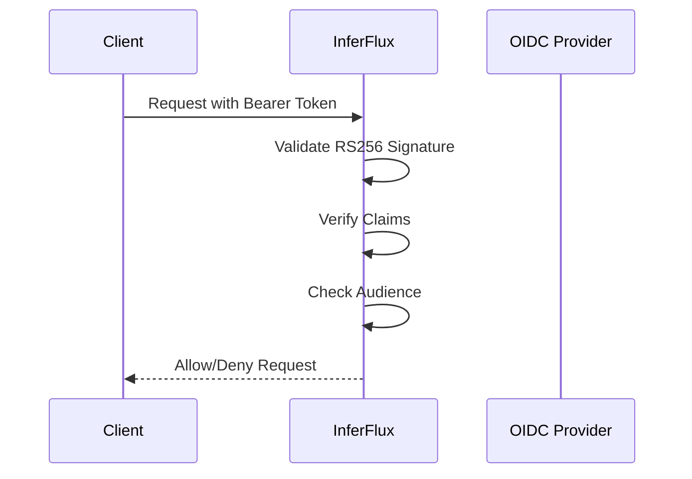
```mermaid
sequenceDiagram
    participant C as Client
    participant I as InferFlux
    participant O as OIDC Provider

    C->>I: Request with Bearer Token
    I->>I: Validate RS256 Signature
    I->>I: Verify Claims
    I->>I: Check Audience
    I-->>C: Allow/Deny Request
```

### Rate Limiting

```yaml
auth:
  rate_limit_per_minute: 120     # Per-API-key limit
```

## Observability Configuration

### Metrics

```yaml
server:
  enable_metrics: true            # Enable Prometheus endpoint
```

### Available Metrics

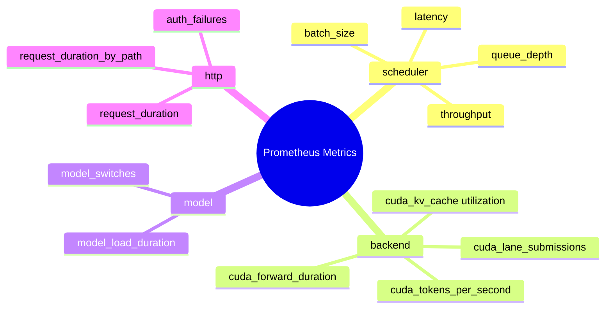
```mermaid
mindmap
  root((Prometheus Metrics))
    scheduler
      batch_size
      queue_depth
      latency
      throughput
    backend
      cuda_tokens_per_second
      cuda_forward_duration
      cuda_kv_cache utilization
      cuda_lane_submissions
    model
      model_load_duration
      model_switches
    http
      request_duration
      request_duration_by_path
      auth_failures
```

### Structured Logging

```yaml
logging:
  level: info                    # debug, info, warn, error
  format: json                   # json or text
  audit_log: logs/audit.log      # Audit trail location
```

### Log Format

```json
{
  "timestamp": "2026-03-04T15:30:45.123Z",
  "level": "INFO",
  "component": "server",
  "message": "Request completed",
  "duration_ms": 523,
  "model": "llama3-8b",
  "tokens": 128
}
```

## Policy Configuration

### Guardrails

```yaml
guardrails:
  blocklist:                    # Blocked words/phrases
    - secret
    - confidential
    - password
```

### OPA Integration

```yaml
guardrails:
  opa_endpoint: http://opa:8181/v1/data
```

### Policy Enforcement Flow

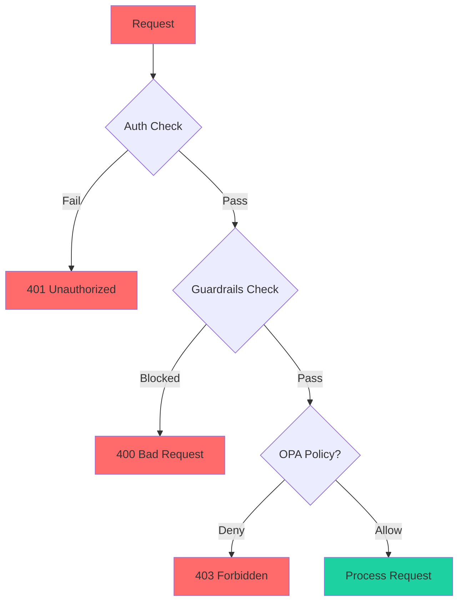
```mermaid
flowchart TD
    A[Request] --> B{Auth Check}
    B -->|Fail| C[401 Unauthorized]
    B -->|Pass| D{Guardrails Check}

    D -->|Blocked| E[400 Bad Request]
    D -->|Pass| F{OPA Policy?}

    F -->|Deny| G[403 Forbidden]
    F -->|Allow| H[Process Request]

    style A fill:#ff6b6b
    style C fill:#ff6b6b
    style E fill:#ff6b6b
    style G fill:#ff6b6b
    style H fill:#1dd1a1
```

## Environment Variables

### Variable Reference

| Variable | Description | Example |
|----------|-------------|---------|
| `INFERFLUX_MODEL_PATH` | Default model path | `/models/llama3.gguf` |
| `INFERFLUX_MODELS` | Multi-model config | `id=m1,path=/p1.gguf;id=m2,path=/p2.gguf` |
| `INFERFLUX_NATIVE_CUDA_EXECUTOR` | CUDA executor mode | `native_kernel` for safetensors |
| `INFERFLUX_BACKEND_PRIORITY` | Backend selection order | `cuda,cpu` |
| `INFERFLUX_DISABLE_STARTUP_ADVISOR` | Disable advisor | `true` |
| `INFERCTL_API_KEY` | Client API key | `dev-key-123` |
| `INFERFLUX_POLICY_PASSPHRASE` | Policy encryption | `secret-key` |

### Config Precedence

```mermaid
graph TD
    A[Config Value] --> B{Env Var Set?}
    B -->|Yes| C[Use Env Var]
    B -->|No| D{Config File Set?}
    D -->|Yes| E[Use Config File]
    D -->|No| F[Use Default]

    style B fill:#feca57
    style C fill:#1dd1a1
    style E fill:#1dd1a1
    style F fill:#96ceb4
```

## Complete Example

```yaml
server:
  host: 0.0.0.0
  http_port: 8080
  max_concurrent: 1024
  enable_metrics: true

models:
  - id: llama3-8b
    path: /models/llama3-8b.Q4_K_M.gguf
    format: gguf
    backend: cuda_universal
    default: true

runtime:
  backend_priority: [cuda, cpu]

  cuda:
    enabled: true
    attention:
      kernel: auto
    flash_attention:
      enabled: true
      tile_size: 128
    phase_overlap:
      enabled: true
      min_prefill_tokens: 256

  scheduler:
    max_batch_size: 32
    max_batch_tokens: 8192
    min_batch_size: 1
    batch_accumulation_ms: 5

  tensor_parallel: 1

  paged_kv:
    cpu_pages: 512
    eviction: lru

auth:
  api_keys:
    - key: prod-key-abc
      scopes: [generate, read]
  rate_limit_per_minute: 120

logging:
  level: info
  format: json
  audit_log: logs/audit.log

guardrails:
  blocklist:
    - secret
    - confidential
```

## Troubleshooting Configs

### Common Issues

```mermaid
flowchart TD
    A[Config Issue] --> B{Problem}
    B -->|Model not loading| C[Check path and format]
    B -->|CUDA not working| D[Check cuda.enabled]
    B -->|Slow performance| E[Check batch_size and KV pages]
    B -->|Auth failures| F[Check API key and scopes]

    C --> G[Verify file exists]
    D --> H[Verify GPU available]
    E --> I[Run startup advisor]
    F --> J[Check key is hashed]

    style A fill:#ff6b6b
    style G fill:#1dd1a1
    style H fill:#1dd1a1
    style I fill:#1dd1a1
    style J fill:#1dd1a1
```

### Validation Command

```bash
# Check config syntax
./build/inferfluxd --config config/server.yaml --validate

# Run with startup advisor
./build/inferfluxd --config config/server.yaml 2>&1 | grep -A 20 "Startup Recommendations"
```

---

**Next:** [Performance Tuning](PERFORMANCE_TUNING.md) | [Admin Guide](AdminGuide.md) | [Competitive Positioning](COMPETITIVE_POSITIONING.md)
