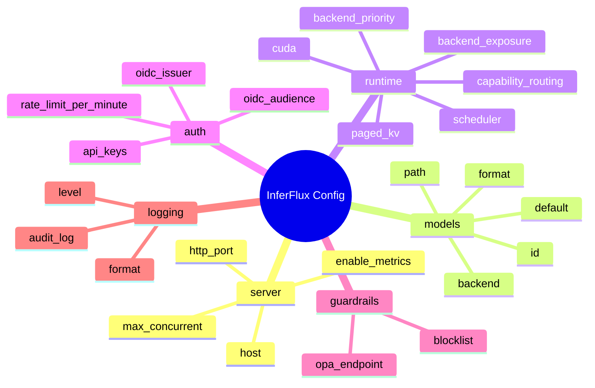
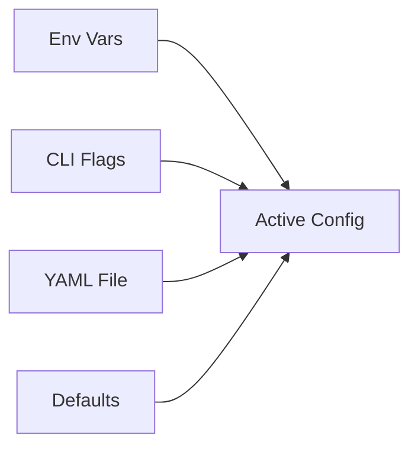

# Configuration Reference

**Status:** Canonical (OSS)

## 1) Config Map (Infographic First)



## 2) File + Precedence Contract

| Source | Typical path / usage | Priority |
|---|---|---:|
| Environment variables | `INFERFLUX_*`, `INFERCTL_API_KEY` | 1 (highest) |
| CLI flags | `--config ...` and runtime command flags | 2 |
| YAML config | `config/server.yaml` or custom file | 3 |
| Built-in defaults | compile/runtime defaults | 4 |



## 3) Top-Level Schema (What Matters Most)

| Key | Required | Purpose |
|---|---|---|
| `server` | Yes | host/port/metrics/tracing switches |
| `models` | Yes | one or more model definitions |
| `runtime` | Yes | backend selection, batching, cache, CUDA |
| `auth` | Yes | API keys, OIDC, rate limits |
| `guardrails` | Recommended | blocklist and optional OPA policy endpoint |
| `logging` | Yes | level/format/audit log path |
| `registry` | Optional | hot-reload model registry polling |

## 4) Minimal Working Profiles

### CPU profile

```yaml
server:
  host: 0.0.0.0
  http_port: 8080
  enable_metrics: true

models:
  - id: llama3-8b
    path: models/Meta-Llama-3-8B-Instruct.Q4_K_M.gguf
    format: gguf
    backend: cpu
    default: true

runtime:
  backend_priority: [cpu]
  scheduler:
    max_batch_size: 4
    max_batch_tokens: 8192
    min_batch_size: 1
    batch_accumulation_ms: 0
    session_handles:
      enabled: false
      ttl_ms: 300000
      max_sessions: 1024
  paged_kv:
    cpu_pages: 4096
    eviction: lru

auth:
  api_keys:
    - key: dev-key-123
      scopes: [generate, read, admin]
  rate_limit_per_minute: 120
```

### NVIDIA CUDA + GGUF llama.cpp compatibility profile

```yaml
models:
  - id: llama3-8b
    path: models/Meta-Llama-3-8B-Instruct.Q4_K_M.gguf
    format: gguf
    backend: cuda_llama_cpp
    default: true

runtime:
  backend_priority: [cuda, cpu]
  cuda:
    enabled: true
    attention:
      kernel: auto
    flash_attention:
      enabled: true
      tile_size: 128
  scheduler:
    max_batch_size: 16
    max_batch_tokens: 8192
    min_batch_size: 1
    batch_accumulation_ms: 5
    session_handles:
      enabled: false
      ttl_ms: 300000
      max_sessions: 1024
```

### NVIDIA CUDA + safetensors native profile

```yaml
models:
  - id: qwen2.5-3b
    path: models/qwen2.5-3b-safetensors/
    format: safetensors
    backend: cuda_native
    default: true

runtime:
  backend_priority: [cuda, cpu]
  backend_exposure:
    prefer_native: true
    allow_llama_cpp_fallback: true
    strict_native_request: false
```

## 5) Model Format / Backend Contract

| Model format | Recommended backend | Notes |
|---|---|---|
| `gguf` | `cuda_llama_cpp` or `cpu` | strongest compatibility path |
| `safetensors` | `cuda_native` | native provider path |
| `hf` | `cuda` or `cpu` | resolved to local model format |
| `auto` | `cuda`/`cpu` | format inferred from path |

## 6) Backend Exposure Policy Contract

```yaml
runtime:
  backend_exposure:
    prefer_native: true
    allow_llama_cpp_fallback: true
    strict_native_request: false
```

| Key | Behavior |
|---|---|
| `prefer_native` | choose native provider when eligible |
| `allow_llama_cpp_fallback` | allow fallback to llama.cpp path when native unavailable |
| `strict_native_request` | explicit `cuda_native` requests fail fast if native path is not ready |

When strict mode is enabled, unsupported explicit native requests fail with `422 backend_policy_violation`.

For `backend: cuda` requests, runtime fallback order is:
`cuda(native)` -> `cuda_llama_cpp` -> `rocm` (if compiled) -> `mlx` (if compiled) -> `mps` (if compiled) -> `cpu`.

## 7) Runtime Tuning Cheat Sheet

### Scheduler

| Key | Default pattern | Tuning intent |
|---|---|---|
| `runtime.scheduler.max_batch_size` | 4-16 | raise for throughput if latency budget allows |
| `runtime.scheduler.max_batch_tokens` | 8192 | cap per-batch token memory pressure |
| `runtime.scheduler.min_batch_size` | 1 | keep low for responsiveness |
| `runtime.scheduler.batch_accumulation_ms` | 0-5 | small wait to form better batches |
| `runtime.scheduler.session_handles.enabled` | `false` | optional `session_id -> sequence slot` mapping layer |
| `runtime.scheduler.session_handles.ttl_ms` | `300000` | TTL for idle session mappings |
| `runtime.scheduler.session_handles.max_sessions` | `1024` | upper bound on concurrently tracked sessions |

Session handle contract:
- API behavior remains stateless by default.
- `session_id` support is opt-in and only active when `session_handles.enabled=true`.
- KV dtype stays server/model-load scoped (`runtime.cuda.kv_cache_dtype`), not per request/session.

### KV cache

| Key | Default pattern | Tuning intent |
|---|---|---|
| `runtime.paged_kv.cpu_pages` | 256-4096 | increase for longer contexts / reuse |
| `runtime.paged_kv.eviction` | `lru` | eviction strategy (`lru` or `clock`) |

### CUDA

| Key | Default pattern | Tuning intent |
|---|---|---|
| `runtime.cuda.enabled` | `true` on GPU nodes | enable accelerator path |
| `runtime.cuda.attention.kernel` | `auto` | kernel selection policy |
| `runtime.cuda.flash_attention.enabled` | `true` on SM>=8.0 | throughput uplift on supported GPUs |
| `runtime.cuda.kv_cache_dtype` | `auto` | KV precision policy (`auto`, `fp16`, `bf16`, `int8`, `fp8`) |
| `runtime.cuda.phase_overlap.enabled` | `true` for mixed workloads | prefill/decode overlap |
| `runtime.cuda.phase_overlap.min_prefill_tokens` | `256` | overlap trigger threshold |

### HTTP Server

| Key | Default pattern | Tuning intent |
|---|---|---|
| `INFERFLUX_HTTP_WORKERS` | `16` | increase for high concurrency non-streaming workloads |

**Performance notes**:
- Non-streaming requests block worker threads via `future.get()` until completion
- More workers = more concurrent non-streaming capacity (4 workers → 2 tok/s, 16 workers → ~8 tok/s for 8 concurrent requests)
- Streaming requests are async and don't block workers (unlimited concurrent capacity)
- Formula: `workers >= expected_concurrent_non_streaming_requests`

**Trade-offs**:
- Each worker thread requires stack memory (~8 MB default)
- More workers = higher memory footprint
- Context switching overhead with very high worker counts (>64)

**Example usage**:
```bash
# High concurrency non-streaming workload
INFERFLUX_HTTP_WORKERS=32 ./build/inferfluxd --config config/server.yaml

# Memory-constrained environment
INFERFLUX_HTTP_WORKERS=8 ./build/inferfluxd --config config/server.yaml
```

## 8) Auth + Policy Contract

| Area | Key(s) | Minimal production stance |
|---|---|---|
| API keys | `auth.api_keys` | remove dev keys; least-privilege scopes |
| Rate limiting | `auth.rate_limit_per_minute` | set non-zero per-key limit |
| OIDC | `auth.oidc_issuer`, `auth.oidc_audience` | set for federated identity deployments |
| Guardrails | `guardrails.blocklist` | non-empty blocklist baseline |
| OPA | `guardrails.opa_endpoint` | set when external policy engine is required |

Scope contract:

| Scope | Allows |
|---|---|
| `generate` | completion/chat generation |
| `read` | model list/detail + embeddings |
| `admin` | `/v1/admin/*` operations |

## 9) Logging + Metrics Contract

| Area | Key(s) | Recommendation |
|---|---|---|
| Metrics | `server.enable_metrics` | keep `true` in all envs |
| Tracing | `server.enable_tracing` | enable where OTEL collector exists |
| Log level | `logging.level` | `info` prod, `debug` for incident windows |
| Log format | `logging.format` | `json` in production |
| Audit log | `logging.audit_log` | durable, writable path |

## 10) Environment Override Map

| Variable | Overrides |
|---|---|
| `INFERFLUX_MODEL_PATH` | default model path |
| `INFERFLUX_MODELS` | multi-model config string |
| `INFERFLUX_NATIVE_CUDA_STRICT` | fail model load if native CUDA runtime reports fallback |
| `INFERFLUX_DISABLE_NATIVE_CUDA` | force native CUDA runtime readiness to false |
| `INFERFLUX_BACKEND_PRIORITY` | runtime backend priority chain |
| `INFERFLUX_BACKEND_PREFER_NATIVE` | `runtime.backend_exposure.prefer_native` |
| `INFERFLUX_BACKEND_ALLOW_LLAMA_FALLBACK` | `runtime.backend_exposure.allow_llama_cpp_fallback` |
| `INFERFLUX_BACKEND_STRICT_NATIVE_REQUEST` | `runtime.backend_exposure.strict_native_request` |
| `INFERFLUX_DISABLE_STARTUP_ADVISOR` | suppress startup recommendations |
| `INFERFLUX_HTTP_WORKERS` | HTTP server thread pool size (default: 16) |
| `INFERCTL_API_KEY` | CLI auth token |

## 11) Startup Advisor Alignment

The startup advisor evaluates config quality at boot and emits recommendations for:

1. backend/model format pairing
2. FlashAttention enablement on supported GPUs
3. batch sizing relative to VRAM/model size
4. phase overlap readiness
5. KV page sizing
6. tensor parallel hints for multi-GPU
7. explicit model format declaration
8. GPU availability usage

## 12) Validation + Fast Troubleshooting

### Validate startup config

```bash
./build/inferfluxd --config config/server.yaml
```

### Common failure matrix

| Symptom | First check |
|---|---|
| model load failure | model `path`, `format`, `backend` compatibility |
| `422 backend_policy_violation` | strict native request policy + backend readiness |
| low throughput | batch settings, KV pages, CUDA/FA2 enablement |
| auth failures | API key scopes and bearer header |
| no metrics | `server.enable_metrics` and `/metrics` reachability |

## 13) Related Docs

- [Quickstart](Quickstart.md)
- [API Surface](API_SURFACE.md)
- [Admin Guide](AdminGuide.md)
- [Architecture](Architecture.md)
- [ARCHIVE_INDEX](ARCHIVE_INDEX.md)
