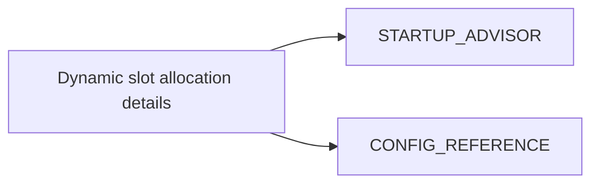

# Dynamic Slot Allocation (Consolidated)

**Status:** Consolidated

## Canonical Source Map

| Need | Source of truth |
|---|---|
| Runtime advisor behavior | [STARTUP_ADVISOR](STARTUP_ADVISOR.md) |
| User-facing configuration knobs | [CONFIG_REFERENCE](CONFIG_REFERENCE.md) |

## Archived Full Deep-Dive

- [DYNAMIC_SLOT_ALLOCATION_STARTUP_ADVISOR_2026_03_05](archive/evidence/DYNAMIC_SLOT_ALLOCATION_STARTUP_ADVISOR_2026_03_05.md)
