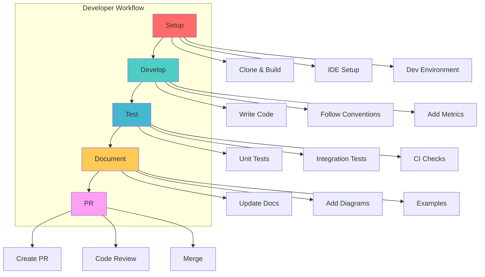
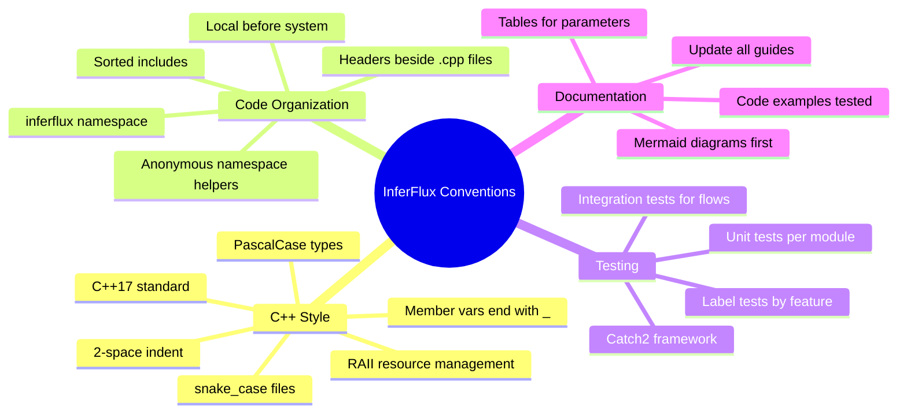
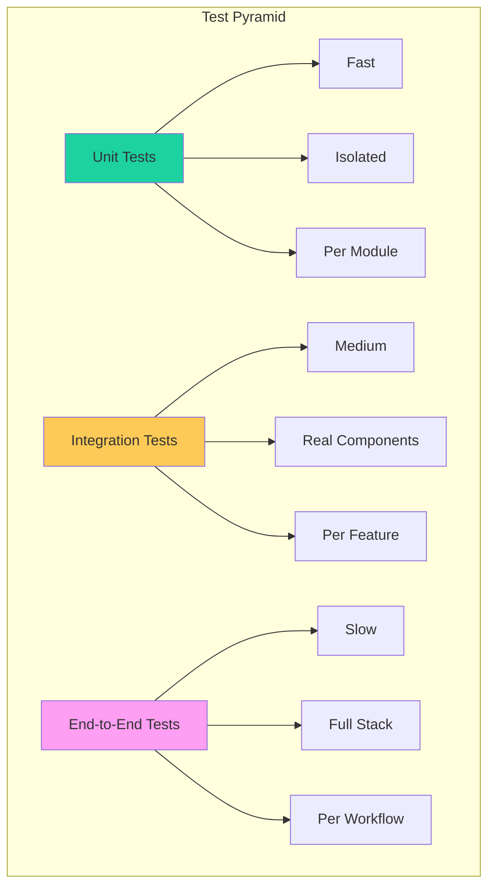
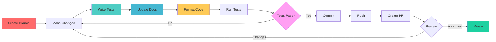
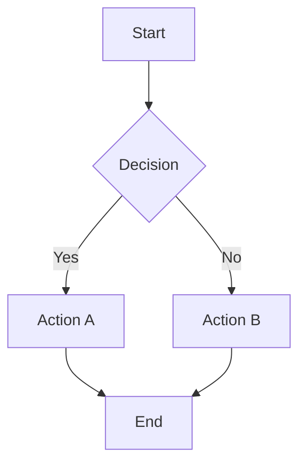
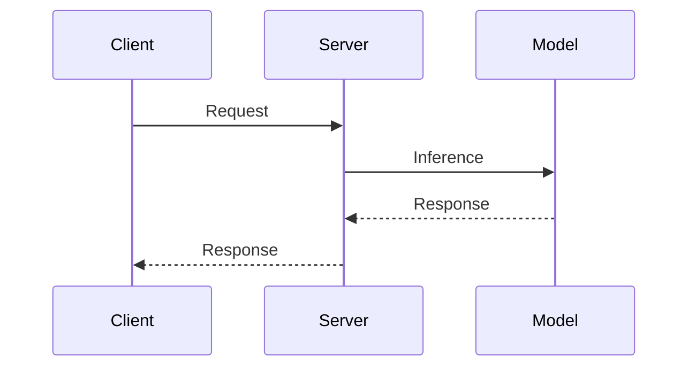

# Developer Guide

Complete guide for contributing to InferFlux development.

## Overview



## Quick Start

### Prerequisites

| Tool | Version | Required For |
|------|---------|--------------|
| **CMake** | ≥ 3.20 | Build system |
| **C++ Compiler** | C++17 compatible | Compilation |
| **Git** | ≥ 2.30 | Version control |
| **Python** | ≥ 3.8 | Testing scripts |
| **NVIDIA CUDA** | ≥ 11.8 (optional) | CUDA backend |
| **ROCm** | ≥ 5.7 (optional) | AMD GPU backend |
| **clang-format** | ≥ 14 | Code formatting |

### Clone & Build

```bash
# Clone repository
git clone https://github.com/your-org/inferflux.git
cd inferflux

# Initialize submodules (llama.cpp, nlohmann/json, Catch2)
git submodule update --init --recursive

# Build (Release mode, auto-detects cores)
./scripts/build.sh

# Fast incremental build
cmake -S . -B build && cmake --build build -j

# Run tests
ctest --test-dir build --output-on-failure
```

### Build Options

```bash
# CPU-only build (fastest, no GPU SDK required)
cmake -S . -B build -DENABLE_CUDA=OFF -DENABLE_ROCM=OFF -DENABLE_MPS=OFF
cmake --build build -j

# CUDA build
cmake -S . -B build -DENABLE_CUDA=ON
cmake --build build -j

# Debug build with sanitizers
cmake -S . -B build -DCMAKE_BUILD_TYPE=Debug -DENABLE_ASAN=ON
cmake --build build -j

# Coverage build (requires gcov/lcov)
cmake -S . -B build-cov -DENABLE_COVERAGE=ON
cmake --build build-cov -j
cmake --build build-cov --target coverage
```

## Development Environment

### IDE Setup

**VS Code:**

```json
// .vscode/settings.json
{
  "C_Cpp.default.configurationProvider": "ms-vscode.cmake-tools",
  "cmake.configureArgs": [
    "-DENABLE_CUDA=OFF"
  ],
  "files.associations": {
    "*.cpp": "cpp",
    "*.h": "cpp"
  },
  "editor.formatOnSave": true,
  "C_Cpp.clang_format_style": "file"
}
```

```json
// .vscode/launch.json
{
  "version": "0.2.0",
  "configurations": [
    {
      "name": "Debug Server",
      "type": "cppdbg",
      "request": "launch",
      "program": "${workspaceFolder}/build/inferfluxd",
      "args": ["--config", "config/server.yaml"],
      "cwd": "${workspaceFolder}",
      "environment": [],
      "externalConsole": false,
      "MIMode": "lldb"
    }
  ]
}
```

**CLion/IntelliJ:**
- File → Open → Select inferflux directory
- CMake will be detected automatically
- Set CMake options: Settings → Build, Execution, Deployment → CMake
- Add build options: `-DENABLE_CUDA=OFF` for faster iteration

**Vim/Neovim:**

```vim
" .vimrc
Plug 'phaazon/hop.nvim'
Plug 'neovim/nvim-lspconfig'
Plug 'hrsh7th/nvim-cmp'

lua << EOF
require('lspconfig').clangd.setup{
  cmd = {
    "clangd",
    "--background-index",
    "--clang-tidy",
    "--header-insertion=iwyu",
  }
}
EOF
```

### Code Conventions



**Naming Conventions:**

| Type | Convention | Example |
|------|------------|---------|
| Files | `snake_case.cpp` | `startup_advisor.cpp` |
| Classes | `PascalCase` | `StartupAdvisor` |
| Functions | `PascalCase` | `RunStartupAdvisor()` |
| Member vars | `snake_case_` | `model_count_` |
| Local vars | `snake_case` | `model_count` |
| Constants | `kPascalCase` | `kMaxBatchSize` |
| Namespaces | `lowercase` | `inferflux::` |

**Include Order:**

```cpp
// 1. Corresponding header (if .cpp)
#include "server/startup_advisor.h"

// 2. Local headers (sorted alphabetically)
#include "runtime/backends/backend_manager.h"
#include "scheduler/model_router.h"

// 3. System headers (sorted alphabetically)
#include <algorithm>
#include <chrono>
#include <memory>
```

## Testing Strategy

### Test Organization



### Unit Tests

**Framework:** Catch2 v3.7.1

**Location:** `tests/unit/`

**Example:**

```cpp
// tests/unit/test_startup_advisor.cpp
#include <catch2/catch_test_macros.hpp>
#include "server/startup_advisor.h"

using namespace inferflux;

TEST_CASE("Well-tuned CUDA config produces 0 recommendations", "[startup_advisor]") {
    StartupAdvisorContext ctx;

    // Setup GPU info
    ctx.gpu.available = true;
    ctx.gpu.device_count = 1;
    ctx.gpu.compute_major = 8;
    ctx.gpu.compute_minor = 9;
    ctx.gpu.free_vram_bytes = 16 * 1024 * 1024 * 1024; // 16 GB

    // Setup config
    ctx.config.cuda_enabled = true;
    ctx.config.flash_attention_enabled = true;
    ctx.config.phase_overlap_enabled = true;
    ctx.config.max_batch_size = 32;

    // Add model
    AdvisorModelInfo model;
    model.id = "test-model";
    model.format = "gguf";
    model.backend = "cuda_universal";
    ctx.models.push_back(model);

    int count = RunStartupAdvisor(ctx);
    REQUIRE(count == 0);
}

TEST_CASE("GPU unused produces recommendation", "[startup_advisor]") {
    StartupAdvisorContext ctx;

    ctx.gpu.available = true;
    ctx.gpu.device_count = 1;
    ctx.config.cuda_enabled = false;

    AdvisorModelInfo model;
    model.id = "cpu-model";
    model.backend = "cpu";
    ctx.models.push_back(model);

    int count = RunStartupAdvisor(ctx);
    REQUIRE(count >= 1);
}
```

**Run Unit Tests:**

```bash
# Run all unit tests
ctest --test-dir build --output-on-failure

# Run by name
./build/inferflux_tests "Well-tuned CUDA config"

# Run by tag
./build/inferflux_tests "[startup_advisor]"

# Run by label
ctest --test-dir build -R startup_advisor

# Run with verbose output
./build/inferflux_tests -s
```

### Integration Tests

**Location:** `tests/integration/`

**Labels:** `StubIntegration`, `IntegrationSSE`, `IntegrationCLI`, `ShmSmoke`

**Example:**

```python
# tests/integration/stub_integration_test.py
import os
import subprocess
import time
import requests
import signal

def test_stub_integration():
    """Test server startup without real model"""
    server_bin = "./build/inferfluxd"
    config = "config/server.yaml"

    # Start server
    proc = subprocess.Popen(
        [server_bin, "--config", config],
        stdout=subprocess.PIPE,
        stderr=subprocess.PIPE
    )

    try:
        # Wait for startup
        time.sleep(2)

        # Test health endpoint
        resp = requests.get("http://localhost:8080/healthz")
        assert resp.status_code == 200

        # Test metrics endpoint
        resp = requests.get("http://localhost:8080/metrics")
        assert resp.status_code == 200

        # Test models endpoint
        api_key = os.environ.get("INFERCTL_API_KEY", "dev-key-123")
        headers = {"Authorization": f"Bearer {api_key}"}
        resp = requests.get("http://localhost:8080/v1/models", headers=headers)
        assert resp.status_code in [200, 503]  # 503 if no model loaded

    finally:
        # Stop server
        proc.send_signal(signal.SIGTERM)
        proc.wait(timeout=10)
```

**Run Integration Tests:**

```bash
# Set required env vars
export INFERCTL_API_KEY=dev-key-123
export INFERFLUX_MODEL_PATH=/path/to/model.gguf

# Run stub tests (no model required)
ctest --test-dir build -R StubIntegration --output-on-failure

# Run SSE tests (model required)
ctest --test-dir build -R IntegrationSSE --output-on-failure

# Run all integration tests
ctest --test-dir build -R Integration --output-on-failure
```

### Test Labels

| Label | Coverage | Command |
|-------|----------|---------|
| `paged_kv` | Paged cache, offload, ref-counts | `ctest -R paged_kv` |
| `unified_batch` | Chunked prefill + mixed decode | `ctest -R unified_batch` |
| `startup_advisor` | Startup recommendation rules | `ctest -R startup_advisor` |
| `flash_attn` | FlashAttention-2 kernel selection | `ctest -R flash_attn` |
| `backend_capabilities` | Capability-based routing | `ctest -R backend_capabilities` |
| `model_format` | Model format detection | `ctest -R model_format` |
| `auth` | Authentication & authorization | `ctest -R auth` |

### Coverage

```bash
# Build with coverage
cmake -S . -B build-cov -DENABLE_COVERAGE=ON -DCMAKE_BUILD_TYPE=Debug
cmake --build build-cov -j

# Run tests with coverage
cmake --build build-cov --target coverage

# View HTML report
open build-cov/coverage/html/index.html

# Check coverage threshold
lcov --summary build-cov/coverage/lcov.info
```

## Contribution Workflow

### Development Process



### Step-by-Step

**1. Create Branch:**

```bash
git checkout -b feature/startup-advisor
# or
git checkout -b fix/batch-size-calculation
# or
git checkout -b docs/update-admin-guide
```

**2. Make Changes:**

```bash
# Edit files
vim server/startup_advisor.cpp

# Check what changed
git status
git diff
```

**3. Write Tests:**

```bash
# Create test file
vim tests/unit/test_startup_advisor.cpp

# Run tests
ctest --test-dir build -R startup_advisor --output-on-failure
```

**4. Update Documentation:**

```bash
# Update relevant guides
vim docs/CONFIG_REFERENCE.md  # For new config options
vim docs/AdminGuide.md        # For operations changes
vim docs/DeveloperGuide.md    # For developer workflow changes
```

**5. Format Code:**

```bash
# Format all C++ code
find server runtime scheduler model cli \
  \( -name '*.cpp' -o -name '*.h' \) \
  | xargs clang-format -i

# Verify formatting
git diff
```

**6. Run All Tests:**

```bash
# Run unit tests
ctest --test-dir build --output-on-failure

# Run integration tests
ctest --test-dir build -R Integration --output-on-failure

# Run throughput gate
./scripts/run_throughput_gate.py \
  --server-bin ./build/inferfluxd \
  --config config/server.cuda.yaml
```

**7. Commit:**

```bash
git add .
git commit -m "Add startup advisor with 8 recommendation rules

- Probe CUDA/ROCm GPU info at startup
- Check for suboptimal config choices
- Log actionable recommendations
- Suppressible via INFERFLUX_DISABLE_STARTUP_ADVISOR

Closes #123"
```

**8. Push & Create PR:**

```bash
git push origin feature/startup-advisor

# Create PR on GitHub with:
# - Title matching commit
# - Description referencing issue
# - Links to relevant docs
# - Test output from ctest
```

### PR Checklist

- [ ] Code follows conventions (clang-format, naming, includes)
- [ ] Tests added/updated (unit + integration)
- [ ] Documentation updated (CONFIG_REFERENCE, guides)
- [ ] All tests pass (`ctest --output-on-failure`)
- [ ] No new compiler warnings
- [ ] Performance gate passes (run_throughput_gate.py)
- [ ] Diagrams updated (Mermaid, ASCII)
- [ ] Commit messages follow guidelines

### Commit Message Guidelines

**Format:**

```
<type>(<scope>): <subject>

<body>

<footer>
```

**Types:**

- `feat` - New feature
- `fix` - Bug fix
- `docs` - Documentation only
- `test` - Test changes
- `refactor` - Code refactoring
- `perf` - Performance improvement
- `ci` - CI/CD changes

**Example:**

```
feat(runtime): Add FlashAttention-2 support

- Implement FA2 kernel selection based on SM version
- Add metrics for kernel selection (fa2 vs standard)
- Update config reference with flash_attention section

Closes #456

Co-Authored-By: Claude Sonnet 4.6 <noreply@anthropic.com>
```

## Debugging

### Debug Builds

```bash
# Build debug with symbols
cmake -S . -B build-debug -DCMAKE_BUILD_TYPE=Debug
cmake --build build-debug -j

# Run with gdb
gdb --args ./build-debug/inferfluxd --config config/server.yaml

# Common gdb commands
(gdb) run                    # Start program
(gdb) bt                     # Backtrace on crash
(gdb) frame 3                # Switch to frame 3
(gdb) print variable_name    # Print variable
(gdb) info locals            # Show local variables
```

### Sanitizers

```bash
# Build with AddressSanitizer and UBSan
cmake -S . -B build-san -DENABLE_ASAN=ON -DCMAKE_BUILD_TYPE=Debug
cmake --build build-san -j

# Run tests with sanitizers
./build-san/inferflux_tests "[startup_advisor]"

# Sanitizer will detect:
# - Use-after-free
# - Buffer overflows
# - Memory leaks
# - Undefined behavior
```

### Logging

```cpp
// Use structured logging
#include "server/logger.h"

// Add context to logs
log::Info("startup_advisor",
  "Model loaded: id=%s, backend=%s, format=%s",
  model.id.c_str(), model.backend.c_str(), model.format.c_str());

// Debug logging
log::Debug("my_component", "Variable value: %d", variable);

// Error logging
log::Error("my_component", "Failed to load model: %s", error_msg.c_str());
```

**Enable Debug Logging:**

```yaml
# config/server.yaml
logging:
  level: debug
  format: text
```

### Profiling

**CPU Profiling:**

```bash
# Record profile
perf record -g ./build/inferfluxd --config config/server.yaml

# Analyze
perf report

# Flame graph
perf script | stackcollapse-perf.pl | flamegraph.pl > flamegraph.svg
```

**CUDA Profiling:**

```bash
# Nsight Systems
nsys profile \
  --output=profile.qdrep \
  --force-overwrite=true \
  ./build/inferfluxd --config config/server.cuda.yaml

# Nsight Compute (kernel-level)
ncu --set full \
  --target-processes=all \
  ./build/inferfluxd --config config/server.cuda.yaml
```

### Common Issues

| Issue | Symptom | Solution |
|-------|---------|----------|
| Segfault | Crash with SIGSEGV | Run with `gdb` to get backtrace |
| Memory leak | Memory usage grows | Run with AddressSanitizer |
| Race condition | Intermittent failures | Run with ThreadSanitizer (`-DENABLE_TSAN=ON`) |
| Slow compile | Long build times | Use `ccache` and precompiled headers |
| Test flakes | Intermittent test failures | Check for timing dependencies, add delays |

## Performance Guidelines

### Metrics

Always add Prometheus metrics for new features:

```cpp
// Add counter
metrics::Counter* my_feature_total =
    metrics_registry->NewCounter("inferflux_my_feature_total",
      "Total count of my feature", "result");

// Use counter
my_feature_total->Increment({"success"});

// Add histogram
metrics::Histogram* my_feature_duration_ms =
    metrics_registry->NewHistogram("inferflux_my_feature_duration_ms",
      "Duration of my feature in milliseconds");

// Use histogram
my_feature_duration_ms->Observe(duration_ms);
```

### Benchmarking

```bash
# Run throughput gate
./scripts/run_throughput_gate.py \
  --server-bin ./build/inferfluxd \
  --config config/server.cuda.yaml \
  --model qwen2.5-3b \
  --backend cuda \
  --min-completion-tok-per-sec 100

# Profile with Nsight Systems
nsys profile \
  --stats=true \
  --force-overwrite=true \
  ./build/inferfluxd --config config/server.cuda.yaml
```

### Performance Tips

1. **Avoid copies** - Use `const std::string&` for parameters
2. **Use move semantics** - `std::move()` when transferring ownership
3. **Reserve capacity** - Pre-allocate vectors with known size
4. **Avoid allocations** - Reuse buffers in hot paths
5. **Profile first** - Measure before optimizing
6. **Cache friendly** - Structure data for sequential access

## Configuration

### Adding New Config Options

**1. Add to YAML schema:**

```cpp
// config/config_loader.cpp
bool LoadConfig(const std::string &path, ServerConfig &config) {
    // ... existing code ...

    // Add new option
    if (node["my_new_option"]) {
        config.my_new_option = node["my_new_option"].as<bool>();
    }

    return true;
}
```

**2. Add to config reference:**

```markdown
# docs/CONFIG_REFERENCE.md

## My New Section

\`\`\`yaml
my_section:
  my_new_option: true  # Enable my new feature
\`\`\`

| Option | Type | Default | Description |
|--------|------|---------|-------------|
| `my_section.my_new_option` | boolean | `false` | Enable my new feature |

**Environment Variable:** `INFERFLUX_MY_NEW_OPTION`
```

**3. Add to template config:**

```yaml
# config/server.template.yaml
my_section:
  my_new_option: false  # Set to true to enable my new feature
```

## Documentation

### Diagram Guidelines

Use **Mermaid diagrams** for:

- Flowcharts (request flow, decision trees)
- Sequence diagrams (API interactions)
- State diagrams (state machines)
- Mind maps (feature organization)
- Timelines (roadmaps)
- Graphs (architecture)

**Example Flowchart:**



**Example Sequence Diagram:**



### Code Examples

All code examples in documentation should be:

- **Tested** - Run the code to verify it works
- **Complete** - Include all necessary context
- **Formatted** - Use syntax highlighting
- **Explained** - Add comments for clarity

```cpp
// Example: Creating a custom backend
class MyBackend : public BackendBase {
public:
    MyBackend(const ModelLoadRequest &req, const BackendConfig &config)
        : BackendBase(req, config) {
        // Initialize your backend
    }

    bool LoadModel() override {
        // Load model logic
        return true;
    }

    token_id_t Decode() override {
        // Generate token
        return token;
    }
};
```

## CI/CD

### GitHub Actions

```yaml
# .github/workflows/ci.yml
name: CI

on: [push, pull_request]

jobs:
  test:
    runs-on: ubuntu-latest

    steps:
    - uses: actions/checkout@v3
      with:
        submodules: recursive

    - name: Install dependencies
      run: |
        sudo apt-get update
        sudo apt-get install -y cmake build-essential

    - name: Build
      run: |
        cmake -S . -B build -DENABLE_CUDA=OFF
        cmake --build build -j

    - name: Run tests
      run: |
        ctest --test-dir build --output-on-failure

    - name: Check formatting
      run: |
        ./scripts/check_format.sh
```

### Local CI Testing

```bash
# Run CI checks locally
./scripts/ci_check.sh

# This will:
# 1. Build the project
# 2. Run all tests
# 3. Check formatting
# 4. Run linting
```

## Resources

### Internal Documentation

- **[INDEX.md](INDEX.md)** - Documentation hub
- **[CONFIG_REFERENCE.md](CONFIG_REFERENCE.md)** - Configuration reference
- **[PERFORMANCE_TUNING.md](PERFORMANCE_TUNING.md)** - Performance guide
- **[BACKEND_DEVELOPMENT.md](BACKEND_DEVELOPMENT.md)** - Backend development
- **[TechDebt_and_Competitive_Roadmap.md](TechDebt_and_Competitive_Roadmap.md)** - Roadmap & debt

### External Resources

- **CMake Reference** - https://cmake.org/cmake/help/latest/
- **Catch2 Tutorial** - https://github.com/catchorg/Catch2/blob/devel/docs/tutorial.md
- **C++ Core Guidelines** - https://isocpp.github.io/CppCoreGuidelines/
- **Google C++ Style** - https://google.github.io/styleguide/cppguide.html
- **CUDA Programming Guide** - https://docs.nvidia.com/cuda/cuda-c-programming-guide/

### Getting Help

- **GitHub Issues** - https://github.com/your-org/inferflux/issues
- **GitHub Discussions** - https://github.com/your-org/inferflux/discussions
- **Slack** - #inferflux-dev (internal)

---

Happy building! 🚀

**Next:** [Backend Development](BACKEND_DEVELOPMENT.md) | [Configuration Reference](CONFIG_REFERENCE.md) | [Admin Guide](AdminGuide.md)
