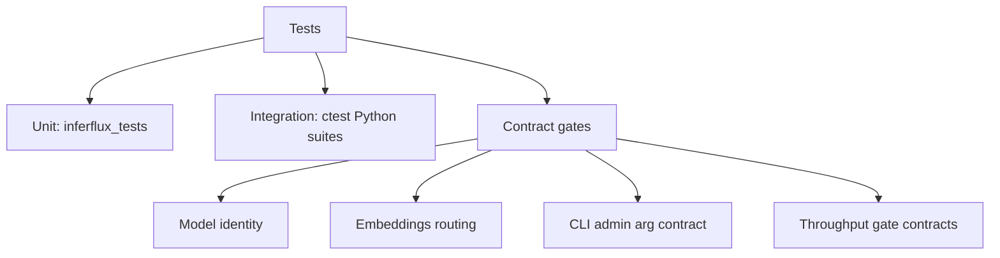

# Developer Guide (Canonical OSS)

**Status:** Done (Canonical)


## 1) Source Layout (Contributor View)

| Path | Role |
|---|---|
| `runtime/` | backend execution, KV/cache, structured output |
| `scheduler/` | batching, fairness, routing/model selection |
| `server/` | HTTP APIs, auth, metrics, startup wiring |
| `cli/` | `inferctl` commands and argument contracts |
| `model/` | format/tokenizer helpers |
| `tests/` | unit + integration suites |
| `scripts/` | build/dev/test/benchmark helpers |
| `docs/` | canonical docs + deep-dive references |

## 2) Build Matrix

| Build | Command |
|---|---|
| Default release | `./scripts/build.sh` |
| Incremental CMake loop | `cmake -S . -B build && cmake --build build -j` |
| CPU-only | `cmake -S . -B build -DENABLE_CUDA=OFF -DENABLE_ROCM=OFF -DENABLE_MPS=OFF && cmake --build build -j` |
| Coverage | `cmake -S . -B build-cov -DENABLE_COVERAGE=ON -DCMAKE_BUILD_TYPE=Debug && cmake --build build-cov -j` |

## 3) Local Development Loop

### Run server quickly

```bash
./scripts/run_dev.sh --config config/server.yaml
```

### Run CLI against local server

```bash
./build/inferctl status --api-key dev-key-123
./build/inferctl models --json --api-key dev-key-123
./build/inferctl completion --prompt "dev smoke" --max-tokens 16 --api-key dev-key-123
```

## 4) Test Matrix



### Core commands

```bash
# Unit + integration baseline
ctest --test-dir build --output-on-failure --timeout 90

# Canonical docs contract gate
python3 scripts/check_docs_contract.py

# Focused suites
ctest --test-dir build -R ModelIdentityTests --output-on-failure -V
ctest --test-dir build -R EmbeddingsRoutingTests --output-on-failure -V
ctest --test-dir build -R IntegrationCLIAdminArgContract --output-on-failure -V
ctest --test-dir build -R ThroughputGateContractTests --output-on-failure -V
ctest --test-dir build -R ThroughputGateFailureContractTests --output-on-failure -V
```

### Throughput gate harness

```bash
./scripts/run_throughput_gate.py \
  --server-bin ./build/inferfluxd \
  --config config/server.cuda.yaml \
  --backend cuda \
  --model tinyllama \
  --min-batch-size-max 2 \
  --min-batch-size-utilization 0.06
```

## 5) Coding Conventions

| Area | Contract |
|---|---|
| Language | C++17 |
| Ownership | prefer RAII and `std::unique_ptr` |
| Naming | files/functions snake_case, types PascalCase, constants `kName`, members `name_` |
| Formatting | clang-format (2-space indentation, sorted includes) |
| Namespace | use `inferflux` |

## 6) API/CLI Contract Discipline

When changing request handling or CLI flags:

1. Update implementation (`server/http/http_server.cpp` and/or `cli/main.cpp`).
2. Add or update focused tests in `tests/unit` or `tests/integration`.
3. Update canonical docs:
- [API Surface](API_SURFACE.md)
- [Quickstart](Quickstart.md)
- [README](../README.md)
- [INDEX](INDEX.md)

## 7) Documentation Discipline

All release-facing docs must follow [DOCS_STYLE_GUIDE](DOCS_STYLE_GUIDE.md).

Minimum for doc-related PRs:
- include one diagram near top
- include one contract table near top
- ensure examples are executable against current CLI/API
- avoid marketing-only prose without concrete contracts

## 8) Pull Request Checklist

- [ ] Build succeeds (`cmake --build build -j`)
- [ ] Relevant tests pass (`ctest --test-dir build ...`)
- [ ] New behavior covered by focused tests/contracts
- [ ] Canonical docs updated when user-visible behavior changed
- [ ] Docs contract gate passes (`python3 scripts/check_docs_contract.py`)

## 9) Related Docs

- Runtime and architecture: [Architecture](Architecture.md)
- API map: [API Surface](API_SURFACE.md)
- Admin operations: [Admin Guide](AdminGuide.md)
- Release process: [ReleaseProcess](ReleaseProcess.md)
- Deep-dive references: [Archive Index](ARCHIVE_INDEX.md)
