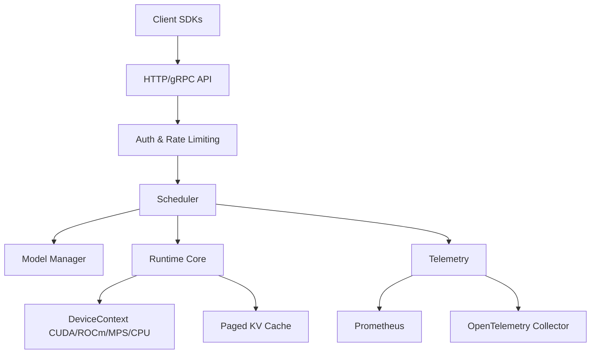
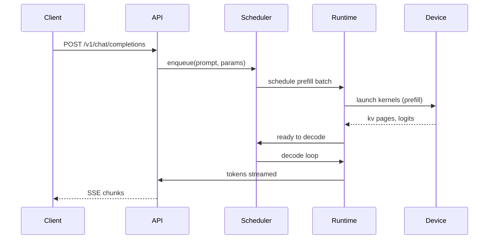
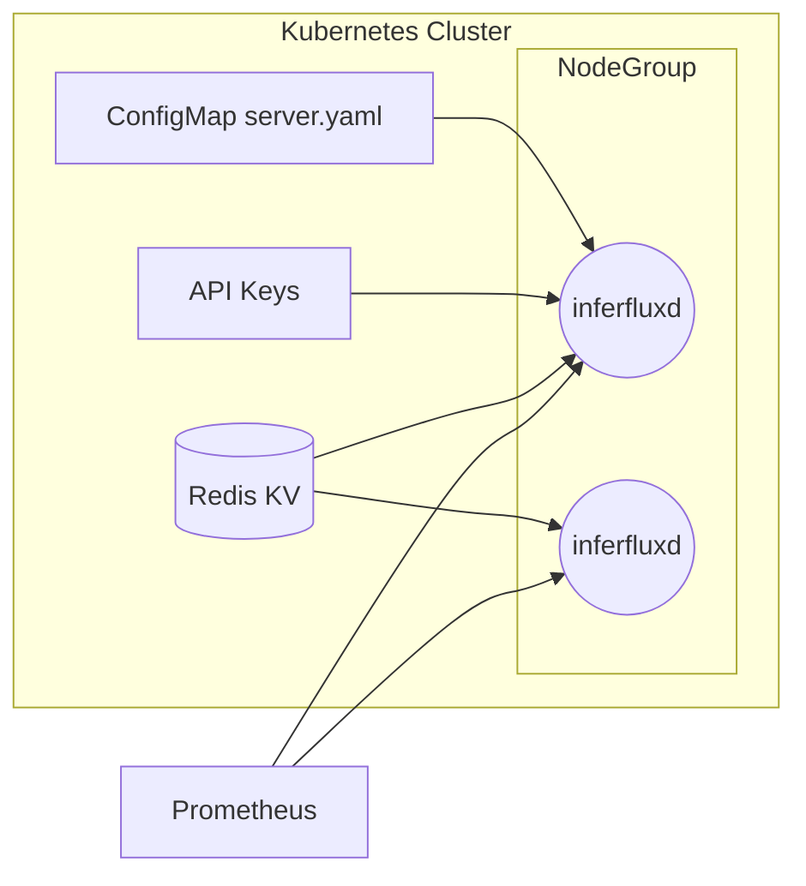

# Diagrams

## System Diagram

```mermaid
graph TD
  A[Client SDKs] --> B[HTTP/gRPC API]
  B --> C[Auth & Rate Limiting]
  C --> D[Scheduler]
  D --> E[Model Manager]
  D --> F[Runtime Core]
  F --> G[DeviceContext CUDA/ROCm/MPS/CPU]
  F --> H[Paged KV Cache]
  D --> I[Telemetry]
  I --> J[Prometheus]
  I --> K[OpenTelemetry Collector]
```

## Request Lifecycle

```mermaid
sequenceDiagram
  participant Client
  participant API
  participant Scheduler
  participant Runtime
  participant Device
  Client->>API: POST /v1/chat/completions
  API->>Scheduler: enqueue(prompt, params)
  Scheduler->>Runtime: schedule prefill batch
  Runtime->>Device: launch kernels (prefill)
  Device-->>Runtime: kv pages, logits
  Runtime->>Scheduler: ready to decode
  Scheduler->>Runtime: decode loop
  Runtime->>API: tokens streamed
  API-->>Client: SSE chunks
```

## Deployment

```mermaid
graph LR
  subgraph Kubernetes Cluster
    direction TB
    CM[ConfigMap server.yaml]
    Secret[API Keys]
    Redis[(Redis KV)]
    subgraph NodeGroup
      Pod1((inferfluxd))
      Pod2((inferfluxd))
    end
    CM --> Pod1
    Secret --> Pod1
    Redis --> Pod1
    Redis --> Pod2
  end
  Prometheus --> Pod1
  Prometheus --> Pod2
```
