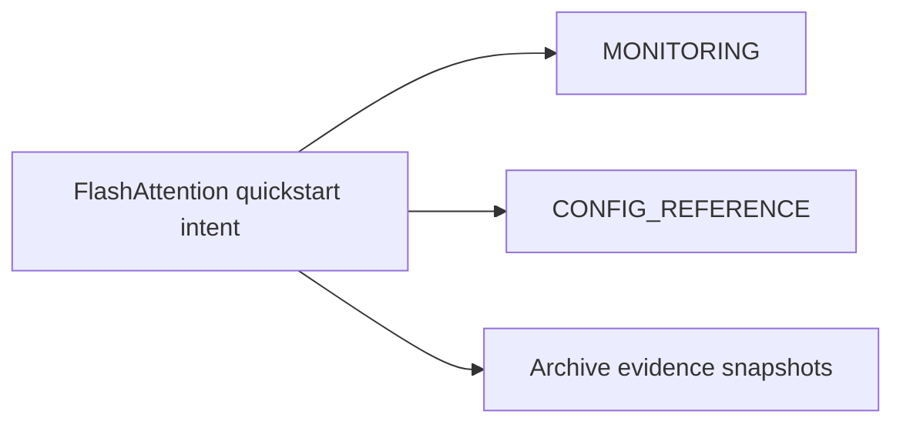

# FlashAttention Quickstart (Consolidated)

**Status:** Consolidated into canonical performance docs

## Canonical Source Map

| Need | Source of truth |
|---|---|
| Current performance tuning workflow | [MONITORING](MONITORING.md) |
| CUDA and scheduler knobs | [CONFIG_REFERENCE](CONFIG_REFERENCE.md) |
| Runtime/backend behavior contracts | [GGUF_NATIVE_KERNEL_IMPLEMENTATION](GGUF_NATIVE_KERNEL_IMPLEMENTATION.md) |

## Archived Snapshot Evidence

- [FLASHATTENTION_LIVE_TEST_RESULTS_2025_03_02](archive/evidence/FLASHATTENTION_LIVE_TEST_RESULTS_2025_03_02.md)
- [GGUF_CONCURRENT_PROFILING_RESULTS_2026_03_05](archive/evidence/GGUF_CONCURRENT_PROFILING_RESULTS_2026_03_05.md)
- [GGUF_PROFILING_QUICK_REFERENCE_2026_03_05](archive/evidence/GGUF_PROFILING_QUICK_REFERENCE_2026_03_05.md)
