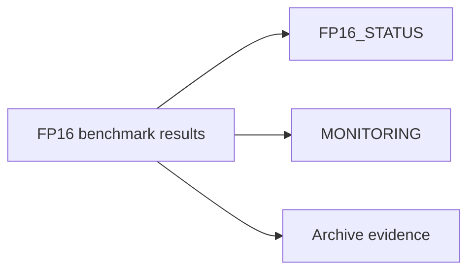

# FP16 Benchmark Results (Consolidated)

**Status:** Consolidated

## Canonical Source Map

| Need | Source of truth |
|---|---|
| Current FP16 benchmark interpretation | [FP16_STATUS](FP16_STATUS.md) |
| Throughput and metrics workflow | [MONITORING](MONITORING.md) |
| Runtime tuning knobs | [CONFIG_REFERENCE](CONFIG_REFERENCE.md) |
| Capacity triage | [Troubleshooting](Troubleshooting.md) |

## Archived Full Benchmark Snapshot

- [FP16_BENCHMARK_RESULTS_FINAL_2026_03_05](archive/evidence/FP16_BENCHMARK_RESULTS_FINAL_2026_03_05.md)
