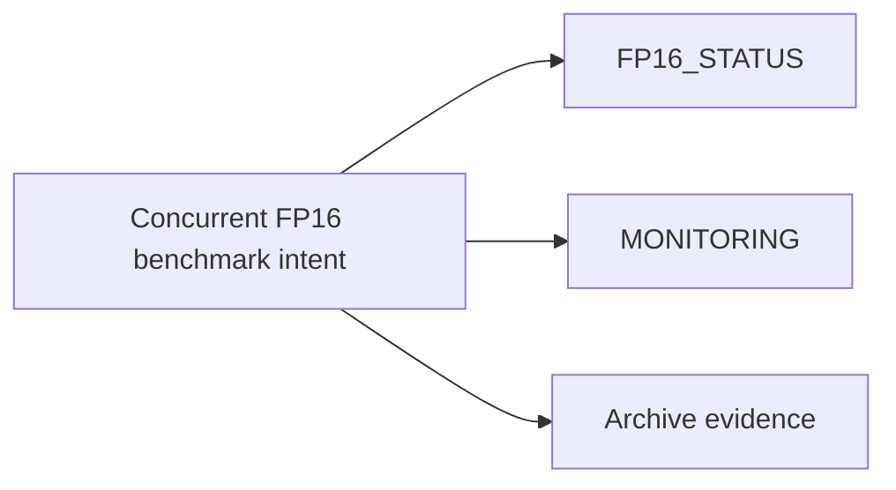

# FP16 Concurrent Benchmark (Consolidated)

**Status:** Consolidated

## Canonical Source Map

| Need | Source of truth |
|---|---|
| Current FP16 benchmark interpretation | [FP16_STATUS](FP16_STATUS.md) |
| Throughput/metrics gate workflow | [MONITORING](MONITORING.md) |
| Runtime tuning knobs | [CONFIG_REFERENCE](CONFIG_REFERENCE.md) |

## Archived Full Benchmark

- [FP16_CONCURRENT_BENCHMARK_FINAL_2026_03_05](archive/evidence/FP16_CONCURRENT_BENCHMARK_FINAL_2026_03_05.md)
