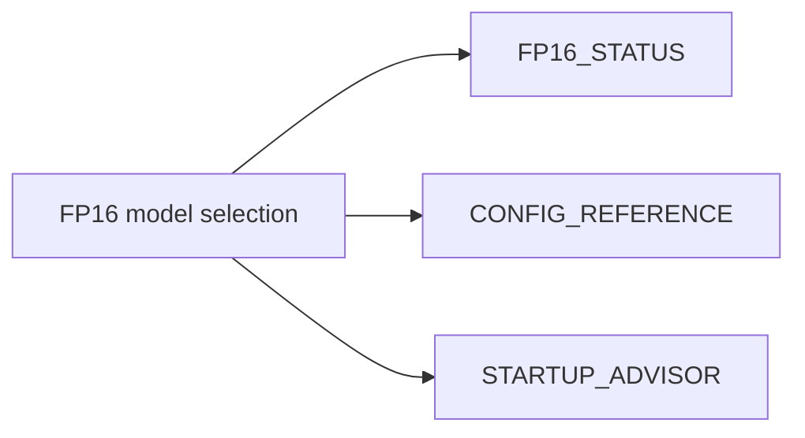

# FP16 Model Guide (Consolidated)

**Status:** Consolidated

## Canonical Source Map

| Need | Source of truth |
|---|---|
| Current FP16 deployment posture | [FP16_STATUS](FP16_STATUS.md) |
| Runtime configuration knobs | [CONFIG_REFERENCE](CONFIG_REFERENCE.md) |
| Memory/slot sizing recommendations | [STARTUP_ADVISOR](STARTUP_ADVISOR.md) |
| Performance validation workflow | [MONITORING](MONITORING.md) |

## Archived Full Guide

- [FP16_MODEL_GUIDE_2026_03_05](archive/evidence/FP16_MODEL_GUIDE_2026_03_05.md)
