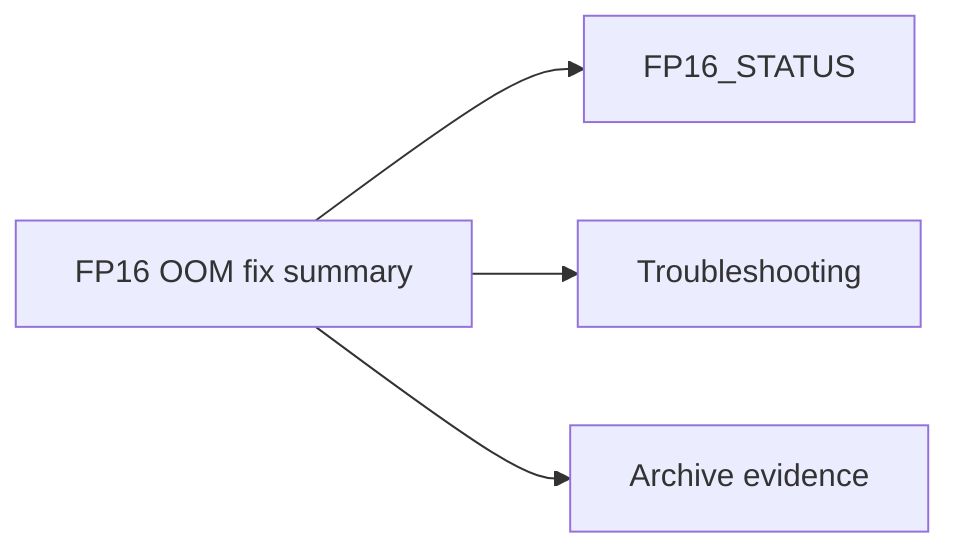

# FP16 OOM Fix Final Summary (Consolidated)

**Status:** Consolidated

## Canonical Source Map

| Need | Source of truth |
|---|---|
| Current FP16 runtime posture | [FP16_STATUS](FP16_STATUS.md) |
| OOM triage and live recovery | [Troubleshooting](Troubleshooting.md) |
| Capacity sizing recommendations | [STARTUP_ADVISOR](STARTUP_ADVISOR.md) |
| Runtime memory knobs | [CONFIG_REFERENCE](CONFIG_REFERENCE.md) |

## Archived Full Summary

- [FP16_OOM_FIX_FINAL_SUMMARY_2026_03_05](archive/evidence/FP16_OOM_FIX_FINAL_SUMMARY_2026_03_05.md)
