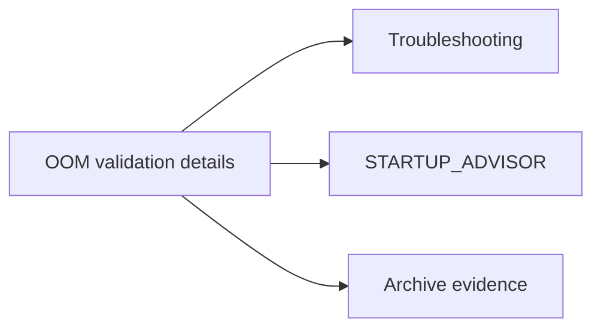

# FP16 OOM Fix Validation (Consolidated)

**Status:** Consolidated

## Canonical Source Map

| Need | Source of truth |
|---|---|
| OOM and capacity triage | [Troubleshooting](Troubleshooting.md) |
| Capacity sizing rules | [STARTUP_ADVISOR](STARTUP_ADVISOR.md) |
| Config knobs for limits | [CONFIG_REFERENCE](CONFIG_REFERENCE.md) |

## Archived Validation Snapshot

- [FP16_OOM_FIX_VALIDATION_2026_03_05](archive/evidence/FP16_OOM_FIX_VALIDATION_2026_03_05.md)
