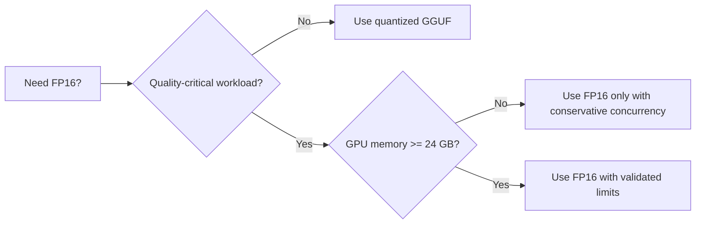

# FP16 Status (Canonical)

**Status:** Canonical
**Snapshot date:** March 5, 2026

## 1) Current Reality (Evidence Snapshot)

| Item | Current reading | Implication |
|---|---|---|
| 20 GB class GPU FP16 concurrency (Qwen2.5 3B F16 snapshots) | OOM/instability observed in archived concurrent runs | Treat 20 GB as constrained for FP16 concurrency; apply conservative slot limits |
| 24 GB class GPU FP16 validation snapshot | Native path handled 8 concurrent requests in archived validation run | Prefer native path for FP16 stress validation once backend contracts permit |
| Universal backend behavior in FP16 stress evidence | Heap-corruption failure was observed in one archived run | Keep universal FP16 concurrency as caution-path until reproduced and closed in code/tests |

## 2) Deployment Guidance

| Decision | Guidance |
|---|---|
| Default production throughput | Prefer quantized GGUF (`q4_k_m`/`q5_k_m`) for concurrency and memory economy |
| FP16 deployment | Reserve for quality-critical workloads and right-size concurrency to VRAM budget |
| Capacity controls | Use StartupAdvisor recommendations + conservative `max_parallel_sequences` + monitored memory pressure |
| Validation gate | Run throughput/contract checks before rollout; treat archived FP16 data as snapshot evidence, not guaranteed ceilings |

## 2.1) Latest Code Findings

| Commit | Finding | Operational impact |
|---|---|---|
| `707138b` | Landed FP16 OOM handling: pre-flight admission check + graceful degradation + quantization-detection wiring + model-path override fix | Reduces OOM crash risk and improves FP16 capacity safety posture |

## 3) Canonical Source Map

| Need | Source of truth |
|---|---|
| Runtime knobs and limits | [CONFIG_REFERENCE](CONFIG_REFERENCE.md) |
| Metrics and tuning loop | [MONITORING](MONITORING.md) |
| Startup sizing recommendations | [STARTUP_ADVISOR](STARTUP_ADVISOR.md) |
| Incident handling | [Troubleshooting](Troubleshooting.md) |

## 4) Archived FP16 Evidence

- [FP16_MODEL_GUIDE_2026_03_05](archive/evidence/FP16_MODEL_GUIDE_2026_03_05.md)
- [FP16_BENCHMARK_RESULTS_FINAL_2026_03_05](archive/evidence/FP16_BENCHMARK_RESULTS_FINAL_2026_03_05.md)
- [FP16_CONCURRENT_BENCHMARK_FINAL_2026_03_05](archive/evidence/FP16_CONCURRENT_BENCHMARK_FINAL_2026_03_05.md)
- [FP16_OOM_FIX_VALIDATION_2026_03_05](archive/evidence/FP16_OOM_FIX_VALIDATION_2026_03_05.md)
- [FP16_OOM_FIX_FINAL_SUMMARY_2026_03_05](archive/evidence/FP16_OOM_FIX_FINAL_SUMMARY_2026_03_05.md)
- [FP16_OOM_ROOT_CAUSE_ANALYSIS_2026_03_05](archive/evidence/FP16_OOM_ROOT_CAUSE_ANALYSIS_2026_03_05.md)
- [PERFORMANCE_OPTIMIZATION_SUMMARY_2026_03_05](archive/evidence/PERFORMANCE_OPTIMIZATION_SUMMARY_2026_03_05.md)
