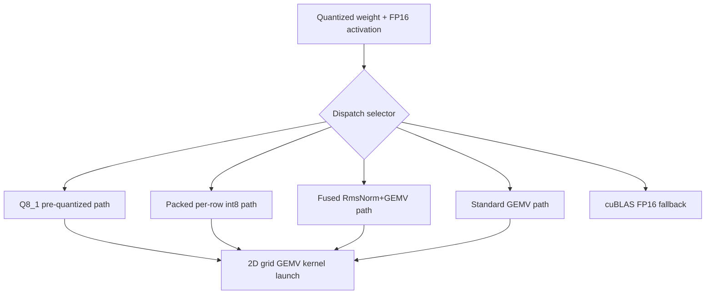

# Native GEMV Kernel Architecture

**Status:** Canonical
**Snapshot date:** March 9, 2026

This document describes the geometry, dispatch, and TDD structure of the native fused dequantization GEMV kernels that form the throughput-critical hot path in InferFlux's native CUDA backend.



## 1) Design Principles

**One kernel launch per projection.** Every linear projection (Q, K, V, O, gate, up, down, LM head) is a single kernel launch. The 2D grid `dim3(ceil(N/warps), M)` covers all output rows and columns in one dispatch. This replaced per-row looping and tiled GEMM approaches.

**Activation reuse across sibling projections.** Q/K/V share input-norm activations. Gate/up share post-attn-norm activations. Pre-quantized activations (Q8_1 or packed int8) are computed once and reused, saving 2-5 redundant quantization passes per layer.

**Memory-bandwidth bound.** At decode (M=1), the kernel reads one weight row per output element and performs a dot product. The bottleneck is weight bandwidth, not compute. All optimizations target reducing activation overhead to maximize the fraction of bandwidth spent on weights.

## 2) Kernel Geometry

### Thread/Block Layout

```
Block: 256 threads = 8 warps x 32 lanes
Grid:  dim3(ceil(N / 8), M)
       blockIdx.x: output column group (8 outputs per block)
       blockIdx.y: input row (batch element or sequence position)
```

Each warp produces one output element. Lane `j` of warp `w` accumulates `weight[out_idx][j..K:32] * activation[row][j..K:32]`. Final reduction via `__shfl_down_sync` produces the scalar result in lane 0.

### Shared Memory

| Kernel family | Smem per block | Contents |
|---|---|---|
| Standard (FP32 activation) | K x 4 bytes | FP32 copy of activation row |
| Standard (FP16 activation) | K x 2 bytes | FP16 copy, used for Q6_K |
| dp4a (int8 activation) | K + 36 bytes | int8 quantized activations + warp workspace |
| Fused RmsNorm+GEMV | K x 4 + 32 bytes | FP32 norm workspace (reused for dot product) |
| Packed / Q8_1 | 0 bytes | Activations read from global memory (L2 cached) |

The zero-smem property of packed and Q8_1 paths is a key advantage: no smem allocation pressure means maximum occupancy, and the activation data stays in L2 cache across sibling projection launches.

### Row-Pair and Row-Quad Variants (Q8_1 only)

For M > 1 decode (concurrent sequences), Q4_K and Q6_K Q8_1 kernels have multi-row variants:

| Variant | Grid Y dimension | Rows per block | Use case |
|---|---|---|---|
| Single | M | 1 | M = 1 |
| RowPair | ceil(M/2) | 2 | M = 2-3 |
| RowQuad | ceil(M/4) | 4 | M >= 4 |

Each block loads multiple activation rows and computes their dot products against the same weight data, amortizing weight reads across rows.

## 3) Kernel Variant Inventory

### 3a) Standard GEMV (4 quant types)

Loads FP16 activations into smem, dequantizes weights on the fly, FP32 dot product.

| Quant | Kernel | Notes |
|---|---|---|
| Q4_K | `fused_dequant_gemv_q4k` | 256-element super-blocks, 4.5 bpw |
| Q6_K | `fused_dequant_gemv_q6k_fp16` | FP16 smem (avoids 210-byte alignment issues) |
| Q8_0 | `fused_dequant_gemv_q8_0` | 32-element blocks, 8.5 bpw |
| Q8_K | `fused_dequant_gemv_q8k` | 256-element super-blocks, 8.5 bpw |

### 3b) dp4a GEMV (4 quant types, SM 6.1+)

Quantizes activations to int8 in smem (per-row symmetric), then uses `__dp4a()` for 4-packed signed-byte dot products. Reduces smem from K*4 to K bytes.

| Quant | Kernel | Hardware |
|---|---|---|
| Q4_K | `fused_dequant_gemv_q4k_dp4a` | SM >= 6.1 (Pascal+) |
| Q6_K | `fused_dequant_gemv_q6k_dp4a` | SM >= 6.1 |
| Q8_0 | `fused_dequant_gemv_q8_0_dp4a` | SM >= 6.1 |
| Q8_K | `fused_dequant_gemv_q8k_dp4a` | SM >= 6.1 |

### 3c) Fused RmsNorm+GEMV (4 quant types)

Eliminates standalone RmsNorm kernel by computing normalization during the activation load phase. Saves 2 norm launches per layer (input norm, post-attn norm) plus 1 for final norm = 45 fewer launches for a 22-layer model.

Three-phase execution:
1. **Load + sum-of-squares**: `LoadHalfToSmemSumSq()` loads FP16, computes partial sums
2. **Norm application**: `ApplyNormInPlace()` applies `rms * weight[k]` vectorized via half2
3. **Dot product**: Standard dequant-multiply-accumulate

### 3d) Fused RmsNorm+GEMV+dp4a (4 quant types, SM 6.1+)

Combines normalization, int8 quantization, and dp4a in one pass. Memory aliasing reuses the FP32 norm workspace as int8 activation storage.

### 3e) Packed Per-Row Int8 GEMV (4 quant types)

Pre-quantized int8 activations (per-row symmetric scale) loaded from global memory. Zero smem for activations. Supports grouped dispatch:

| Variant | Projections per launch | Use case |
|---|---|---|
| Single | 1 | O proj, down proj, LM head |
| Pair (group<2>) | 2 | Gate+up, K+V |
| Triple (group<3>) | 3 | Q+K+V |

### 3f) Q8_1 Pre-Quantized GEMV (4 quant types)

The highest-throughput path. Activations are quantized to `block_q8_1` format (36 bytes per 32 elements: per-block scale + sum + int8 values) matching llama.cpp's activation format. Key advantages:

- **Per-block scales** (32 elements) vs per-row scales: better precision for long vectors
- **Pre-computed sum field** (`ds.y = d * sum(qs)`): eliminates dp4a sum for Q4_K dmin correction
- **Zero smem**: activations read from L2-cached global memory
- **Row-pair/quad variants**: amortize weight reads across concurrent sequences

Grouped dispatch (pair/triple) launches a single kernel that computes 2 or 3 output projections sharing the same activation data.

### 3g) Q8_1 Quantization Kernels

| Kernel | Input | Output | Use case |
|---|---|---|---|
| `quantize_row_q8_1_kernel` | FP16 | Q8_1 blocks | O proj, down proj |
| `silu_mul_quantize_q8_1_kernel` | FP16 gate + FP16 up | Q8_1 blocks | Fused SiLU(gate)*up + quantize |
| `fused_rmsnorm_quantize_q8_1_kernel` | FP16 residual + norm weights | Q8_1 blocks | Fused norm + quantize for Q/K/V, gate/up |

### 3h) Down-Projection MMQ (Q4_K, Q6_K)

Tiled matrix-multiply kernels for the down projection, using 2D thread blocks. Gated behind `INFERFLUX_DOWNPROJ_MMQ_MIN_BATCH` for controlled rollout.

## 4) Dispatch Priority

The transformer forward pass attempts dispatch paths in this order:

```
Q8_1 grouped (pair/triple with fused norm+quantize)
  -> Q8_1 single (standalone quantize + GEMV)
    -> Packed grouped (per-row int8, pair/triple)
      -> Packed single
        -> Fused RmsNorm+GEMV (dp4a if SM >= 6.1)
          -> Standalone RmsNorm + Fused GEMV
            -> cuBLAS FP16 (fallback)
```

Each path checks `FusedQuantGemm::ShouldUseFusedPath()` which compares M against an adaptive threshold:

```
threshold = base_threshold(SM) * (16 / bits_per_weight)
```

where `base_threshold` varies by GPU generation (3 for Hopper, 4-5 for Ampere/Ada, 8 for Volta, 16 for Pascal). Clamped to [4, 64].

## 5) Activation Data Flow Per Layer

```
Residual
  |
  +-- [FusedRmsNormQuantizeQ8_1] --> d_act_q8_1_
  |     (input norm + quantize in one kernel)
  |
  +-- d_act_q8_1_ --> [Q8_1 GEMV triple] --> d_q_, d_k_, d_v_
  |     (single launch, 3 projections, L2-cached activations)
  |
  +-- d_q_, d_k_ --> [BatchedRoPE] --> rotated Q, K
  +-- d_k_, d_v_ --> [BatchedKvAppend] --> KV cache
  +-- d_q_ + KV cache --> [FlashDecodeMultiSeq] --> d_attn_out_
  |
  +-- d_attn_out_ --> [QuantizeQ8_1] --> d_act_q8_1_
  +-- d_act_q8_1_ --> [Q8_1 GEMV] --> O proj --> residual add
  |
  +-- [FusedRmsNormQuantizeQ8_1] --> d_act_q8_1_
  |     (post-attn norm + quantize)
  |
  +-- d_act_q8_1_ --> [Q8_1 GEMV pair] --> d_ffn_gate_, d_ffn_up_
  +-- d_ffn_gate_, d_ffn_up_ --> [SiluMulQuantizeQ8_1] --> d_act_q8_1_
  +-- d_act_q8_1_ --> [Q8_1 GEMV] --> down proj --> residual add
```

For a 22-layer model at B=1: ~155 kernel launches per token (7 GEMV + 2 norm-quantize + 3 batched ops + SiLU + 2 residual per layer, plus embed + final norm + LM head).

## 6) Batched Decode Kernels

When `INFERFLUX_ENABLE_BATCHED_DECODE=1` and B > 1, three batched kernels replace per-sequence loops:

| Kernel | Grid | Purpose |
|---|---|---|
| `BatchedRoPEKernel<T>` | `(total_pairs / 256,)` | RoPE rotation for B sequences with different `n_past` |
| `BatchedKvAppendKernel<T>` | `(B * kv_dim / 256,)` | Scatter-copy K/V into per-sequence KV cache slots |
| `FlashDecodeMultiSeqKernel<T>` | `(B, num_heads)` | Tiled FA2 attention for B queries with variable kv_len |

Bulk KV pointer arrays (`d_all_k_append_ptrs_`, etc.) are pre-computed for all layers in a single H2D upload, eliminating per-layer pointer copies.

**Status:** Verified working. Isolated synthetic tests pass (6 cases, 4531 assertions). Integration verified with 8 concurrent Qwen2.5-3B Q4_K_M requests producing correct coherent responses. CUDA graphs captured for B=1-4 (599 nodes, 36 layers). Opt-in via `INFERFLUX_ENABLE_BATCHED_DECODE=1`.

## 7) CUDA Graph Capture

When batched decode is enabled, the compute section (embedding through LM head) can be captured into a CUDA graph. Graph replay eliminates ~5-10 us per kernel launch overhead. Guards:

- cuBLAS calls during capture corrupt host heap -> all cuBLAS fallback paths check `if (!capturing)`
- If any projection falls back to cuBLAS during capture, the graph is discarded and re-executed without capture
- Graph is invalidated when batch size changes

## 8) Test-Driven Development Coverage

### Kernel Correctness (100+ test cases in `test_native_forward.cpp`)

| Category | Count | What's tested |
|---|---|---|
| Q8_1 GEMV (single, pair, triple) | 20+ | Output accuracy per quant type, misaligned activation blocks |
| Q8_1 quantization | 3 | `QuantizeRowQ8_1`, `SiluMulQuantizeQ8_1`, `FusedRmsNormQuantizeQ8_1` |
| Packed GEMV (single, pair, triple) | 10+ | Grouped kernel output accuracy |
| Dispatch geometry | 15+ | Adaptive threshold, down-proj selector, MMQ promotion |
| Fused RmsNorm+GEMV | 4+ | RmsNorm threshold and fused path |
| Batched decode | 7 | BatchedRoPE, BatchedKvAppend, FlashDecodeMultiSeq in isolation + pipeline |
| Activation grouping | 3 | `SelectSharedActivationGrouping` for triple/pair/single fallback |
| Support queries | 5+ | Null data, unsupported types, threshold bounds |

### Dispatch Policy Tests

The `FusedDispatchGeometry` struct drives policy tests:

```cpp
struct FusedDispatchGeometry {
  int M;            // batch/sequence rows
  int N;            // output columns
  int K;            // input columns
  int group_size;   // 1=single, 2=pair, 3=triple
  bool is_hot;      // FFN projections (high reuse)
  bool is_down;     // down-projection (different selector)
};
```

Tests verify:
- Threshold clamping `[4, 64]`
- GPU-specific base thresholds (Pascal through Hopper)
- Geometry-aware boosts for packed sibling projections
- Down-proj selector chain: Q8_1 -> RowPair -> RowQuad -> MMQ -> fallback
- FFN grouped selector: hot Q4_K small-batch -> packed path -> fallback

### Integration Tests

- `test_batched_decode.cpp`: 6 synthetic-data tests for all batched kernels
- `test_native_batching.cpp`: 8 tests for metrics recording (forward shape, batch buckets, KV occupancy)
- `test_native_dequant_policy.cpp`: 4 tests for dequant cache lifecycle

## 9) Throughput Evidence

RTX 4000 Ada (SM 8.9, 360 GB/s peak bandwidth):

| Model | Config | Native tok/s | llama.cpp tok/s | Ratio |
|---|---|---|---|---|
| TinyLlama 1.1B Q4_K_M | Sequential | 239.7 | 314 | 0.76x |
| TinyLlama 1.1B Q4_K_M | 4x concurrent | 170 | — | — |
| Qwen2.5-3B Q4_K_M | Sequential | 82.2 | 235.5 | 0.35x |

The remaining gap is primarily weight bandwidth utilization (~40% of peak vs llama.cpp's ~60%+). The Q8_1 pre-quantized path improved throughput 49% on TinyLlama (161 -> 240 tok/s) by eliminating redundant per-kernel activation quantization.

## 10) File Index

| File | Role |
|---|---|
| `runtime/backends/cuda/native/kernels/fused_dequant_gemv.cuh` | 40+ GEMV kernel implementations |
| `runtime/backends/cuda/native/kernels/fused_dequant_gemm.cuh` | Tiled GEMM kernels (legacy, superseded by 2D GEMV) |
| `runtime/backends/cuda/native/kernels/dequantization.cuh` | Block struct definitions (block_q4_k, block_q8_1, etc.) |
| `runtime/backends/cuda/native/fused_quant_gemm.cu` | Dispatch tables, threshold logic, public API |
| `runtime/backends/cuda/native/fused_quant_gemm.h` | `FusedQuantGemm` class, dispatch geometry types |
| `runtime/backends/cuda/native/transformer_forward.cu` | Forward pass wiring, dispatch priority chain |
| `runtime/backends/cuda/native/llama_forward.h` | `LlamaForwardTyped<T>` class, buffer declarations |
| `runtime/backends/cuda/native/cuda_kernels.cu` | BatchedRoPE, BatchedKvAppend implementations |
| `runtime/backends/cuda/kernels/flash_attention.cu` | FlashDecodeMultiSeq implementation |
| `tests/unit/test_native_forward.cpp` | 100+ kernel correctness and dispatch policy tests |
| `tests/unit/test_batched_decode.cpp` | Batched decode kernel isolation tests |

## 11) Related Docs

- [GGUF_NATIVE_KERNEL_IMPLEMENTATION](GGUF_NATIVE_KERNEL_IMPLEMENTATION.md)
- [MONITORING](MONITORING.md)
- [Architecture](Architecture.md)
- [design/NATIVE_GGUF_QUANTIZED_RUNTIME_ARCHITECTURE](design/NATIVE_GGUF_QUANTIZED_RUNTIME_ARCHITECTURE.md)
