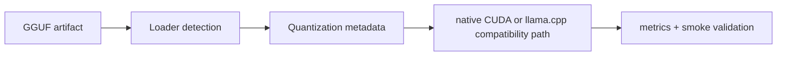

# GGUF Runtime Guide

**Status:** Canonical
**Snapshot date:** March 9, 2026
**See also:** [GEMV_KERNEL_ARCHITECTURE](GEMV_KERNEL_ARCHITECTURE.md) for kernel geometry, dispatch, and TDD details.



## 1) Capability Contract

| Area | Current contract |
|---|---|
| Format detection | Loader selection is based on artifact structure/metadata, not filename conventions |
| Runtime paths | `native_cuda` and `cuda_llama_cpp` both accept GGUF artifacts |
| Quantization metadata | GGUF tensor types drive handler/strategy selection |
| Alias handling | `q4_k_m`, `q6_k_m`, and `q8_k_m` aliases resolve to their canonical GGUF tensor families |
| Memory policy | Native quantized path defaults to memory-first `dequant_cache_policy=none` |
| KV policy | KV precision is load-scoped; native can auto-tune sequence budget against available VRAM |

## 2) Native vs Compatibility Path

| Path | What it is best at today | Current caution |
|---|---|---|
| `native_cuda` | First-party runtime control, native metrics, memory policy control, 50+ fused GEMV kernels (v1 column-major + v2 cooperative-warp) with Q8_1/dp4a/RmsNorm fusion, batched decode default-on, adaptive dispatch geometry, native logprobs, native embeddings, execution policy refactor | Single-sequence throughput gap vs llama.cpp (~0.35-0.76x); v2 cooperative-warp GEMV targeting ≥55% bandwidth utilization |
| `cuda_llama_cpp` | Stable GGUF compatibility and lower operational risk, higher single-sequence throughput today | Lower ceiling for InferFlux-specific runtime innovation |

## 3) Runtime Components

| Component | File(s) |
|---|---|
| Loader abstraction | `runtime/backends/cuda/native/model_loader.h` |
| Loader selection | `runtime/backends/cuda/native/model_loader.cpp` |
| GGUF loader | `runtime/backends/cuda/native/gguf_model_loader.{h,cpp}` |
| Quantization registry/handlers | `runtime/backends/cuda/native/quantization_handler.{h,cpp}` |
| Quantized weight map | `runtime/backends/cuda/native/quantized_weight_map.{h,cpp}` |
| Native execution core | `runtime/backends/cuda/native_kernel_executor.cpp` |

## 4) Supported Native GGUF Families

| Family | Kernel coverage | Dispatch paths |
|---|---|---|
| `F16` | Functional native load/execution path | cuBLAS GEMM |
| `Q4_K` / `q4_k_m` | Full fused coverage: standard, dp4a, RmsNorm-fused, packed, Q8_1 (single/pair/triple/rowpair/rowquad), MMQ down-proj | Q8_1 > packed > fused RmsNorm > dp4a > standard > cuBLAS |
| `Q6_K` / `q6_k_m` | Full fused coverage: FP16-smem standard, dp4a, RmsNorm-fused, packed, Q8_1 (single/pair/triple/rowpair/rowquad), MMQ down-proj | Same priority chain |
| `Q8_0` | Standard, dp4a, RmsNorm-fused, packed, Q8_1 (single/pair/triple) | Q8_1 > packed > fused RmsNorm > dp4a > standard > cuBLAS |
| `Q8_K` / `q8_k_m` | Standard, dp4a, RmsNorm-fused, packed, Q8_1 (single/pair/triple) | Same priority chain |

All quantization types have 100+ TDD test cases covering correctness, dispatch geometry, and grouped projection accuracy. See [GEMV_KERNEL_ARCHITECTURE](GEMV_KERNEL_ARCHITECTURE.md) for the full kernel inventory.

## 5) Active Operator Status

| Area | Current reality |
|---|---|
| Decode GEMV (M=1) | Q8_1 pre-quantized path is the default hot path for all quant types. Activations quantized once to `block_q8_1` format (per-32-element scales matching llama.cpp), reused across sibling projections via L2 cache. Improved TinyLlama tok/s by 49% (161 -> 240). |
| Grouped projections | Q/K/V triple and gate/up pair launches share a single fused RmsNorm+Quantize kernel followed by grouped Q8_1 GEMV (one kernel for 2-3 outputs). Eliminates 2-5 redundant quantization passes per layer. The specialized `q8_1_group_hot_q4k` decode fast path stays enabled by default only for the single-row `M=1` envelope. The exact live `Q4_K M=2,N=11008,K=2048` row-pair benchmark remained numerically clean but measured at `0.89-0.99x` of the generic grouped path on Ada RTX 4000, so `q8_1_group_row_pair_w4` remains opt-in via `INFERFLUX_ENABLE_EXPERIMENTAL_Q8_1_GROUPED_ROWPAIR_W4=1`. `q8_1_group_v2` remains a separate evidence hook for cooperative-warp trials. |
| Batched decode (B>1) | Three batched kernels (BatchedRoPE, BatchedKvAppend, FlashDecodeMultiSeq) replace per-sequence loops. Reduces kernel launches from 264 to 66 for B=4, 22 layers. Default-on; opt-out via `INFERFLUX_DISABLE_BATCHED_DECODE=1`. |
| Native logprobs | GPU logits copied D2H after sampling, then `ComputeLogprob()` computes log-softmax + top-N alternatives. `SupportsLogprobsContract() = true`. No parity delegate needed for OpenAI `logprobs`/`top_logprobs` spec. |
| Native embeddings | Full forward pass through all transformer layers, then final RmsNorm to all positions, then `MeanPool` CUDA kernel for mean-pooled embedding extraction. `SupportsEmbeddingsContract() = true`. Delegate fallback only if native extraction fails. |
| Down projection | Hybrid selector: generic `Q8_1` GEMV for the safe default path, optional fixed-block `Q8_1` hot path for the exact `M=1,N=2048,K=11008` decode envelope, row-pair/row-quad for M>1, MMQ for large M (`Q4_K`/`Q6_K`), cuBLAS fallback. MMQ threshold tunable via `INFERFLUX_DOWNPROJ_MMQ_MIN_BATCH`. |
| 2D grid GEMV | All M values use single kernel launch via `dim3(ceil(N/8), M)`. Replaced tiled GEMM. Improved B=4 decode from 125ms to 12.6ms. |
| Column-pair GEMV (M=1) | For M=1 decode, Q4_K and Q6_K Q8_1 kernels use column-pair variant: each warp computes 2 output columns, halving grid.x to `dim3(ceil(N/16), 1)`. Reduces kernel launch overhead and improves ILP via interleaved weight row processing. |
| dp4a int8 | Hardware `__dp4a()` on SM >= 6.1 for all quant types. Both standalone and fused-with-RmsNorm variants. |
| Fused RmsNorm+GEMV | 9 kernel variants (4 standard + 4 dp4a + FP16). Saves 45 kernel launches per decode step. |
| Observability | `/metrics` exports FFN operator counts (`q8_1_group_hot_q4k` / `q8_1_group_row_pair_w4` / `q8_1_group_v2` / `q8_1_group` / `packed_group` / `fallback`), down-proj mix (`q8_1_gemv_v2` / `q8_1_gemv` / `q8_1_gemv_hot_fixed` / `q8_1_gemv_row_pair_hot_fixed` / `q8_1_gemv_row_pair_v2` / `q8_1_gemv_row_pair` / `q8_1_gemv_row_quad` / `packed_gemv` / `mmq` / `fallback`), geometry counters, and forward batch-size buckets by phase. Use these to prove an experimental path helps under the long concurrency envelope before promoting it. |
| Terminal token policy | Both backends stop on GGUF end-of-generation tokens |
| Split handoff | Process-local native decode workers now transfer ownership of the existing sequence slot on `KVChannel` instead of serializing KV to a blob and hydrating into a second slot. Cross-process transports still use serialize/hydrate. |

Experimental tuning knob:
- `INFERFLUX_DOWNPROJ_MMQ_MIN_BATCH`
  Forces the minimum batch size at which native `down_proj` may promote from `Q8_1` to `MMQ`.
  Use only for benchmark experiments until a proven default crossover is established.
- `INFERFLUX_ENABLE_EXPERIMENTAL_Q8_1_GROUPED_HOT_Q4K`
  Re-enables the specialized small-batch grouped `Q4_K` decode path for controlled experiments only.
- `INFERFLUX_ENABLE_EXPERIMENTAL_Q8_1_DOWNPROJ_HOT_FIXED`
  Forces the exact-shape fixed-block `down_proj` kernel (`M=1,N=2048,K=11008`) on for quant types that are otherwise held behind the experimental gate. The proven `Q4_K` hot path is now enabled by default; this knob remains relevant for `Q6_K` experiments.
- `INFERFLUX_ENABLE_EXPERIMENTAL_Q8_1_DOWNPROJ_ROWPAIR_HOT_FIXED`
  Forces the exact-shape fixed-block row-pair `down_proj` kernel (`M=2,N=2048,K=11008`) on for quant types that are otherwise held behind the experimental gate. The proven `Q4_K` row-pair hot path is now enabled by default; this knob remains relevant for `Q6_K` experiments.

Benchmark harness tuning knobs:
- `INFERFLUX_BENCH_MIN_BATCH_SIZE`
- `INFERFLUX_BENCH_BATCH_ACCUMULATION_MS`
- `INFERFLUX_BENCH_DECODE_BURST_TOKENS`
- `INFERFLUX_BENCH_NATIVE_TIMING_SAMPLE_RATE`
  Use `0` for pure throughput runs; use `N>1` to sample native CUDA timing every `N`th work item without timing every prefill request.
  The harness default for `INFERFLUX_BENCH_DECODE_BURST_TOKENS` is now `0`.
  `>1` remains an explicit experiment only until native batched decode parity is closed.

Current evidence:
- Short Ada RTX 4000 probes improved native tok/s by widening the scheduler window from `min_batch_size=1,batch_accumulation_ms=2` to `min_batch_size=2,batch_accumulation_ms=6`.
- On the same Ada RTX 4000 safe benchmark envelope (`decode_burst_tokens=0`), enabling real batched decode improved native throughput from `35.8 tok/s` to `40.5 tok/s` and improved exact match from `8/10` to `9/10`.
- Pushing the accumulation window higher increased some `decode` multi-row buckets but still left the hot path dominated by the small-batch `Q8_1` family, so larger windows alone are not the next throughput jump.
- The old benchmark-harness default `decode_burst_tokens=8` regressed native exact match on `qwen2.5-3b-instruct-q4_k_m.gguf` from `8/10` down to `6/10` for only a modest throughput lift (`38.5 -> 40.2 tok/s`), so the harness now defaults back to the accuracy-safe path.

## 6) Recommended Operating Posture

| Goal | Recommended path |
|---|---|
| Validate strict native behavior | Use `backend=cuda` with strict-native policy and inspect provider metadata |
| Lowest compatibility risk on GGUF | Use `cuda_llama_cpp` |
| Memory-constrained native experimentation | Keep native quantized dequant policy on `none` and let KV auto-tune protect VRAM |

## 7) Validation Commands

```bash
./build/inferflux_tests "[gguf]"
./build/inferflux_tests "[quantization]"
ctest --test-dir build -R GGUFMemoryContractTests --output-on-failure
```

Runtime checks:

```bash
curl -s http://127.0.0.1:8080/metrics | grep inferflux_native_forward_passes_total
curl -s http://127.0.0.1:8080/metrics | grep inferflux_native_kv_
./build/inferctl models --json --api-key dev-key-123
```

## 8) Troubleshooting Signals

| Symptom | Check | Likely action |
|---|---|---|
| Native path not active | provider/fallback fields in `/v1/models` | inspect routing policy and native readiness |
| High native VRAM use | native KV planning metrics + dequant policy | keep memory-first policy and tighten KV budget |
| Unexpected fallback | `/v1/models` and logs | confirm model format/capability path and strict-native policy |
| GGUF load failure | startup log + model path | validate artifact structure and permissions |

## 9) Related Docs

- [GEMV_KERNEL_ARCHITECTURE](GEMV_KERNEL_ARCHITECTURE.md) — kernel geometry, dispatch priority, TDD coverage
- [Architecture](Architecture.md)
- [CONFIG_REFERENCE](CONFIG_REFERENCE.md)
- [MONITORING](MONITORING.md)
- [design/NATIVE_GGUF_QUANTIZED_RUNTIME_ARCHITECTURE](design/NATIVE_GGUF_QUANTIZED_RUNTIME_ARCHITECTURE.md)
