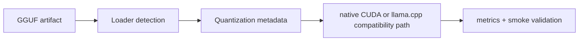

# GGUF Runtime Guide

**Status:** Canonical  
**Snapshot date:** March 9, 2026



## 1) Capability Contract

| Area | Current contract |
|---|---|
| Format detection | Loader selection is based on artifact structure/metadata, not filename conventions |
| Runtime paths | `native_cuda` and `cuda_llama_cpp` both accept GGUF artifacts |
| Quantization metadata | GGUF tensor types drive handler/strategy selection |
| Alias handling | `q4_k_m`, `q6_k_m`, and `q8_k_m` aliases resolve to their canonical GGUF tensor families |
| Memory policy | Native quantized path defaults to memory-first `dequant_cache_policy=none` |
| KV policy | KV precision is load-scoped; native can auto-tune sequence budget against available VRAM |

## 2) Native vs Compatibility Path

| Path | What it is best at today | Current caution |
|---|---|---|
| `native_cuda` | First-party runtime control, native metrics, memory policy control, and active quantized execution foundation | Quantized GGUF hot-path maturity is still in progress, especially for sustained heavy-batch throughput |
| `cuda_llama_cpp` | Stable GGUF compatibility and lower operational risk | Lower ceiling for InferFlux-specific runtime innovation |

## 3) Runtime Components

| Component | File(s) |
|---|---|
| Loader abstraction | `runtime/backends/cuda/native/model_loader.h` |
| Loader selection | `runtime/backends/cuda/native/model_loader.cpp` |
| GGUF loader | `runtime/backends/cuda/native/gguf_model_loader.{h,cpp}` |
| Quantization registry/handlers | `runtime/backends/cuda/native/quantization_handler.{h,cpp}` |
| Quantized weight map | `runtime/backends/cuda/native/quantized_weight_map.{h,cpp}` |
| Native execution core | `runtime/backends/cuda/native_kernel_executor.cpp` |

## 4) Supported Native GGUF Families

| Family | Status |
|---|---|
| `F16` | Functional native load/execution path |
| `Q4_K` / `q4_k_m` | Functional handler and native execution foundation |
| `Q6_K` / `q6_k_m` | Functional handler and native execution foundation |
| `Q8_0` | Supported in native quantization handling |
| `Q8_K` / `q8_k_m` | Functional handler and strategy/test coverage foundation |

“Functional” here means load/dispatch/test coverage exists. It does not imply native throughput leadership yet.

## 5) Recommended Operating Posture

| Goal | Recommended path |
|---|---|
| Validate strict native behavior | Use `backend=cuda` with strict-native policy and inspect provider metadata |
| Lowest compatibility risk on GGUF | Use `cuda_llama_cpp` |
| Memory-constrained native experimentation | Keep native quantized dequant policy on `none` and let KV auto-tune protect VRAM |

## 6) Validation Commands

```bash
./build/inferflux_tests "[gguf]"
./build/inferflux_tests "[quantization]"
ctest --test-dir build -R GGUFMemoryContractTests --output-on-failure
```

Runtime checks:

```bash
curl -s http://127.0.0.1:8080/metrics | grep inferflux_native_forward_passes_total
curl -s http://127.0.0.1:8080/metrics | grep inferflux_native_kv_
./build/inferctl models --json --api-key dev-key-123
```

## 7) Troubleshooting Signals

| Symptom | Check | Likely action |
|---|---|---|
| Native path not active | provider/fallback fields in `/v1/models` | inspect routing policy and native readiness |
| High native VRAM use | native KV planning metrics + dequant policy | keep memory-first policy and tighten KV budget |
| Unexpected fallback | `/v1/models` and logs | confirm model format/capability path and strict-native policy |
| GGUF load failure | startup log + model path | validate artifact structure and permissions |

## 8) Related Docs

- [Architecture](Architecture.md)
- [CONFIG_REFERENCE](CONFIG_REFERENCE.md)
- [MONITORING](MONITORING.md)
- [design/NATIVE_GGUF_QUANTIZED_RUNTIME_ARCHITECTURE](design/NATIVE_GGUF_QUANTIZED_RUNTIME_ARCHITECTURE.md)
