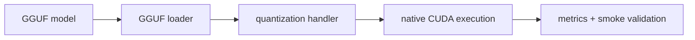

# GGUF Runtime Guide (Canonical)

**Status:** Canonical



## 1) Capability Contract

| Area | Contract |
|---|---|
| Model format | GGUF (`format: gguf` or `auto` detection) |
| Runtime paths | native CUDA and llama.cpp CUDA compatibility paths |
| Quantization support | Q4_K, Q5_K, Q6_K, Q8_0 handler path |
| Validation | unit tags (`[gguf]`, `[quantization]`) + smoke runbook |

## 2) Runtime Components

| Component | File(s) |
|---|---|
| Loader abstraction | `runtime/backends/cuda/native/model_loader.h` |
| GGUF loader | `runtime/backends/cuda/native/gguf_model_loader.{h,cpp}` |
| Quantization dispatch | `runtime/backends/cuda/native/quantization_handler.{h,cpp}` |
| Quantized forward | `runtime/backends/cuda/native/quantized_forward.{h,cpp}` |
| Quantized GEMM | `runtime/backends/cuda/native/quantized_gemm.{h,cpp}` |
| CUDA kernels | `runtime/backends/cuda/native/kernels/dequantization.cu` |

## 3) Recommended Config

```yaml
models:
  - id: qwen-gguf
    path: models/qwen2.5-3b-q4_k_m.gguf
    format: gguf
    backend: cuda_native
    default: true

runtime:
  backend_priority: [cuda, cpu]
  cuda:
    enabled: true
    attention:
      kernel: auto
    flash_attention:
      enabled: true
  scheduler:
    max_batch_size: 16
    max_batch_tokens: 8192
```

## 4) Validation and Metrics

| Check | Command |
|---|---|
| GGUF unit tests | `./build/inferflux_tests "[gguf]"` |
| Quantization unit tests | `./build/inferflux_tests "[quantization]"` |
| Runtime smoke | see [GGUF_SMOKE_TEST_GUIDE](GGUF_SMOKE_TEST_GUIDE.md) |
| Native forward activity | `curl -s http://127.0.0.1:8080/metrics | grep inferflux_native_forward_passes_total` |
| Attention kernel selection | `curl -s http://127.0.0.1:8080/metrics | grep inferflux_cuda_attention_kernel_selected` |

## 5) Troubleshooting Signals

| Symptom | Check | Likely action |
|---|---|---|
| Model fails to load | startup log + model path | validate GGUF file path and permissions |
| Native path not active | backend exposure fields + native counters | verify backend policy/request path |
| Low throughput | batch and skip counters | tune scheduler and CUDA knobs |
| Unexpected fallback | `/v1/models` backend exposure fields | inspect strict/fallback backend policy |

## 6) Consolidation Notes

Detailed design and algorithm references are archived:

- [GGUF_NATIVE_KERNEL_IMPLEMENTATION_2026_03_05](archive/evidence/GGUF_NATIVE_KERNEL_IMPLEMENTATION_2026_03_05.md)
- [GGUF_QUANTIZATION_REFERENCE_2026_03_05](archive/evidence/GGUF_QUANTIZATION_REFERENCE_2026_03_05.md)
