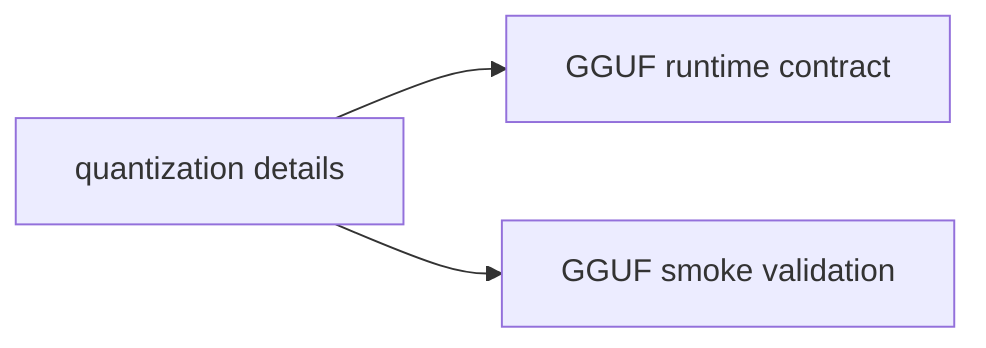

# GGUF Quantization Reference (Consolidated)

**Status:** Consolidated

## Canonical Source Map

| Need | Source of truth |
|---|---|
| Active GGUF runtime contract | [GGUF_NATIVE_KERNEL_IMPLEMENTATION](GGUF_NATIVE_KERNEL_IMPLEMENTATION.md) |
| Validation workflow | [GGUF_SMOKE_TEST_GUIDE](GGUF_SMOKE_TEST_GUIDE.md) |

## Archived Full Reference

- [GGUF_QUANTIZATION_REFERENCE_2026_03_05](archive/evidence/GGUF_QUANTIZATION_REFERENCE_2026_03_05.md)
