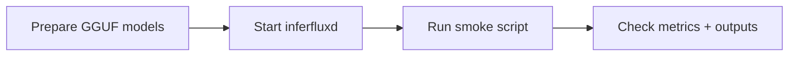

# GGUF Smoke Test Guide (Canonical Runbook)

**Status:** Canonical



## 1) Preconditions

| Requirement | Check |
|---|---|
| Built binaries | `cmake --build build --target inferfluxd inferctl` |
| GGUF model files | directory contains `*.gguf` variants |
| CUDA visibility (if GPU path) | `nvidia-smi` |

## 2) Fast Path (Recommended)

```bash
python3 scripts/test_gguf_native_smoke.py \
  --model-dir ~/.inferflux/models/qwen-gguf \
  --num-tokens 20
```

Expected: each supported quantization variant reports `SUCCESS`.

## 3) Full Comparison Path (Optional)

```bash
./scripts/test_gguf_quantization_smoke.sh \
  --model-path /abs/path/to/source-model \
  --num-tokens 20
```

Use this when you want native-vs-universal/llama comparison behavior in one flow.

## 4) Post-Run Verification

```bash
curl -s http://127.0.0.1:8080/metrics | grep -E "native_forward|cuda_attention_kernel"
./build/inferctl models --json --api-key dev-key-123
```

## 5) Failure Matrix

| Failure | First check | Action |
|---|---|---|
| server startup failure | server log, model path, port | fix config/path and restart |
| inference failure | model format/backend exposure | enforce `format: gguf`, verify backend policy |
| empty output | prompt/model mismatch | test with simpler prompt and higher token budget |
| low performance | batch/skip metrics | tune scheduler and CUDA settings |

## 6) Consolidation Notes

The previous long-form smoke guide is archived at:

- [GGUF_SMOKE_TEST_GUIDE_2026_03_05](archive/evidence/GGUF_SMOKE_TEST_GUIDE_2026_03_05.md)
