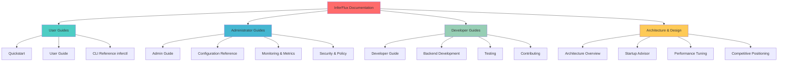
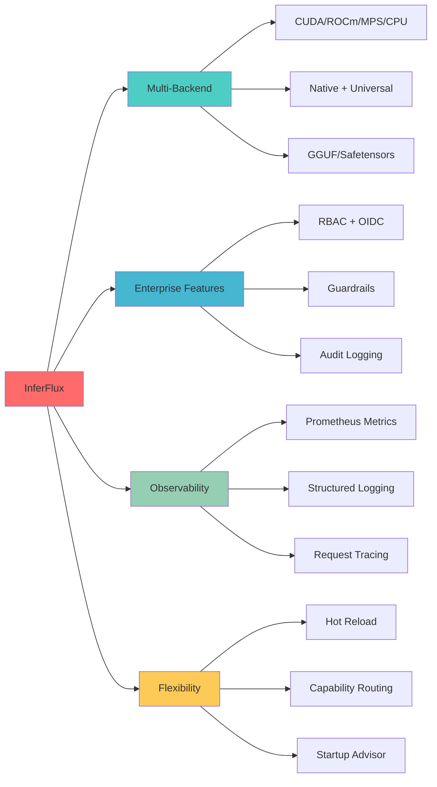

# InferFlux Documentation

## 📚 Documentation by Role

### 👤 For Users
- [Quickstart Guide](Quickstart.md) - Get started in 5 minutes
- [User Guide](UserGuide.md) - Common usage patterns
- [Troubleshooting](Troubleshooting.md) - Common issues and solutions

### 🔧 For Administrators
- [Administrator Guide](AdminGuide.md) - Deployment and operations
- [Configuration Guide](CONFIG_REFERENCE.md) - All configuration options
- [Monitoring & Metrics](MONITORING.md) - Observability and alerting
- [Security & Policy](Policy.md) - Authentication and guardrails

### 🛠️ For Developers
- [Developer Guide](DeveloperGuide.md) - Building and contributing
- [Backend Development](BACKEND_DEVELOPMENT.md) - Adding new backends
- [Testing Guide](TESTING.md) - Test architecture and running tests
- [Release Process](ReleaseProcess.md) - Making releases

### 🏗️ Architecture & Design
- [Architecture Overview](Architecture.md) - System architecture
- [Startup Advisor](STARTUP_ADVISOR.md) - Configuration recommendations
- [Performance Tuning](PERFORMANCE_TUNING.md) - Optimization guide
- [Competitive Positioning](COMPETITIVE_POSITIONING.md) - vs vLLM, SGLang, Ollama

## 🚀 Quick Links

| What you want to do | Where to go |
|---------------------|-------------|
| Get started quickly | [Quickstart](Quickstart.md) |
| Deploy to production | [Admin Guide](AdminGuide.md) |
| Add a new backend | [Backend Development](BACKEND_DEVELOPMENT.md) |
| Understand performance | [Performance Tuning](PERFORMANCE_TUNING.md) |
| Configure models | [Configuration Reference](CONFIG_REFERENCE.md) |
| Troubleshoot issues | [Troubleshooting](Troubleshooting.md) |

## 📖 Reading Order by Goal

### New Users Evaluating InferFlux
1. [Quickstart](Quickstart.md) - Try it out
2. [Competitive Positioning](COMPETITIVE_POSITIONING.md) - Why InferFlux?
3. [User Guide](UserGuide.md) - Common operations
4. [Configuration Reference](CONFIG_REFERENCE.md) - Available options

### Production Deployment
1. [Administrator Guide](AdminGuide.md) - Deployment planning
2. [Configuration Reference](CONFIG_REFERENCE.md) - All options explained
3. [Monitoring & Metrics](MONITORING.md) - Observability
4. [Performance Tuning](PERFORMANCE_TUNING.md) - Optimization
5. [Security & Policy](Policy.md) - Hardening

### Contributors
1. [Developer Guide](DeveloperGuide.md) - Build and dev environment
2. [Architecture Overview](Architecture.md) - System design
3. [Testing Guide](TESTING.md) - Running tests
4. [Backend Development](BACKEND_DEVELOPMENT.md) - Extending backends
5. [Release Process](ReleaseProcess.md) - Making releases

### Architects and Evaluators
1. [Competitive Positioning](COMPETITIVE_POSITIONING.md) - Comparison matrix
2. [Architecture Overview](Architecture.md) - System design
3. [Performance Tuning](PERFORMANCE_TUNING.md) - Capabilities and limits
4. [Roadmap](Roadmap.md) - Future plans
5. [Tech Debt Tracker](TechDebt_and_Competitive_Roadmap.md) - Known gaps

## 🎯 Key Differentiators

### Why InferFlux?

| Feature | InferFlux | vLLM | SGLang | Ollama | LM Studio |
|---------|-----------|------|--------|--------|-----------|
| **Multi-Hardware** | ✅ CUDA/ROCm/MPS/CPU | ⚠️ CUDA-only | ⚠️ CUDA-only | ⚠️ CPU/MPS mostly | ⚠️ CPU/MPS mostly |
| **Format Support** | ✅ GGUF + Safetensors | ⚠️ Limited | ⚠️ Limited | ⚠️ GGUF only | ⚠️ GGUF only |
| **Enterprise Auth** | ✅ RBAC + OIDC | ❌ Basic | ❌ Basic | ❌ API key only | ❌ None |
| **Guardrails** | ✅ Built-in + OPA | ❌ None | ❌ None | ❌ None | ❌ None |
| **Observability** | ✅ Prometheus + Structured | ⚠️ Basic | ⚠️ Basic | ❌ Minimal | ❌ None |
| **Hot Reload** | ✅ Yes | ❌ No | ❌ No | ⚠️ Partial | ❌ No |
| **Startup Advisor** | ✅ 8 Rules | ❌ None | ❌ None | ❌ None | ❌ None |

## 📊 Current Status

**Version:** 0.1.0
**Last Updated:** 2026-03-04
**Overall Grade:** C+ (up from C)

### Recent Improvements (March 2026)
- ✅ Startup Advisor with 8 recommendation rules
- ✅ Safetensors support with native CUDA backend
- ✅ FlashAttention-2 confirmed working (398.9 tok/s)
- ✅ 5/5 models verified (GGUF Q4, FP16, Safetensors BF16)
- ✅ Configuration guide with all rules documented
- ✅ Production-ready configs for all model types

## 🤝 Contributing

See [Contributing](CONTRIBUTING.md) for guidelines on:
- Code style and formatting
- Pull request process
- Test requirements
- Documentation standards

## 📄 License

[License information to be added]

---

**Quick Navigation:**
- **[← Back to Main README](../README.md)**
- **[Quickstart](Quickstart.md)** - Get started now
- **[Admin Guide](AdminGuide.md)** - Deploy to production
