# InferFlux Docs Index (OSS Release)

> Canonical, infographic-first map for users, operators, and contributors.

```mermaid
graph TD
    A[InferFlux Docs] --> B[Canonical]
    A --> C[Runbooks]
    A --> D[Advanced Guides]
    A --> E[Design Proposals]
    A --> F[Issue Backlog]
    A --> G[Archive Evidence]

    B --> B1[Quickstart]
    B --> B2[API Surface]
    B --> B3[Architecture]
    B --> B4[Admin Guide]
    B --> B5[Config Reference]
    B --> B6[Developer Guide]
    B --> B7[PRD + Roadmap + TechDebt]

    C --> C1[User Guide]
    C --> C2[Troubleshooting]
    C --> C3[Monitoring + Tune]
    C --> C4[Release Process]
    C --> C5[Installer]
    C --> C6[GGUF Runtime + Smoke]

    D --> D1[Backend Development]
    D --> D2[Policy]
    D --> D3[ROCm WSL Note]

    E --> E1[Backend parity and MLX]
    E --> E2[KV and slot-manager deep dives]
    E --> E3[EP/TP scaling plan]

    F --> F1[docs/issues/*.md]
    G --> G1[ARCHIVE_INDEX]
```

## 1) Start Here

| Goal | Primary doc | Time |
|---|---|---:|
| Run local server + first request | [Quickstart](Quickstart.md) | 5-10 min |
| Understand API + auth scopes | [API Surface](API_SURFACE.md) | 10 min |
| Operate models/routing/admin | [Admin Guide](AdminGuide.md) | 15 min |

## 2) Canonical Docs (Source of Truth)

| Domain | Canonical doc |
|---|---|
| API contract | [API Surface](API_SURFACE.md) |
| Runtime architecture | [Architecture](Architecture.md) |
| Operations and admin | [Admin Guide](AdminGuide.md) |
| Monitoring and tuning | [MONITORING](MONITORING.md) |
| Configuration | [CONFIG_REFERENCE](CONFIG_REFERENCE.md) |
| Contributor workflow | [Developer Guide](DeveloperGuide.md) |
| Product requirements | [PRD](PRD.md) |
| Delivery plan | [Roadmap](Roadmap.md) |
| Debt/competitive priorities | [TechDebt_and_Competitive_Roadmap](TechDebt_and_Competitive_Roadmap.md) |
| GGUF runtime contract | [GGUF_NATIVE_KERNEL_IMPLEMENTATION](GGUF_NATIVE_KERNEL_IMPLEMENTATION.md) |
| GGUF smoke runbook | [GGUF_SMOKE_TEST_GUIDE](GGUF_SMOKE_TEST_GUIDE.md) |
| FP16 deployment status | [FP16_STATUS](FP16_STATUS.md) |

## 3) Runbooks

| Topic | Doc |
|---|---|
| User flows | [UserGuide](UserGuide.md) |
| Incident triage | [Troubleshooting](Troubleshooting.md) |
| Release flow | [ReleaseProcess](ReleaseProcess.md) |
| Packaging/installers | [Installer](Installer.md) |

## 4) Advanced Contributor Guides

| Topic | Doc |
|---|---|
| Backend extension and implementation | [BACKEND_DEVELOPMENT](BACKEND_DEVELOPMENT.md) |
| Auth/guardrail/rate-limit policy surface | [Policy](Policy.md) |
| ROCm setup constraints on WSL/native Linux | [ROCM_INSTALLATION_GUIDE_WSL](ROCM_INSTALLATION_GUIDE_WSL.md) |

## 5) Design Proposals and Deep Dives

| Topic | Doc |
|---|---|
| Backend parity direction | [design/Backend_Parity_LlamaCpp_CUDA_MLX](design/Backend_Parity_LlamaCpp_CUDA_MLX.md) |
| MLX backend design | [design/mlx_backend](design/mlx_backend.md) |
| UI launcher design | [design/ui_launcher](design/ui_launcher.md) |
| KV cache deep dive | [design/KV_CACHE_ARCHITECTURE_DEEP_DIVE_2026_03_04](design/KV_CACHE_ARCHITECTURE_DEEP_DIVE_2026_03_04.md) |
| Sequence slot manager plan | [design/SEQUENCE_SLOT_MANAGER_PLAN](design/SEQUENCE_SLOT_MANAGER_PLAN.md) |
| Common backend refactoring plan | [design/REFACTORING_COMMON_BACKEND_LOGIC](design/REFACTORING_COMMON_BACKEND_LOGIC.md) |
| Model-parallel scaling plan | [design_ep_tp](design_ep_tp.md) |

## 6) Consolidated Redirect Docs

These files now redirect to canonical sources and keep historical versions in archive evidence.

| Consolidated file | Canonical target |
|---|---|
| [VISION](VISION.md) | [PRD](PRD.md), [Roadmap](Roadmap.md), [TechDebt](TechDebt_and_Competitive_Roadmap.md) |
| [COMPETITIVE_POSITIONING](COMPETITIVE_POSITIONING.md) | [PRD](PRD.md), [TechDebt](TechDebt_and_Competitive_Roadmap.md) |
| [NFR](NFR.md) | [PRD](PRD.md), [Roadmap](Roadmap.md) |
| [PERFORMANCE_TUNING](PERFORMANCE_TUNING.md) | [MONITORING](MONITORING.md), [CONFIG_REFERENCE](CONFIG_REFERENCE.md) |
| [PROFILING_OPERATIONS_GUIDE](PROFILING_OPERATIONS_GUIDE.md) | [MONITORING](MONITORING.md), [Developer Guide](DeveloperGuide.md) |
| [INFERCTL_SERVER_MANAGEMENT](INFERCTL_SERVER_MANAGEMENT.md) | [AdminGuide](AdminGuide.md) |
| [GGUF_QUANTIZATION_REFERENCE](GGUF_QUANTIZATION_REFERENCE.md) | [GGUF_NATIVE_KERNEL_IMPLEMENTATION](GGUF_NATIVE_KERNEL_IMPLEMENTATION.md), [GGUF_SMOKE_TEST_GUIDE](GGUF_SMOKE_TEST_GUIDE.md) |
| [FLASHATTENTION_QUICKSTART](FLASHATTENTION_QUICKSTART.md) | [MONITORING](MONITORING.md), [CONFIG_REFERENCE](CONFIG_REFERENCE.md) |
| [DYNAMIC_SLOT_ALLOCATION_STARTUP_ADVISOR](DYNAMIC_SLOT_ALLOCATION_STARTUP_ADVISOR.md) | [STARTUP_ADVISOR](STARTUP_ADVISOR.md), [CONFIG_REFERENCE](CONFIG_REFERENCE.md) |
| [STARTUP_ADVISOR_DYNAMIC_SLOTS_SUMMARY](STARTUP_ADVISOR_DYNAMIC_SLOTS_SUMMARY.md) | [STARTUP_ADVISOR](STARTUP_ADVISOR.md), [CONFIG_REFERENCE](CONFIG_REFERENCE.md) |
| [STARTUP_ADVISOR_CONFIGURABLE_CONSTANTS_2026_03_04](STARTUP_ADVISOR_CONFIGURABLE_CONSTANTS_2026_03_04.md) | [STARTUP_ADVISOR](STARTUP_ADVISOR.md), [CONFIG_REFERENCE](CONFIG_REFERENCE.md) |
| [LARGE_CONTEXT_CONFIGURATION_GUIDE](LARGE_CONTEXT_CONFIGURATION_GUIDE.md) | [CONFIG_REFERENCE](CONFIG_REFERENCE.md), [STARTUP_ADVISOR](STARTUP_ADVISOR.md) |
| [FP16_MODEL_GUIDE](FP16_MODEL_GUIDE.md) | [FP16_STATUS](FP16_STATUS.md), [CONFIG_REFERENCE](CONFIG_REFERENCE.md), [STARTUP_ADVISOR](STARTUP_ADVISOR.md) |
| [FP16_BENCHMARK_RESULTS_FINAL](FP16_BENCHMARK_RESULTS_FINAL.md) | [FP16_STATUS](FP16_STATUS.md), [MONITORING](MONITORING.md) |
| [FP16_CONCURRENT_BENCHMARK_FINAL](FP16_CONCURRENT_BENCHMARK_FINAL.md) | [FP16_STATUS](FP16_STATUS.md), [MONITORING](MONITORING.md) |
| [FP16_OOM_FIX_VALIDATION](FP16_OOM_FIX_VALIDATION.md) | [Troubleshooting](Troubleshooting.md), [STARTUP_ADVISOR](STARTUP_ADVISOR.md) |
| [FP16_OOM_FIX_FINAL_SUMMARY](FP16_OOM_FIX_FINAL_SUMMARY.md) | [FP16_STATUS](FP16_STATUS.md), [Troubleshooting](Troubleshooting.md), [STARTUP_ADVISOR](STARTUP_ADVISOR.md) |
| [OOM_ROOT_CAUSE_ANALYSIS](OOM_ROOT_CAUSE_ANALYSIS.md) | [Troubleshooting](Troubleshooting.md), [STARTUP_ADVISOR](STARTUP_ADVISOR.md) |
| [PERFORMANCE_OPTIMIZATION_SUMMARY](PERFORMANCE_OPTIMIZATION_SUMMARY.md) | [MONITORING](MONITORING.md), [CONFIG_REFERENCE](CONFIG_REFERENCE.md) |
| [GGUF_CONCURRENT_PROFILING_RESULTS](archive/evidence/GGUF_CONCURRENT_PROFILING_RESULTS_2026_03_05.md) → archived | [MONITORING](MONITORING.md), [GGUF_SMOKE_TEST_GUIDE](GGUF_SMOKE_TEST_GUIDE.md) |
| [GGUF_PROFILING_QUICK_REFERENCE](archive/evidence/GGUF_PROFILING_QUICK_REFERENCE_2026_03_05.md) → archived | [MONITORING](MONITORING.md), [CONFIG_REFERENCE](CONFIG_REFERENCE.md) |
| [KV_CACHE_ARCHITECTURE_DEEP_DIVE](design/KV_CACHE_ARCHITECTURE_DEEP_DIVE_2026_03_04.md) → design/ | [Architecture](Architecture.md), [STARTUP_ADVISOR](STARTUP_ADVISOR.md) |
| [SEQUENCE_SLOT_MANAGER_PLAN](design/SEQUENCE_SLOT_MANAGER_PLAN.md) → design/ | [Architecture](Architecture.md), [STARTUP_ADVISOR](STARTUP_ADVISOR.md) |
| [FLASHATTENTION_LIVE_TEST_RESULTS](archive/evidence/FLASHATTENTION_LIVE_TEST_RESULTS_2025_03_02.md) → archived | [MONITORING](MONITORING.md), [CONFIG_REFERENCE](CONFIG_REFERENCE.md) |

## 7) Archive Evidence

- Evidence catalog: [ARCHIVE_INDEX](ARCHIVE_INDEX.md)
- Archived snapshots and benchmarks: `docs/archive/evidence/`

## 8) Contracts and Style

- Docs style + structure rules: [DOCS_STYLE_GUIDE](DOCS_STYLE_GUIDE.md)
- Issue-ready implementation backlog: [docs/issues/README](issues/README.md)
