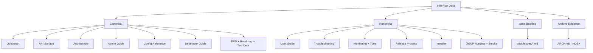

# InferFlux Docs Index (OSS Release)

> Canonical, infographic-first map for users, operators, and contributors.

## 1) Start Here

| Goal | Primary doc | Time |
|---|---|---:|
| Run local server + first request | [Quickstart](Quickstart.md) | 5-10 min |
| Understand API + auth scopes | [API Surface](API_SURFACE.md) | 10 min |
| Operate models/routing/admin | [Admin Guide](AdminGuide.md) | 15 min |

## 2) Canonical Docs (Source of Truth)

| Domain | Canonical doc |
|---|---|
| API contract | [API Surface](API_SURFACE.md) |
| Runtime architecture | [Architecture](Architecture.md) |
| Operations and admin | [Admin Guide](AdminGuide.md) |
| Monitoring and tuning | [MONITORING](MONITORING.md) |
| Configuration | [CONFIG_REFERENCE](CONFIG_REFERENCE.md) |
| Contributor workflow | [Developer Guide](DeveloperGuide.md) |
| Product requirements | [PRD](PRD.md) |
| Delivery plan | [Roadmap](Roadmap.md) |
| Debt/competitive priorities | [TechDebt_and_Competitive_Roadmap](TechDebt_and_Competitive_Roadmap.md) |
| GGUF runtime contract | [GGUF_NATIVE_KERNEL_IMPLEMENTATION](GGUF_NATIVE_KERNEL_IMPLEMENTATION.md) |
| GGUF smoke runbook | [GGUF_SMOKE_TEST_GUIDE](GGUF_SMOKE_TEST_GUIDE.md) |

## 3) Runbooks

| Topic | Doc |
|---|---|
| User flows | [UserGuide](UserGuide.md) |
| Incident triage | [Troubleshooting](Troubleshooting.md) |
| Release flow | [ReleaseProcess](ReleaseProcess.md) |
| Packaging/installers | [Installer](Installer.md) |

## 4) Consolidated Redirect Docs

These files now redirect to canonical sources and keep historical versions in archive evidence.

| Consolidated file | Canonical target |
|---|---|
| [VISION](VISION.md) | [PRD](PRD.md), [Roadmap](Roadmap.md), [TechDebt](TechDebt_and_Competitive_Roadmap.md) |
| [COMPETITIVE_POSITIONING](COMPETITIVE_POSITIONING.md) | [PRD](PRD.md), [TechDebt](TechDebt_and_Competitive_Roadmap.md) |
| [NFR](NFR.md) | [PRD](PRD.md), [Roadmap](Roadmap.md) |
| [PERFORMANCE_TUNING](PERFORMANCE_TUNING.md) | [MONITORING](MONITORING.md), [CONFIG_REFERENCE](CONFIG_REFERENCE.md) |
| [PROFILING_OPERATIONS_GUIDE](PROFILING_OPERATIONS_GUIDE.md) | [MONITORING](MONITORING.md), [Developer Guide](DeveloperGuide.md) |
| [INFERCTL_SERVER_MANAGEMENT](INFERCTL_SERVER_MANAGEMENT.md) | [AdminGuide](AdminGuide.md) |
| [GGUF_QUANTIZATION_REFERENCE](GGUF_QUANTIZATION_REFERENCE.md) | [GGUF_NATIVE_KERNEL_IMPLEMENTATION](GGUF_NATIVE_KERNEL_IMPLEMENTATION.md), [GGUF_SMOKE_TEST_GUIDE](GGUF_SMOKE_TEST_GUIDE.md) |
| [DYNAMIC_SLOT_ALLOCATION_STARTUP_ADVISOR](DYNAMIC_SLOT_ALLOCATION_STARTUP_ADVISOR.md) | [STARTUP_ADVISOR](STARTUP_ADVISOR.md), [CONFIG_REFERENCE](CONFIG_REFERENCE.md) |
| [STARTUP_ADVISOR_DYNAMIC_SLOTS_SUMMARY](STARTUP_ADVISOR_DYNAMIC_SLOTS_SUMMARY.md) | [STARTUP_ADVISOR](STARTUP_ADVISOR.md), [CONFIG_REFERENCE](CONFIG_REFERENCE.md) |
| [STARTUP_ADVISOR_CONFIGURABLE_CONSTANTS_2026_03_04](STARTUP_ADVISOR_CONFIGURABLE_CONSTANTS_2026_03_04.md) | [STARTUP_ADVISOR](STARTUP_ADVISOR.md), [CONFIG_REFERENCE](CONFIG_REFERENCE.md) |
| [LARGE_CONTEXT_CONFIGURATION_GUIDE](LARGE_CONTEXT_CONFIGURATION_GUIDE.md) | [CONFIG_REFERENCE](CONFIG_REFERENCE.md), [STARTUP_ADVISOR](STARTUP_ADVISOR.md) |

## 5) Contracts and Style

- Docs style + structure rules: [DOCS_STYLE_GUIDE](DOCS_STYLE_GUIDE.md)
- Archive evidence catalog: [ARCHIVE_INDEX](ARCHIVE_INDEX.md)
- Issue-ready implementation backlog: [docs/issues/README](issues/README.md)
