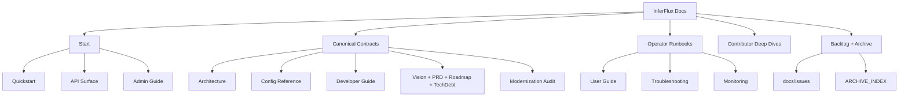

# InferFlux Docs Index (Canonical OSS)

> Fast map: canonical contracts first, deep dives second, archived evidence last.

## 1) Start Here

| Goal | Doc |
|---|---|
| First local run | [Quickstart](Quickstart.md) |
| API and auth contract | [API_SURFACE](API_SURFACE.md) |
| Admin/model operations | [AdminGuide](AdminGuide.md) |

## 2) Canonical Contracts (Source of Truth)

| Domain | Doc |
|---|---|
| Vision and product direction | [VISION](VISION.md), [PRD](PRD.md) |
| Runtime architecture | [Architecture](Architecture.md) |
| API surface | [API_SURFACE](API_SURFACE.md) |
| Configuration | [CONFIG_REFERENCE](CONFIG_REFERENCE.md) |
| **Benchmark results (validated vs Ollama)** | **[benchmarks](benchmarks.md)** ⭐ |
| Monitoring and tuning | [MONITORING](MONITORING.md) |
| Archived throughput investigations | [ARCHIVE_INDEX](ARCHIVE_INDEX.md) |
| Developer workflow + CI contracts | [DeveloperGuide](DeveloperGuide.md) |
| Grades and execution plan | [Roadmap](Roadmap.md), [TechDebt_and_Competitive_Roadmap](TechDebt_and_Competitive_Roadmap.md) |
| Modernization migration guide | [MODERNIZATION_AUDIT](MODERNIZATION_AUDIT.md) |
| Maintenance simplification review | [MAINTENANCE_REVIEW](MAINTENANCE_REVIEW.md) |
| Competitive positioning | [COMPETITIVE_POSITIONING](COMPETITIVE_POSITIONING.md) |
| GGUF runtime contract | [GGUF_NATIVE_KERNEL_IMPLEMENTATION](GGUF_NATIVE_KERNEL_IMPLEMENTATION.md) |
| FP16 status | [FP16_STATUS](FP16_STATUS.md) |

## 3) Operator Runbooks

| Topic | Doc |
|---|---|
| User workflows | [UserGuide](UserGuide.md) |
| Incident triage | [Troubleshooting](Troubleshooting.md) |
| Release process | [ReleaseProcess](ReleaseProcess.md) |
| Installer/package flow | [Installer](Installer.md) |

## 4) Contributor Deep Dives

| Topic | Doc |
|---|---|
| Backend implementation | [BACKEND_DEVELOPMENT](BACKEND_DEVELOPMENT.md) |
| Policy surface | [Policy](Policy.md) |
| Backend parity design | [design/Backend_Parity_LlamaCpp_CUDA_MLX](design/Backend_Parity_LlamaCpp_CUDA_MLX.md) |
| Native GGUF quantized runtime design | [design/NATIVE_GGUF_QUANTIZED_RUNTIME_ARCHITECTURE](design/NATIVE_GGUF_QUANTIZED_RUNTIME_ARCHITECTURE.md) |
| InferFlux CUDA + distributed uplift plan | [design/NATIVE_CUDA_SGLANG_INSPIRED_EXECUTION_PLAN](design/NATIVE_CUDA_SGLANG_INSPIRED_EXECUTION_PLAN.md) |
| Session handle layer (Phase 1) | [design/SESSION_HANDLE_LAYER_PHASE1](design/SESSION_HANDLE_LAYER_PHASE1.md) |
| EP/TP scaling design | [design_ep_tp](design_ep_tp.md) |

## 5) Backlog and Evidence

| Need | Doc |
|---|---|
| Issue-ready tickets | [docs/issues/README](issues/README.md) |
| Archived snapshots/benchmarks | [ARCHIVE_INDEX](ARCHIVE_INDEX.md) |

## 6) Grade Table Source

Use these two docs for current scoring and grade movement rationale:

- [Roadmap](Roadmap.md)
- [TechDebt_and_Competitive_Roadmap](TechDebt_and_Competitive_Roadmap.md)

Use this doc for old-practice -> modern-practice migration guidance:

- [MODERNIZATION_AUDIT](MODERNIZATION_AUDIT.md)
