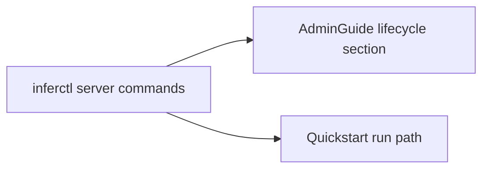

# Inferctl Server Management (Consolidated)

**Status:** Consolidated

## Canonical Source Map

| Need | Source of truth |
|---|---|
| `inferctl server start/stop/status/restart/logs` contracts | [AdminGuide](AdminGuide.md) |
| First-run local workflow | [Quickstart](Quickstart.md) |
| Full CLI usage text | `cli/main.cpp` (`PrintUsage`) |

## Archived Full Guide

- [INFERCTL_SERVER_MANAGEMENT_2026_03_05](archive/evidence/INFERCTL_SERVER_MANAGEMENT_2026_03_05.md)
