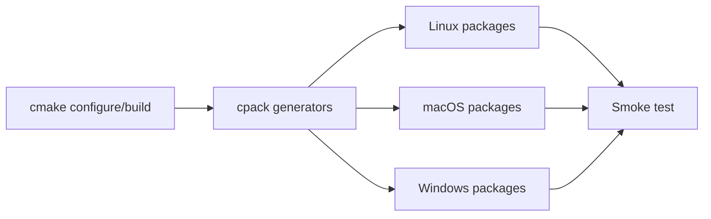

# Installer Guide (Canonical OSS)

**Status:** Canonical



## 1) Build Once

```bash
cmake -S . -B build -DCMAKE_BUILD_TYPE=Release -DENABLE_WEBUI=ON
cmake --build build -j$(sysctl -n hw.ncpu 2>/dev/null || nproc)
cmake --install build --prefix build/install
```

## 2) Package Matrix

| Platform | CPack generator | Primary outputs | Local install/test command |
|---|---|---|---|
| Linux Debian/Ubuntu | `DEB` | `.deb` | `sudo apt install ./inferflux-*.deb` |
| Linux RHEL/Fedora | `RPM` | `.rpm` | `sudo rpm -i inferflux-*.rpm` |
| Linux/macOS generic | `TGZ` | `.tar.gz` | extract + run `inferfluxd` |
| macOS Installer | `productbuild` | `.pkg` | open package installer |
| macOS App bundle | `DragNDrop` | `.dmg` | mount DMG and copy app |
| Windows | `WIX` | `.msi` | run MSI installer |

## 3) Packaging Commands

```bash
# Linux
cpack --config build/CPackConfig.cmake -G DEB
cpack --config build/CPackConfig.cmake -G RPM
cpack --config build/CPackConfig.cmake -G TGZ

# macOS
cpack --config build/CPackConfig.cmake -G productbuild
cpack --config build/CPackConfig.cmake -G DragNDrop

# Windows (PowerShell with WiX on PATH)
cpack --config build/CPackConfig.cmake -G WIX
```

## 4) Verification Contract

| Check | Command |
|---|---|
| Binary starts | `inferfluxd --help` |
| CLI works | `inferctl --help` |
| Health endpoint | `curl -s http://127.0.0.1:8080/livez` |
| Model listing | `./build/inferctl models --api-key dev-key-123` |

## 5) Release Integration

- Homebrew template: `installers/homebrew/inferflux.rb`
- Winget template: `installers/winget/inferencial.inferflux.yaml`
- Release workflow: [ReleaseProcess](ReleaseProcess.md)

## 6) Notes

- Rebuild with `-DENABLE_MLX=ON` if MLX backend support is needed in macOS artifacts.
- Docker remains optional (`docker/`) and is not required for package-native setup.
