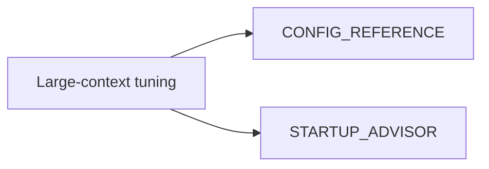

# Large Context Configuration (Consolidated)

**Status:** Consolidated

## Canonical Source Map

| Need | Source of truth |
|---|---|
| Context-size and memory knobs | [CONFIG_REFERENCE](CONFIG_REFERENCE.md) |
| Startup recommendations and safety checks | [STARTUP_ADVISOR](STARTUP_ADVISOR.md) |

## Archived Full Guide

- [LARGE_CONTEXT_CONFIGURATION_GUIDE_2026_03_05](archive/evidence/LARGE_CONTEXT_CONFIGURATION_GUIDE_2026_03_05.md)
