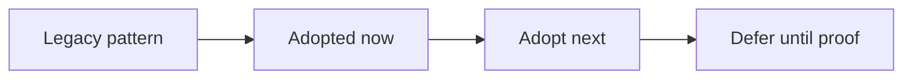

# Runtime Modernization Audit

**Snapshot date:** March 9, 2026  
**Purpose:** Replace stale assumptions with code-aligned modern serving practices.

## 1) Executive Read

| Area | Status | Why it matters |
|---|---|---|
| Provider identity + policy routing | Adopted | Fallback is observable and automatable |
| Sync-first batched execution stance | Adopted | Preserves throughput under concurrent load better than per-step async dispatch |
| Memory-first quantized GGUF policy | Adopted foundation | Avoids large persistent dequant buffers on edge GPUs |
| Budgeted KV sizing + metrics | Adopted foundation | Prevents wasteful fixed reservations and improves operator tuning |
| Optional session lease layer | Adopted foundation | Enables sticky reuse without making the API stateful by default |
| Ticketed distributed KV handoff | Not adopted | Required before claiming robust distributed runtime |
| Mandatory GPU release gate | Not adopted | Needed to stop native perf regressions from slipping through CI |

## 2) Practices To Retire

| Older practice to retire | Modern target | Repo status today | Migration guidance |
|---|---|---|---|
| Hidden fallback decisions | Expose `requested_backend`, `exposed_backend`, `provider`, `fallback`, `fallback_reason` everywhere | Mostly adopted | Keep all API/CLI/admin outputs aligned with the backend factory contract |
| Filename-driven format behavior | Detect loader/format from artifact structure and GGUF metadata | Adopted foundation | Continue using `CreateModelLoader()` and GGUF tensor metadata as the source of truth |
| Persistent dequantized GGUF caches | Policy-scoped dequant (`none|batch|model`) with memory-first default | Adopted foundation | Expand fused execution so `none` remains the default instead of a fallback-only mode |
| Fixed KV reservation | Budget-aware KV planner with explicit metrics | Adopted foundation | Feed planner output into startup advice and future autoscaling signals |
| Treating async as the throughput feature | Async admission, sync batched execution core | Adopted stance | Do not re-enable native async until it shares the same batched execution path without per-token queue overhead |
| Delegate-coupled parity hidden behind generic capability flags | Policy-driven parity with explicit native-vs-delegate ownership | Partial | Close native-first completion/chat/embeddings behavior endpoint by endpoint |
| Benchmark-only grading | Contract gates plus representative perf matrices | Partial | Require both GPU behavior gates and archived benchmark evidence before moving grades |
| Best-effort distributed transport | Ticket/ack/commit lifecycle with readiness impact | Not adopted | Implement transport state and worker-health propagation before expanding cluster claims |
| Server-global hidden state | Stateless default with optional TTL session leases | Adopted foundation | Keep session leases optional and ownership-safe, especially with decode-worker mode |
| Mixed KV ABI per request | Load-scoped KV precision | Adopted | Keep KV precision fixed at model-load scope, never per request/session |

## 3) Adopt Now

| Priority | Change |
|---|---|
| P0 | Finish first-class native quantized GGUF hot paths so memory-first mode is also the fast path |
| P0 | Add mandatory GPU behavior lane for native provider, overlap, and quantized path contracts |
| P1 | Remove remaining delegate-coupled parity for completion/chat/embeddings where native logic can own the feature |
| P1 | Add ticketed distributed KV transport and sequence ownership cleanup |

## 4) Adopt Next

| Area | Next modern practice |
|---|---|
| Scheduler | Prefix-aware and cost-aware admission becomes the default policy, not an opt-in experiment |
| Memory economy | Paged KV accounting and planner outputs feed startup advice and autoscaling signals |
| Native CUDA | Graph capture buckets and fused quantized kernels become standard for repeatable decode/prefill envelopes |
| Distributed runtime | Readiness, transport saturation, and worker-health metrics become first-class release gates |

## 5) Defer Until Proof

| Candidate | Why it should wait |
|---|---|
| Re-enabling native async unified-batch | Current code shows the sync batch core is faster; async should return only if it preserves the same batching semantics |
| Lower-precision KV cache by default | Quality/stability and allocator ABI need clearer proof before making this the standard path |
| Session leases in decode-worker mode | Ownership and cleanup must be explicit first to avoid stale-sequence reuse |

## 6) Canonical References

- [VISION](VISION.md)
- [Architecture](Architecture.md)
- [Roadmap](Roadmap.md)
- [TechDebt_and_Competitive_Roadmap](TechDebt_and_Competitive_Roadmap.md)
- [design/NATIVE_CUDA_SGLANG_INSPIRED_EXECUTION_PLAN](design/NATIVE_CUDA_SGLANG_INSPIRED_EXECUTION_PLAN.md)
