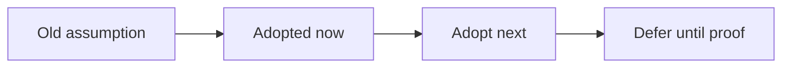

# Runtime Modernization Audit

**Snapshot date:** March 9, 2026  
**Purpose:** Replace stale serving assumptions with code-aligned modern practice.

## 1) Executive Read

| Area | Status | Why it matters |
|---|---|---|
| Provider identity + policy routing | Adopted | Fallback is observable, automatable, and contract-tested |
| Sync-first batching stance | Adopted | Preserves throughput better than naive per-step async dispatch |
| Memory-first quantized GGUF policy | Adopted foundation | Avoids large persistent dequant buffers on edge GPUs |
| Budgeted KV sizing + metrics | Adopted foundation | Replaces wasteful fixed reservations with explicit planning |
| Optional session lease layer | Adopted foundation | Enables sticky reuse without making the API stateful by default |
| Ticketed distributed KV transport | Adopted foundation | Readiness, admin pools, and admission now understand transport degradation |
| Mandatory GPU release gate | Not adopted | Native/provider regressions can still slip through CI |

## 2) Modern Serving Primitives

| Modern primitive | Current best practice | Repo status today | Migration next |
|---|---|---|---|
| Paged KV / PagedAttention-style memory thinking | Treat KV as a separately managed memory plane with reuse/accounting | Adopted foundation | Finish allocator/ownership maturity under concurrency |
| Quantized serving | Keep weights quantized; use fused dequant-tile + matmul instead of persistent full dequant | Partial | Close GGUF hot paths so memory-first mode is also the fast path |
| PD disaggregation | Make transport lifecycle and health explicit; let degradation affect readiness/admission | Adopted foundation | Add sequence ownership cleanup and multi-process fault tests |
| CUDA graphs / repeatable envelopes | Reuse stable decode/prefill buckets instead of paying repeated launch overhead | Partial | Promote graph capture from experimental path to productionized contract |
| Async serving | Use async for admission/collection only if batching semantics stay intact | Adopted stance | Keep native async disabled until it shares the same batched core |
| Explicit backend identity | Surface requested backend, exposed backend, provider, fallback, reason | Adopted | Keep every user/admin surface aligned as backends evolve |
| Contract-driven grading | Move grades only when tests and runtime evidence agree | Adopted stance | Add required GPU/provider lanes before moving runtime grades up |

## 3) Practices To Retire

| Older practice to retire | Modern target | Repo status today | Migration guidance |
|---|---|---|---|
| Hidden fallback decisions | Expose `requested_backend`, `exposed_backend`, `provider`, `fallback`, `fallback_reason` everywhere | Mostly adopted | Keep API/CLI/admin outputs aligned with backend factory contract |
| Filename-driven format behavior | Detect loader/format from artifact structure and GGUF metadata | Adopted foundation | Continue using model loaders and GGUF metadata as the source of truth |
| Persistent dequantized GGUF caches | Policy-scoped dequant (`none|batch|model`) with memory-first default | Adopted foundation | Expand fused execution so `none` remains the default fast path |
| Fixed KV reservation | Budget-aware KV planner with explicit metrics | Adopted foundation | Feed planner outputs into startup advice and later autoscaling decisions |
| Treating async as the throughput feature | Async admission, sync batched execution core | Adopted stance | Do not re-enable native async until it preserves the same batch semantics |
| Delegate-coupled parity hidden behind generic capability flags | Policy-driven parity with explicit native-vs-delegate ownership | Partial | Close remaining native-owned behavior endpoint by endpoint |
| Benchmark-only grading | Contract gates plus representative perf matrices | Partial | Require both GPU behavior gates and retained benchmark evidence before moving grades |
| Passive readiness only | Transport-health can influence readiness, admin visibility, and optional fail-closed admission | Adopted foundation | Expand to more explicit operator policy only when distributed ownership matures |
| Topology-only distributed claims | Ticket lifecycle, ownership semantics, and failure tests | Partial | Finish ownership cleanup before broadening scale claims |
| Server-global hidden state | Stateless default with optional TTL session leases | Adopted foundation | Keep session reuse optional and ownership-safe |
| Mixed KV ABI per request | Load-scoped KV precision | Adopted | Never make KV precision request-scoped |

## 4) Adopt Now

| Priority | Change |
|---|---|
| P0 | Finish first-class native quantized GGUF hot paths so memory-first mode is also the fast path |
| P0 | Add required GPU/provider behavior lane for `inferflux` provider, overlap, and quantized-path contracts |
| P1 | Close distributed sequence ownership cleanup now that transport lifecycle and health signals exist |
| P1 | Remove remaining delegate-coupled parity for completion/chat/embeddings where native logic can own the feature |

## 5) Adopt Next

| Area | Next modern practice |
|---|---|
| Scheduler | Prefix-aware and cost-aware admission becomes the default policy, not an opt-in experiment |
| Memory economy | Planner outputs feed startup advice, capacity planning, and later autoscaling signals |
| InferFlux CUDA | Graph capture buckets and broader fused quantized kernels become standard for repeatable envelopes |
| Distributed runtime | Worker-loss, queue pressure, and transport health become required failure-path gates |

## 6) Defer Until Proof

| Candidate | Why it should wait |
|---|---|
| Re-enabling native async unified-batch | Current code shows the sync batch core is the safer throughput path |
| Lower-precision KV cache by default | Quality/stability and allocator ABI need clearer proof |
| Session leases in decode-worker mode | Ownership and cleanup must be explicit first |

## 7) Canonical References

- [VISION](VISION.md)
- [Architecture](Architecture.md)
- [Roadmap](Roadmap.md)
- [TechDebt_and_Competitive_Roadmap](TechDebt_and_Competitive_Roadmap.md)
- [design/NATIVE_CUDA_SGLANG_INSPIRED_EXECUTION_PLAN](design/NATIVE_CUDA_SGLANG_INSPIRED_EXECUTION_PLAN.md)
