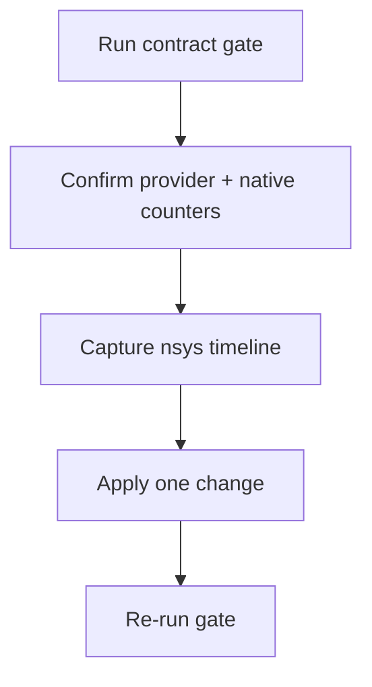

# Monitoring and Performance Operations

**Status:** Canonical  
**Snapshot date:** March 9, 2026


## 1) Observability Contract

| Surface | Endpoint/metric |
|---|---|
| Health | `/livez`, `/readyz`, `/healthz` |
| Prometheus | `/metrics` |
| Request latency | `inferflux_request_duration_ms*` |
| Errors | `inferflux_errors_total` |
| Queue depth | `inferflux_scheduler_queue_depth`, `inferflux_prefill_queue_depth`, `inferflux_decode_queue_depth` |
| Batch quality | `inferflux_batch_size_max`, `inferflux_scheduler_batch_token_budget_skips_total`, `inferflux_scheduler_iterations_total{phase=...}` |
| CUDA overlap | `inferflux_cuda_lane_submissions_total`, `inferflux_cuda_lane_overlap_events_total` |
| Native path activity | `inferflux_native_forward_passes_total{phase=...}` |
| Native KV planning | `inferflux_native_kv_active_sequences`, `inferflux_native_kv_max_sequences`, `inferflux_native_kv_autotune_events_total`, `inferflux_native_kv_requested_max_seq`, `inferflux_native_kv_planned_max_seq`, `inferflux_native_kv_budget_bytes` |
| Cache reuse | `inferflux_prefix_hits_total`, `inferflux_prefix_partial_hits_total`, `inferflux_prefix_matched_tokens_total`, `inferflux_kv_prefix_reuse_total` |

## 2) Fast Checks

```bash
curl -s http://127.0.0.1:8080/livez
curl -s http://127.0.0.1:8080/readyz
curl -s http://127.0.0.1:8080/metrics | head -160
```

## 3) Tuning Levers

| Goal | Primary knob | Secondary knob | Validation signal |
|---|---|---|---|
| Increase throughput | `runtime.scheduler.max_batch_size` | `runtime.scheduler.batch_accumulation_ms` | `inferflux_batch_size_max` rises without error spikes |
| Improve mixed workloads | `runtime.cuda.phase_overlap.enabled` | `runtime.scheduler.mixed_prefill_budget_ratio` | overlap events and mixed scheduler iterations rise |
| Improve memory economy | native dequant policy + KV budget knobs | session/prefix reuse patterns | native KV plan shrinks to budget without request failures |
| Improve cache reuse | prefix warm path + KV pages | scheduler policy | prefix/kv reuse counters rise |
| Validate provider intent | backend exposure policy | strict-native mode | `/v1/models` shows expected provider/fallback fields |

Reference knobs: [CONFIG_REFERENCE](CONFIG_REFERENCE.md)

## 4) CUDA and Native Quick Reference

| Signal | What to check | How to read it |
|---|---|---|
| Selected provider | `/v1/models` or `inferctl models --json` | `provider=llama_cpp` with `fallback=true` means native is not serving the request path |
| Native execution | `inferflux_native_forward_passes_total{phase=...}` | Zero deltas mean native forward is not active |
| Overlap activity | `inferflux_cuda_lane_submissions_total`, `inferflux_cuda_lane_overlap_events_total` | Non-zero deltas confirm mixed-workload lane activity |
| Native KV sizing | `inferflux_native_kv_requested_max_seq`, `inferflux_native_kv_planned_max_seq`, `inferflux_native_kv_budget_bytes` | Planned values below requested show KV auto-tune is protecting VRAM |
| Readiness on decode nodes | `/readyz` | Decode nodes are ready only when weights are loaded and all configured workers are alive |

## 5) Throughput Gate Contract

Use gates as release-quality checks, not ad-hoc screenshots:

```bash
./scripts/run_throughput_gate.py \
  --server-bin ./build/inferfluxd \
  --config config/server.cuda.yaml \
  --backend cuda \
  --gpu-profile ada_rtx_4000 \
  --min-batch-size-max 2 \
  --min-batch-size-utilization 0.06 \
  --require-mixed-scheduler-iterations
```

Interpretation rule:

1. Confirm the selected provider is the one you intended.
2. Confirm native forward and overlap counters move on the same run.
3. Treat throughput numbers as meaningful only after 1 and 2 are true.

## 6) Profiling Workflow



```bash
nsys profile -t cuda,nvtx -o /tmp/inferflux_profile \
  --force-overwrite=true --duration=30 \
  python3 scripts/run_throughput_gate.py --backend cuda --requests 48
```

## 7) Alert Baselines

| Alert | Trigger example |
|---|---|
| Readiness failure | `/readyz != 200` for 2m |
| Error surge | `rate(inferflux_errors_total[5m])` above SLO threshold |
| Batch collapse | `inferflux_batch_size_max` drops while load is stable |
| Native path regression | expected native workload shows no native-forward deltas |
| Memory over-reservation | native KV budget/requested gap disappears unexpectedly on constrained nodes |

## 8) Incident Matrix

| Symptom | First checks | Typical action |
|---|---|---|
| High latency, low throughput | queue depth + batch metrics + provider identity | fix routing/batch settings before profiling kernels |
| Native CUDA expected but missing | `/v1/models` exposure fields + native counters | inspect strict/fallback policy and model format path |
| VRAM pressure | native KV planning metrics + dequant policy | tighten budget or keep memory-first dequant policy |
| Cache not helping | prefix/kv reuse counters | validate warmup patterns and prefix-affinity policy |

## 9) Related Docs

- [Architecture](Architecture.md)
- [CONFIG_REFERENCE](CONFIG_REFERENCE.md)
- [Troubleshooting](Troubleshooting.md)
- [ARCHIVE_INDEX](ARCHIVE_INDEX.md)
