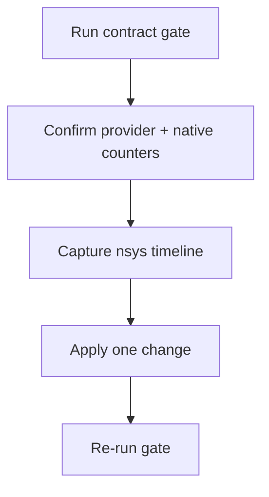

# Monitoring and Performance Operations

**Status:** Canonical  
**Snapshot date:** March 9, 2026


## 1) Observability Contract

| Surface | Endpoint/metric |
|---|---|
| Health | `/livez`, `/readyz`, `/healthz` |
| Prometheus | `/metrics` |
| Request latency | `inferflux_request_duration_ms*` |
| Errors | `inferflux_errors_total` |
| Queue depth | `inferflux_scheduler_queue_depth`, `inferflux_prefill_queue_depth`, `inferflux_decode_queue_depth` |
| Batch quality | `inferflux_batch_size_max`, `inferflux_scheduler_batch_token_budget_skips_total`, `inferflux_scheduler_iterations_total{phase=...}` |
| Sequence reclamation | `inferflux_scheduler_deferred_sequence_retirements`, `inferflux_scheduler_deferred_sequence_retirements_completed_total`, `inferflux_scheduler_sequence_retirement_duration_ms*` |
| CUDA overlap | `inferflux_cuda_lane_submissions_total`, `inferflux_cuda_lane_overlap_events_total` |
| Native path activity | `inferflux_cuda_forward_passes_total{phase=...}` |
| Native forward batch distribution | `inferflux_cuda_forward_batch_size_total{phase=...,bucket=...}` |
| Native FFN projection mix | `inferflux_cuda_ffn_proj_operator_total{phase=...,operator=...}` |
| Native FFN geometry | `inferflux_cuda_ffn_proj_geometry_total{phase=...,operator=...,quant=...,m_bucket=...,n=...,k=...,grouped_outputs=...}` |
| Native down-proj operator mix | `inferflux_cuda_down_proj_operator_total{phase=...,operator=...}` |
| Native down-proj geometry | `inferflux_cuda_down_proj_geometry_total{phase=...,operator=...,quant=...,m_bucket=...,n=...,k=...}` |
| Native GEMV dispatch | `inferflux_cuda_ffn_proj_operator_total{operator=...}` — confirms Q8_1 vs packed vs fallback for FFN gate/up, including `q8_1_group_hot_q4k`, `q8_1_group_row_pair_w4`, and `q8_1_group_v2` when grouped decode experiments are active. `inferflux_cuda_down_proj_operator_total{operator=...}` — confirms generic `q8_1_gemv`, `q8_1_gemv_v2`, experimental `q8_1_gemv_hot_fixed`, experimental `q8_1_gemv_row_pair_hot_fixed`, row-pair/row-quad, `q8_1_gemv_row_pair_v2`, MMQ, or fallback for down proj |
| Row-pair kernel usage | `inferflux_cuda_rowpair_selection_total{phase=...,operator=...,bucket=...}` | Correlates multi-row batches (bucket ≥2) to the actual row-pair code paths for FFN gate/up (`q8_1_group_row_pair_w4`) and down-proj (`q8_1_gemv_row_pair*`). Use the bucket label to validate only grouped workloads triggered the specialized kernels before enabling them by default. |
| Native KV planning | `inferflux_cuda_kv_active_sequences`, `inferflux_cuda_kv_max_sequences`, `inferflux_cuda_kv_autotune_events_total`, `inferflux_cuda_kv_requested_max_seq`, `inferflux_cuda_kv_planned_max_seq`, `inferflux_cuda_kv_budget_bytes` |
| Distributed KV health | `inferflux_disagg_kv_tickets_total{stage=...}`, `inferflux_disagg_kv_timeout_streak`, `inferflux_disagg_kv_timeout_debt` |
| Cache reuse | `inferflux_prefix_hits_total`, `inferflux_prefix_partial_hits_total`, `inferflux_prefix_matched_tokens_total`, `inferflux_kv_prefix_reuse_total` |

## 2) Fast Checks

```bash
curl -s http://127.0.0.1:8080/livez
curl -s http://127.0.0.1:8080/readyz
curl -s http://127.0.0.1:8080/metrics | head -160
```

## 3) Tuning Levers

| Goal | Primary knob | Secondary knob | Validation signal |
|---|---|---|---|
| Increase throughput | `runtime.scheduler.max_batch_size` | `runtime.scheduler.batch_accumulation_ms` | `inferflux_batch_size_max` rises without error spikes |
| Improve mixed workloads | `runtime.cuda.phase_overlap.enabled` | `runtime.scheduler.mixed_prefill_budget_ratio` | overlap events and mixed scheduler iterations rise |
| Improve memory economy | native dequant policy + KV budget knobs | session/prefix reuse patterns | native KV plan shrinks to budget without request failures |
| Validate deferred slot reuse | backend release fences | scheduler slot reuse | retirement gauge drains and retirement duration stays bounded |
| Improve cache reuse | prefix warm path + KV pages | scheduler policy | prefix/kv reuse counters rise |
| Validate provider intent | backend exposure policy | strict-native mode | `/v1/models` shows expected provider/fallback fields |

Reference knobs: [CONFIG_REFERENCE](CONFIG_REFERENCE.md)

## 4) CUDA and Native Quick Reference

| Signal | What to check | How to read it |
|---|---|---|
| Selected provider | `/v1/models` or `inferctl models --json` | `provider=llama_cpp` with `fallback=true` means native is not serving the request path |
| Native execution | `inferflux_cuda_forward_passes_total{phase=...}` | Zero deltas mean native forward is not active |
| Native decode batch shape | `inferflux_cuda_forward_batch_size_total{phase="decode",bucket=...}` | If decode stays mostly in `bucket="1"`, scheduler/kernel work is still effectively single-row |
| Native FFN gate+up path | `inferflux_cuda_ffn_proj_operator_total{phase=...,operator=...}` | Confirms whether the live FFN projection hot path is the default single-row Q4_K fast path `q8_1_group_hot_q4k`, the experimental `M=2` row-pair `q8_1_group_row_pair_w4`, generic `q8_1_group`, cooperative-warp `q8_1_group_v2`, packed, or fallback. The default hot path is intentionally limited to `M=1`; if `q8_1_group_hot_q4k` appears on `M=2`, the selector regressed. |
| Native FFN gate+up geometry | `inferflux_cuda_ffn_proj_geometry_total{phase=...,operator=...,quant=...,m_bucket=...,n=...,k=...,grouped_outputs=...}` | Identifies the actual grouped gate/up GEMV envelope before changing kernels or thresholds |
| Native down-proj operator | `inferflux_cuda_down_proj_operator_total{phase=...,operator=...}` | Confirms whether native `down_proj` is actually using generic `q8_1_gemv`, cooperative-warp `q8_1_gemv_v2`, experimental `q8_1_gemv_hot_fixed`, experimental `q8_1_gemv_row_pair_hot_fixed`, row-pair/row-quad `Q8_1`, cooperative-warp `q8_1_gemv_row_pair_v2`, packed, `mmq`, or fallback |
| Native down-proj geometry | `inferflux_cuda_down_proj_geometry_total{phase=...,operator=...,quant=...,m_bucket=...,n=...,k=...}` | Identifies the actual down-proj GEMV envelope before changing kernels or thresholds |
| Native operator selection logs | `INFERFLUX_CUDA_DEBUG_OPERATOR_SELECTION=1` | Emits `operator_select[...]` lines with chosen operator plus `M/N/K` geometry; use only for short debug runs |
| Native vs llama decode parity | `INFERFLUX_DEBUG_LOGITS=1`, `INFERFLUX_DEBUG_TOKEN_TRACE=1`, then `python3 scripts/compare_decode_traces.py native.log llama.log --json` | Reports the first divergent `client_request_id / n_past / top-token` step when stable client tags are present, falling back to scheduler `request_id` only when no caller tag was logged |
| Phased fairness resume | `inferflux_empty_generations_total` plus unified-batch regression tests | Empty generations should not spike after a fairness-slice change; resumed phased requests must carry only the next feed token |
| Slot/request identity debugging | `INFERFLUX_DEBUG_SEQUENCE_SLOTS=1` and `INFERFLUX_CUDA_DEBUG_DECODE_MAPPING=1` | Logs must include `request_id` plus `sequence_generation`; slot id alone is not enough once leases are reused |
| Compatibility-path EOG parity | local GGUF tokenizer/backend regression tests | `llama_cpp_cuda` should stop on GGUF end-of-generation tokens, not just model EOS |
| Batched decode active | Batch buckets in `bucket="2"` or higher | Default-on. B>1 decode uses BatchedRoPE/KvAppend/FlashDecodeMultiSeq instead of per-sequence loop. Opt-out via `INFERFLUX_DISABLE_BATCHED_DECODE=1`. |
| Native logprobs | `logprobs` field in completion response is non-null when `logprobs: true` | Native path computes log-softmax from GPU logits (D2H copy). No parity delegate needed. |
| Native embeddings | `/v1/embeddings` returns vectors | Native MeanPool kernel extracts embeddings. Falls back to delegate only if native fails. |
| Q8_1 activation path | startup log shows `using Q8_1 grouped triple GEMV` or `using Q8_1 pre-quantized GEMV` | Confirms pre-quantized Q8_1 activations are active (highest throughput path). Disable with `INFERFLUX_DISABLE_Q8_1_ACTIVATIONS=1` for A/B testing. |
| Overlap activity | `inferflux_cuda_lane_submissions_total`, `inferflux_cuda_lane_overlap_events_total` | Non-zero deltas confirm mixed-workload lane activity. CUDA graphs are now enabled on the primary forward instance during lane overlap after the `lane_overlap_mutex_` fix in commit `0ccbad3` eliminated the heap corruption that previously required disabling them. |
| Native KV sizing | `inferflux_cuda_kv_requested_max_seq`, `inferflux_cuda_kv_planned_max_seq`, `inferflux_cuda_kv_budget_bytes` | Planned values below requested show KV auto-tune is protecting VRAM |
| Readiness on decode/disagg nodes | `/readyz` | Ready requires weights loaded, full decode-worker health, and timeout streak/debt below threshold |
| Fail-closed admission | generation `503` with `error=distributed_kv_transport_degraded` | optional protection when degraded transport should stop new generation work immediately |

Benchmark-only experiment:
- `INFERFLUX_DOWNPROJ_MMQ_MIN_BATCH=<n>`
  Lowers the native `down_proj` MMQ promotion threshold for controlled experiments.
  Validate with `inferflux_cuda_down_proj_operator_total` before trusting throughput movement.
- `INFERFLUX_ENABLE_EXPERIMENTAL_Q8_1_DOWNPROJ_HOT_FIXED=1`
  Enables the exact-shape fixed-block `down_proj` kernel for the observed `M=1,N=2048,K=11008` decode envelope. Keep it off for normal runs until the full concurrent benchmark reaches the same exact-match bar as the generic path.

- `INFERFLUX_ENABLE_EXPERIMENTAL_Q8_1_DOWNPROJ_ROWPAIR_HOT_FIXED=1`
  Enables the exact-shape fixed-block row-pair `down_proj` kernel for the observed `M=2,N=2048,K=11008` decode envelope. Current isolated benchmarking is mixed (`Q4_K` slower, `Q6_K` faster), so keep it off by default and validate against the full model before wider use.

Benchmark harness knobs:
- `INFERFLUX_BENCH_MIN_BATCH_SIZE=<n>`
- `INFERFLUX_BENCH_BATCH_ACCUMULATION_MS=<ms>`
- `INFERFLUX_BENCH_DECODE_BURST_TOKENS=<n>`
- `INFERFLUX_NATIVE_BURST_CHUNK_TOKENS=<n>`
  Tunes the executor-side singleton native burst path used by stepwise decode. This is the current throughput knob for the production burst integration, distinct from `decode_burst_tokens`.
  Current WSL2 guidance:
  - `4` for balanced throughput
  - `2` for lower-concurrency serving
  - `8` only for explicit high-concurrency experiments
- `BACKEND_STARTUP_TIMEOUT_SEC=<sec>`
  Benchmark-harness only. Default is backend-aware (`60s`, `llama_cpp_cuda=180s`). Increase only when cold-start `llama_cpp_cuda` load time would otherwise masquerade as a throughput failure.
- `INFERFLUX_BENCH_NATIVE_TIMING_SAMPLE_RATE=<n>`
  `0` disables InferFlux CUDA event timing; `N>0` records every `N`th InferFlux CUDA work item across both decode batches and prefill requests.
  The harness default for `INFERFLUX_BENCH_DECODE_BURST_TOKENS` is `0`; use `>1` only for explicit throughput experiments because native exact-match parity is not closed there yet.
- `INFERFLUX_BENCH_DEBUG_SEQUENCE_SLOTS=1`
- `INFERFLUX_BENCH_DEBUG_UNIFIED_ASSEMBLY=1`
- `INFERFLUX_BENCH_NATIVE_DEBUG_DECODE_MAPPING=1`
- `INFERFLUX_BENCH_NATIVE_DEBUG_OPERATOR_SELECTION=1`
  Passes the corresponding debug knobs through `scripts/run_gguf_comparison_benchmark.sh` so the artifact directory contains slot, decode-mapping, assembly, and operator-selection traces.

Logging control:
- `INFERFLUX_LOG_LEVEL=warning` or `error`
  Suppresses native `INFO`-level kernel/path logs during throughput runs.

Measured starting point, not a global default:
- On RTX 4000 Ada with `qwen2.5-3b-instruct-q4_k_m.gguf`, a short `concurrency=4` probe improved native throughput when moving from `min_batch_size=1,batch_accumulation_ms=2` to `min_batch_size=2,batch_accumulation_ms=6`.
- Raising the window further to `10ms` increased `decode` multi-row buckets slightly but reduced net throughput.
- Keep `runtime.scheduler.decode_burst_tokens=0` for the current native-burst solution. That scheduler slice knob is not the same as the executor-side native burst path and should remain experiment-only.
- March 27 WSL2 long sweep for the executor-side native burst path (`32` requests, `32` max tokens, `1/2/4/8/16` concurrency):
  - `chunk=2`: better at `c=2` / `c=4`
  - `chunk=4`: best balanced default
  - `chunk=8`: better only at `c=8`, regressive at lower concurrency
- Matching long-run `llama_cpp_cuda` comparison after the harness startup-timeout fix:
  - native `chunk=4` ratios vs `llama_cpp_cuda`: `0.58x / 0.66x / 0.69x / 0.74x / 0.42x` at `c=1/2/4/8/16`
  - use this as the current competitive baseline until a new run supersedes it
- `INFERFLUX_ENABLE_STICKY_DECODE_ACCUMULATION_WAIT=1` remains A/B-only. Keep it disabled by default unless a measured workload proves otherwise.
- Use the native forward batch-size and geometry metrics to validate that a tuning change improved the actual live decode envelope before changing defaults.

## 5) Throughput Gate Contract

Use gates as release-quality checks, not ad-hoc screenshots:

```bash
./scripts/run_throughput_gate.py \
  --server-bin ./build/inferfluxd \
  --config config/server.cuda.yaml \
  --backend cuda \
  --gpu-profile ada_rtx_4000 \
  --min-batch-size-max 2 \
  --min-batch-size-utilization 0.06 \
  --require-mixed-scheduler-iterations
```

Interpretation rule:

1. Confirm the selected provider is the one you intended.
2. Confirm native forward and overlap counters move on the same run.
3. Treat throughput numbers as meaningful only after 1 and 2 are true.

## 6) Profiling Workflow



```bash
nsys profile -t cuda,nvtx -o /tmp/inferflux_profile \
  --force-overwrite=true --duration=30 \
  python3 scripts/run_throughput_gate.py --backend cuda --requests 48
```

## 7) Alert Baselines

| Alert | Trigger example |
|---|---|
| Readiness failure | `/readyz != 200` for 2m |
| Error surge | `rate(inferflux_errors_total[5m])` above SLO threshold |
| Batch collapse | `inferflux_batch_size_max` drops while load is stable |
| Native path regression | expected native workload shows no native-forward deltas |
| Memory over-reservation | native KV budget/requested gap disappears unexpectedly on constrained nodes |

## 8) Incident Matrix

| Symptom | First checks | Typical action |
|---|---|---|
| High latency, low throughput | queue depth + batch metrics + provider identity | fix routing/batch settings before profiling kernels |
| Distributed route instability | distributed KV ticket counters + timeout streak/debt | inspect transport pressure before widening worker pools |
| InferFlux CUDA expected but missing | `/v1/models` exposure fields + native counters | inspect strict/fallback policy and model format path |
| VRAM pressure | native KV planning metrics + dequant policy | tighten budget or keep memory-first dequant policy |
| Cache not helping | prefix/kv reuse counters | validate warmup patterns and prefix-affinity policy |

## 9) Related Docs

- [Architecture](Architecture.md)
- [GEMV_KERNEL_ARCHITECTURE](GEMV_KERNEL_ARCHITECTURE.md)
- [CONFIG_REFERENCE](CONFIG_REFERENCE.md)
- [Troubleshooting](Troubleshooting.md)
- [ARCHIVE_INDEX](ARCHIVE_INDEX.md)
