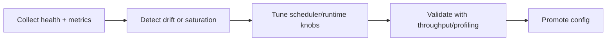
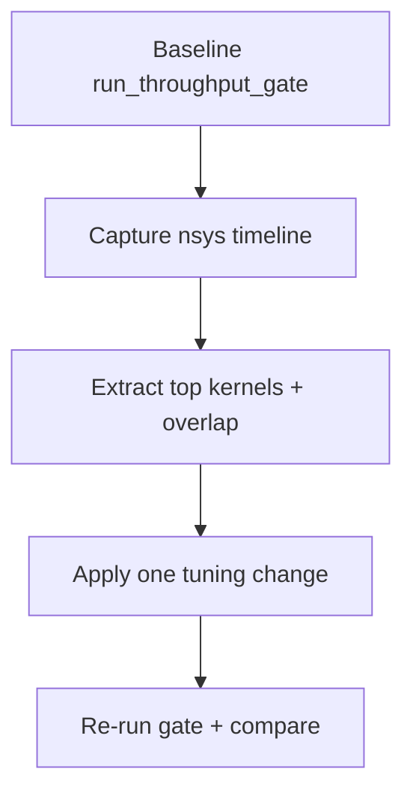

# Monitoring and Performance Operations (Canonical)

**Status:** Canonical



## 1) Observability Contract

| Surface | Endpoint/metric |
|---|---|
| Liveness/readiness | `/livez`, `/readyz`, `/healthz` |
| Prometheus | `/metrics` |
| Request latency | `inferflux_request_duration_ms*` |
| Errors | `inferflux_errors_total` |
| Throughput | `inferflux_completion_tokens_total`, `inferflux_model_completion_tokens_total` |
| Queue depth | `inferflux_scheduler_queue_depth`, `inferflux_prefill_queue_depth`, `inferflux_decode_queue_depth` |
| Batch quality | `inferflux_batch_size_max`, `inferflux_scheduler_batch_limit_size`, `inferflux_scheduler_batch_token_budget_skips_total` |
| Scheduler composition | `inferflux_scheduler_iterations_total{phase="prefill|decode|mixed"}` |
| CUDA lane health | `inferflux_cuda_lane_submissions_total`, `inferflux_cuda_lane_overlap_events_total`, `inferflux_cuda_attention_kernel_selected` |
| Native path activity | `inferflux_native_forward_passes_total{phase=...}` |
| Cache reuse | `inferflux_prefix_hits_total`, `inferflux_prefix_partial_hits_total`, `inferflux_prefix_matched_tokens_total`, `inferflux_kv_prefix_reuse_total` |

## 2) Fast Checks

```bash
curl -s http://127.0.0.1:8080/livez
curl -s http://127.0.0.1:8080/readyz
curl -s http://127.0.0.1:8080/metrics | head -120
```

## 3) Tuning Levers (Operate + Tune)

| Goal | Primary knob | Secondary knob | Validation signal |
|---|---|---|---|
| Increase throughput | `runtime.scheduler.max_batch_size` | `runtime.scheduler.batch_accumulation_ms` | `inferflux_batch_size_max` rising without error spikes |
| Reduce token-budget skips | `runtime.scheduler.max_batch_tokens` | fairness slice settings | lower `inferflux_scheduler_batch_token_budget_skips_total` delta |
| Improve mixed workload behavior | `runtime.cuda.phase_overlap.enabled` | `runtime.cuda.phase_overlap.min_prefill_tokens` | `inferflux_cuda_lane_overlap_events_total` and mixed scheduler iterations |
| Improve attention efficiency | `runtime.cuda.attention.kernel` | `runtime.cuda.flash_attention.enabled` | kernel selection + latency reduction |
| Improve cache reuse | `runtime.paged_kv.cpu_pages` | prefix warm paths | prefix/kv reuse counters increase |

Reference knobs: [CONFIG_REFERENCE](CONFIG_REFERENCE.md)

## 4) Throughput Gate Contract

Use gate checks as release-quality guardrails:

```bash
./scripts/run_throughput_gate.py \
  --server-bin ./build/inferfluxd \
  --config config/server.cuda.yaml \
  --backend cuda \
  --gpu-profile ada_rtx_4000 \
  --min-batch-size-max 2 \
  --min-batch-size-utilization 0.06 \
  --require-mixed-scheduler-iterations
```

## 5) Profiling Workflow



```bash
nsys profile -t cuda,nvtx -o /tmp/inferflux_profile \
  --force-overwrite=true --duration=30 \
  python3 scripts/run_throughput_gate.py --backend cuda --requests 48

nsys stats /tmp/inferflux_profile.qdrep | head -120
```

## 6) Alert Baselines (Starter)

| Alert | Trigger example |
|---|---|
| Readiness failure | `/readyz != 200` for 2m |
| Error surge | `rate(inferflux_errors_total[5m])` above SLO threshold |
| Queue saturation | `inferflux_scheduler_queue_depth` sustained above workload baseline |
| Batch collapse | `inferflux_batch_size_max` drops while request load stable |
| Overlap regression | overlap events drop to zero on mixed workload profile |

## 7) Incident Matrix

| Symptom | First checks | Typical action |
|---|---|---|
| High latency, low throughput | queue depth + batch metrics | raise batch size/token budget carefully |
| 422 capability errors | routing config + model capability | adjust routing policy or model selection |
| Native CUDA expected but missing | model exposure fields + native counters | inspect backend policy/identity settings |
| Cache not helping | prefix/kv reuse counters | increase pages, validate warmup patterns |

## 8) Consolidation Notes

Deep-dive legacy docs are archived as evidence:

- [PERFORMANCE_TUNING_2026_03_05](archive/evidence/PERFORMANCE_TUNING_2026_03_05.md)
- [PROFILING_OPERATIONS_GUIDE_2026_03_05](archive/evidence/PROFILING_OPERATIONS_GUIDE_2026_03_05.md)

For triage runbooks, see [Troubleshooting](Troubleshooting.md).
