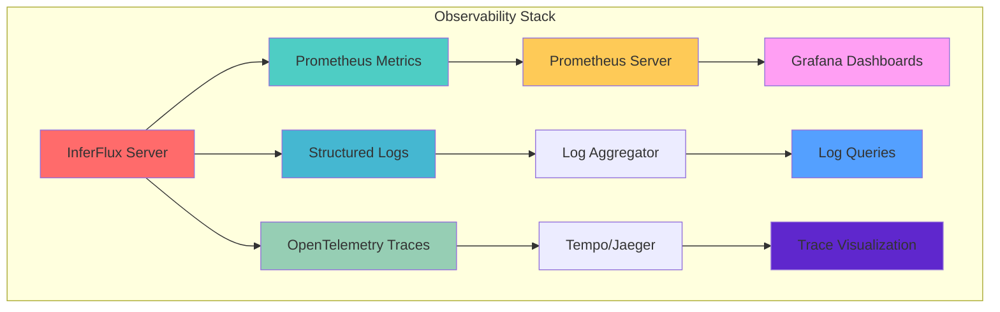
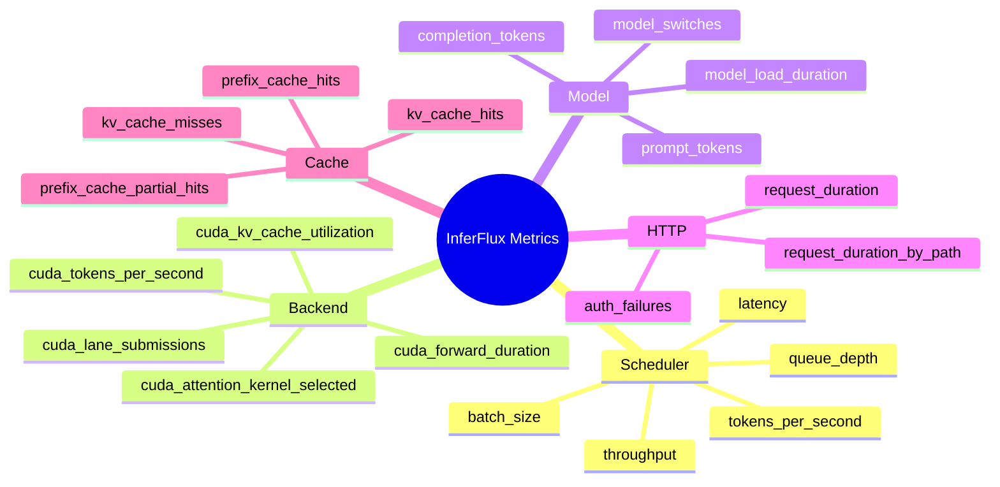
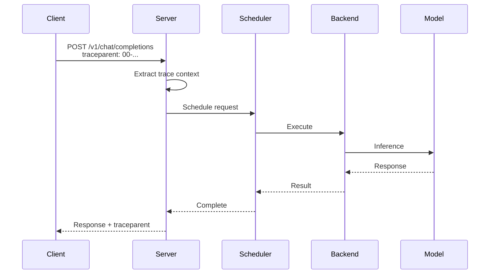
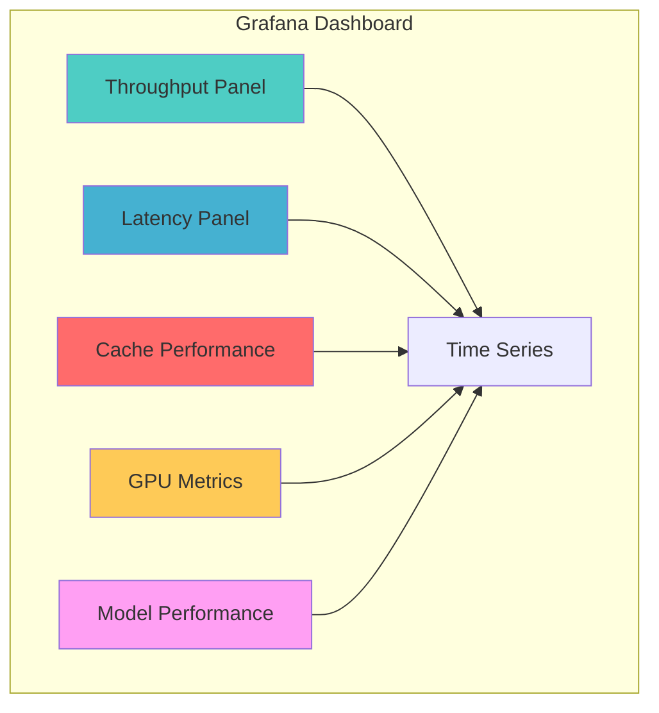

# Monitoring and Observability Guide

Complete guide to metrics, logging, and observability for InferFlux.

## Overview



## Prometheus Metrics

### Endpoint

```
GET /metrics
```

Returns Prometheus text-format metrics.

### Metric Categories



### Key Metrics

#### Scheduler Metrics

| Metric | Type | Description |
|--------|------|-------------|
| `inferflux_scheduler_batch_tokens_total` | Counter | Tokens processed per batch |
| `inferflux_scheduler_batch_limit_size_skips_total` | Counter | Tokens dropped due to batch limit |
| `inferflux_scheduler_queue_depth` | Gauge | Current queue depth |
| `inferflux_scheduler_request_duration_seconds` | Histogram | Request processing time |

**Example Queries:**
```promql
# Average batch size
rate(inferflux_scheduler_batch_tokens_total[5m]) / rate(inferflux_scheduler_batches_total[5m])

# P99 latency
histogram_quantile(0.99, rate(inferflux_scheduler_request_duration_seconds_bucket[5m]))

# Queue depth trend
inferflux_scheduler_queue_depth
```

#### Backend Metrics

| Metric | Type | Labels | Description |
|--------|------|--------|-------------|
| `inferflux_cuda_tokens_per_second` | Gauge | `backend`, `model_id` | Throughput |
| `inferflux_cuda_forward_duration_ms` | Histogram | `phase` | Forward pass timing |
| `inferflux_cuda_kv_active_sequences` | Gauge | - | Active KV slots |
| `inferflux_cuda_lane_submissions_total` | Counter | - | Lane submissions |
| `inferflux_cuda_lane_overlap_events_total` | Counter | - | Overlap events |
| `inferflux_cuda_attention_kernel_selected` | Gauge | `kernel` | Selected kernel (fa2/standard) |

**Example Queries:**
```promql
# Throughput by model
rate(inferflux_cuda_tokens_per_second[5m]) by (model_id)

# FA2 usage
inferflux_cuda_attention_kernel_selected{kernel="fa2"}

# P50 forward pass duration
histogram_quantile(0.5, rate(inferflux_cuda_forward_duration_ms_bucket[5m]))
```

#### Model Metrics

| Metric | Type | Labels | Description |
|--------|------|--------|-------------|
| `inferflux_model_prompt_tokens_total` | Counter | `model_id` | Prompt tokens |
| `inferflux_model_completion_tokens_total` | Counter | `model_id` | Completion tokens |
| `inferflux_model_load_duration_seconds` | Histogram | `model_id` | Load time |

**Example Queries:**
```promql
# Throughput by model
sum(rate(inferflux_model_completion_tokens_total[5m])) by (model_id)

# Model load time
histogram_quantile(0.99, inferflux_model_load_duration_seconds_bucket{model_id="llama3-8b"})
```

#### Cache Metrics

| Metric | Type | Description |
|--------|------|-------------|
| `inferflux_kv_cache_hits_total` | Counter | KV cache hits |
| `inferflux_kv_cache_misses_total` | Counter | KV cache misses |
| `inferflux_prefix_matched_tokens_total` | Counter | Prefix cache matched tokens |
| `inferflux_prefix_partial_hits_total` | Counter | Prefix cache partial hits |

**Example Queries:**
```promql
# KV cache hit rate
rate(inferflux_kv_cache_hits_total[5m]) / (rate(inferflux_kv_cache_hits_total[5m]) + rate(inferflux_kv_cache_misses_total[5m]))

# Prefix cache effectiveness
rate(inferflux_prefix_matched_tokens_total[5m]) / rate(inferflux_scheduler_tokens_generated_total[5m])
```

## Structured Logging

### Log Format

**JSON Format:**
```json
{
  "timestamp": "2026-03-04T15:30:45.123Z",
  "level": "INFO",
  "component": "server",
  "message": "Request completed",
  "duration_ms": 523,
  "model": "llama3-8b",
  "tokens": 128,
  "request_id": "abc-123"
}
```

**Text Format:**
```
[INFO] server: Request completed duration_ms=523 model=llama3-8b tokens=128
```

### Log Levels

| Level | Usage |
|-------|-------|
| DEBUG | Detailed diagnostic information |
| INFO | Normal operational messages |
| WARN | Warning messages that indicate potential issues |
| ERROR | Error messages that don't prevent operation |
| FATAL | Critical errors that terminate operation |

### Configuration

```yaml
logging:
  level: info                    # debug, info, warn, error
  format: json                   # json or text
  audit_log: logs/audit.log    # Audit trail location
```

### Audit Logging

Audit logs track all security-relevant events:

```json
{
  "timestamp": "2026-03-04T15:30:45.123Z",
  "level": "INFO",
  "component": "audit",
  "event": "authentication",
  "api_key_hash": "sha256:abc123...",
  "scopes": ["generate", "read"],
  "success": true,
  "client_ip": "10.0.0.1"
}
```

## OpenTelemetry Tracing

### Trace Propagation



### Spans

The following spans are created:

1. **http_request** - HTTP request handling
2. **tokenize** - Tokenization
3. **schedule** - Scheduler queuing
4. **prefill** - Prefill execution
5. **decode** - Decode execution
6. **model_load** - Model loading (if applicable)

### Configuration

```yaml
server:
  enable_tracing: false         # Enable OpenTelemetry (future)
```

## Health Check Endpoints

### /healthz

```bash
curl http://localhost:8080/healthz
```

Returns:
- `200 OK` if server is healthy
- `503 Service Unavailable` if unhealthy

### /readyz

```bash
curl http://localhost:8080/readyz
```

Returns:
- `200 OK` if server is ready to serve requests
- `503 Service Unavailable` if not ready

Checks:
- Model loaded
- Backend ready
- Scheduler operational

### /livez

```bash
curl http://localhost:8080/livez
```

Returns:
- `200 OK` if server is alive (always returns 200 if server is running)

## Grafana Dashboards

### Dashboard Layout



### Example Dashboard Queries

**Throughput:**
```promql
# Requests per second
rate(inferflux_http_requests_total[1m])

# Tokens per second by model
sum(rate(inferflux_model_completion_tokens_total[1m])) by (model_id)
```

**Latency:**
```promql
# P50 latency
histogram_quantile(0.50, rate(inferflux_http_request_duration_seconds_bucket[5m]))

# P99 latency
histogram_quantile(0.99, rate(inferflux_http_request_duration_seconds_bucket[5m]))
```

**GPU Utilization:**
```promql
# GPU memory usage
inferflux_cuda_vram_used_bytes / inferflux_cuda_vram_total_bytes

# Throughput by GPU
rate(inferflux_cuda_tokens_per_second[1m]) by (gpu_id)
```

## Alerting Rules

### Critical Alerts

```yaml
groups:
  - name: critical
    rules:
      # High error rate
      - alert: HighErrorRate
        expr: rate(inferflux_http_requests_total{status=~"5.."}[5m]) / rate(inferflux_http_requests_total[5m]) > 0.05
        for: 5m
        labels:
          severity: critical

      # OOM risk
      - alert: OOMRisk
        expr: inferflux_cuda_vram_used_bytes / inferflux_cuda_vram_total_bytes > 0.95
        for: 5m
        labels:
          severity: critical

      # Queue depth
      - alert: HighQueueDepth
        expr: inferflux_scheduler_queue_depth > 100
        for: 5m
        labels:
          severity: critical
```

### Warning Alerts

```yaml
  - name: warnings
    rules:
      # Low cache hit rate
      - alert: LowCacheHitRate
        expr: rate(inferflux_kv_cache_hits_total[5m]) / (rate(inferflux_kv_cache_hits_total[5m]) + rate(inferflux_kv_cache_misses_total[5m])) < 0.3
        for: 15m
        labels:
          severity: warning

      # High latency
      - alert: HighLatency
        expr: histogram_quantile(0.99, rate(inferflux_http_request_duration_seconds_bucket[5m])) > 2
        for: 5m
        labels:
          severity: warning
```

## Monitoring Setup

### Prometheus Configuration

```yaml
# prometheus.yml
global:
  scrape_interval: 15s

scrape_configs:
  - job_name: 'inferflux'
    static_configs:
      - targets: ['localhost:8080']
    metrics_path: '/metrics'
    scrape_interval: 10s
```

### Start Prometheus

```bash
prometheus --config.file=prometheus.yml
```

Access at http://localhost:9090

### Grafana Setup

```bash
docker run -d \
  -p 3000:3000 \
  -v grafana-data:/var/lib/grafana \
  -e GF_SECURITY_ADMIN_PASSWORD=admin \
  grafana/grafana
```

Access at http://localhost:3000 (admin/admin)

## Troubleshooting

### Issue: No Metrics Appearing

```bash
# Check if metrics endpoint is accessible
curl http://localhost:8080/metrics

# Check server config
grep enable_metrics config/server.yaml

# Check Prometheus target
curl http://localhost:9090/targets
```

### Issue: Logs Not Showing

```bash
# Check log level
grep level config/server.yaml

# Check log file location
ls -la logs/

# Check disk space
df -h
```

### Issue: High Memory Usage

```bash
# Check VRAM usage
curl http://localhost:8080/metrics | grep vram

# Check KV cache
curl http://localhost:8080/metrics | grep kv_cache

# Check batch size
curl http://localhost:8080/metrics | grep batch
```

---

**Next:** [Configuration Reference](CONFIG_REFERENCE.md) | [Performance Tuning](PERFORMANCE_TUNING.md) | [Architecture](Architecture.md)
