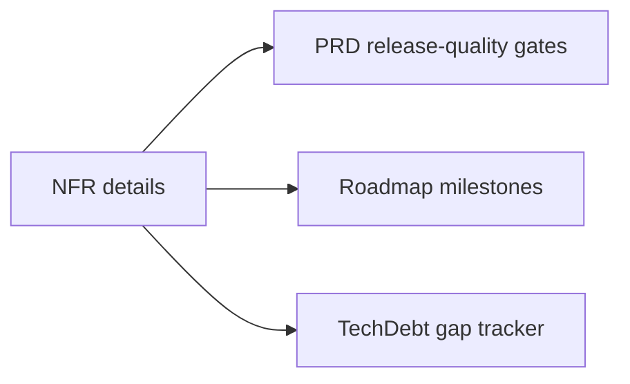

# Non-Functional Requirements (Consolidated)

**Status:** Consolidated into canonical docs

## Canonical Source Map

| Need | Source of truth |
|---|---|
| Active release-quality gates | [PRD](PRD.md) |
| Priority and timing | [Roadmap](Roadmap.md) |
| Risk/debt retirement | [TechDebt_and_Competitive_Roadmap](TechDebt_and_Competitive_Roadmap.md) |

## Archived Full NFR Snapshot

- [NFR_2026_03_05](archive/evidence/NFR_2026_03_05.md)
