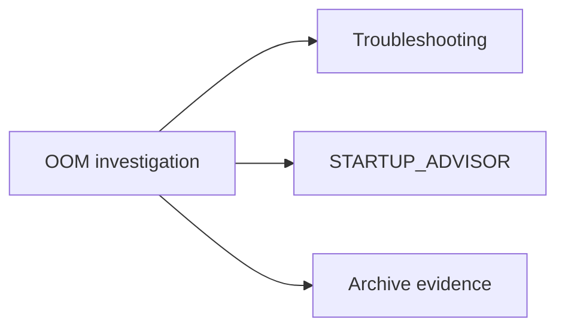

# OOM Root Cause Analysis (Consolidated)

**Status:** Consolidated

## Canonical Source Map

| Need | Source of truth |
|---|---|
| Live OOM incident triage | [Troubleshooting](Troubleshooting.md) |
| Startup memory recommendations | [STARTUP_ADVISOR](STARTUP_ADVISOR.md) |
| Runtime memory knobs | [CONFIG_REFERENCE](CONFIG_REFERENCE.md) |

## Archived Root-Cause Snapshot

- [FP16_OOM_ROOT_CAUSE_ANALYSIS_2026_03_05](archive/evidence/FP16_OOM_ROOT_CAUSE_ANALYSIS_2026_03_05.md)
