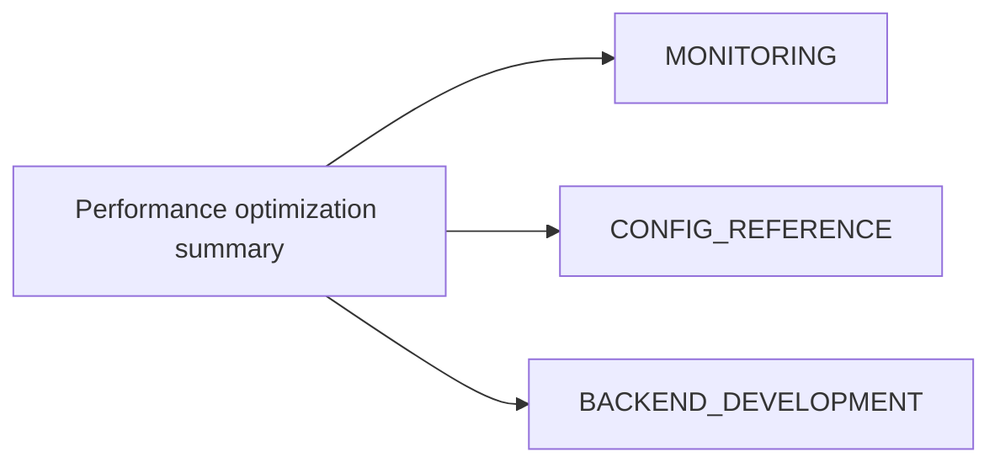

# Performance Optimization Summary (Consolidated)

**Status:** Consolidated

## Canonical Source Map

| Need | Source of truth |
|---|---|
| Metrics-driven tuning loop | [MONITORING](MONITORING.md) |
| Runtime and scheduler knobs | [CONFIG_REFERENCE](CONFIG_REFERENCE.md) |
| Backend implementation/perf guidance | [BACKEND_DEVELOPMENT](BACKEND_DEVELOPMENT.md) |
| FP16-specific status | [FP16_STATUS](FP16_STATUS.md) |

## Archived Full Summary

- [PERFORMANCE_OPTIMIZATION_SUMMARY_2026_03_05](archive/evidence/PERFORMANCE_OPTIMIZATION_SUMMARY_2026_03_05.md)
